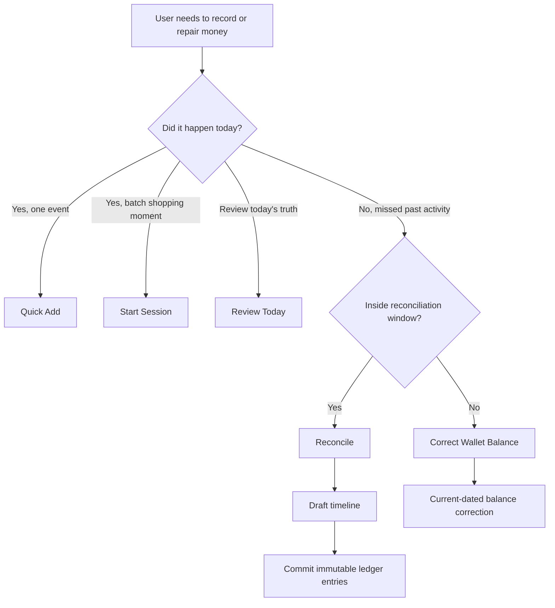
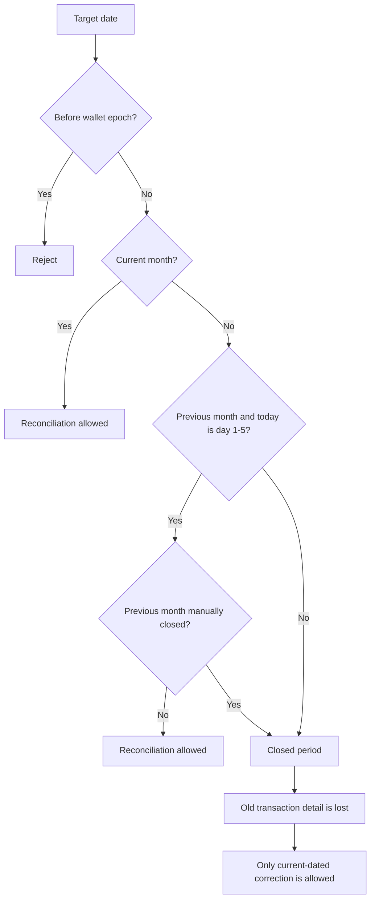
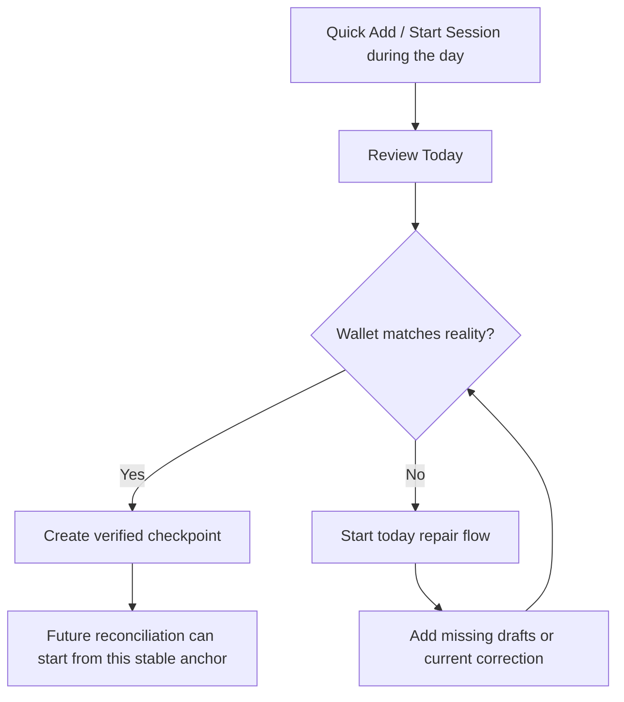
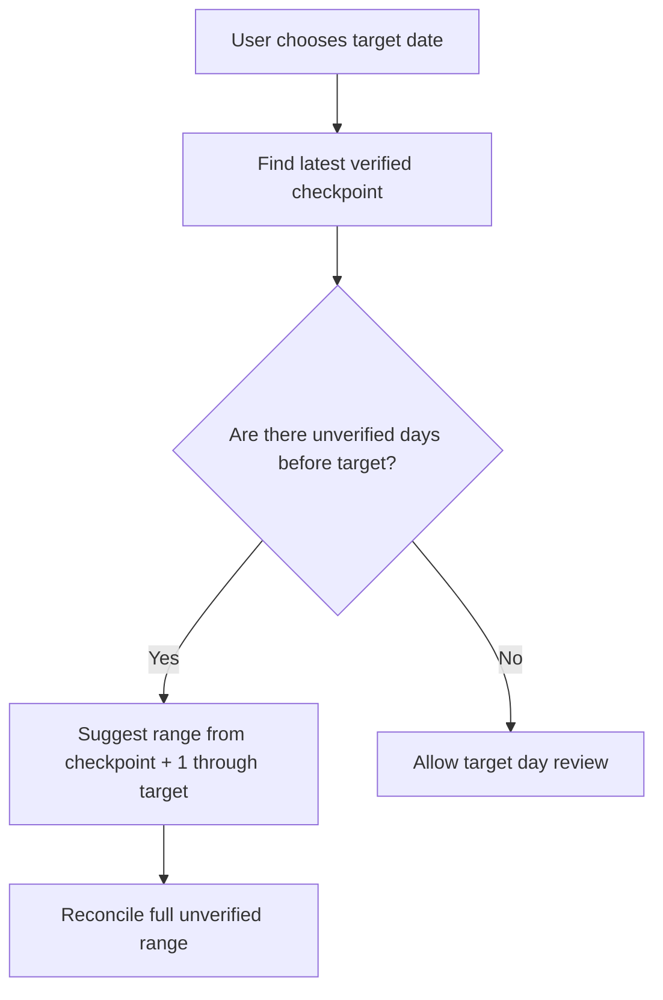
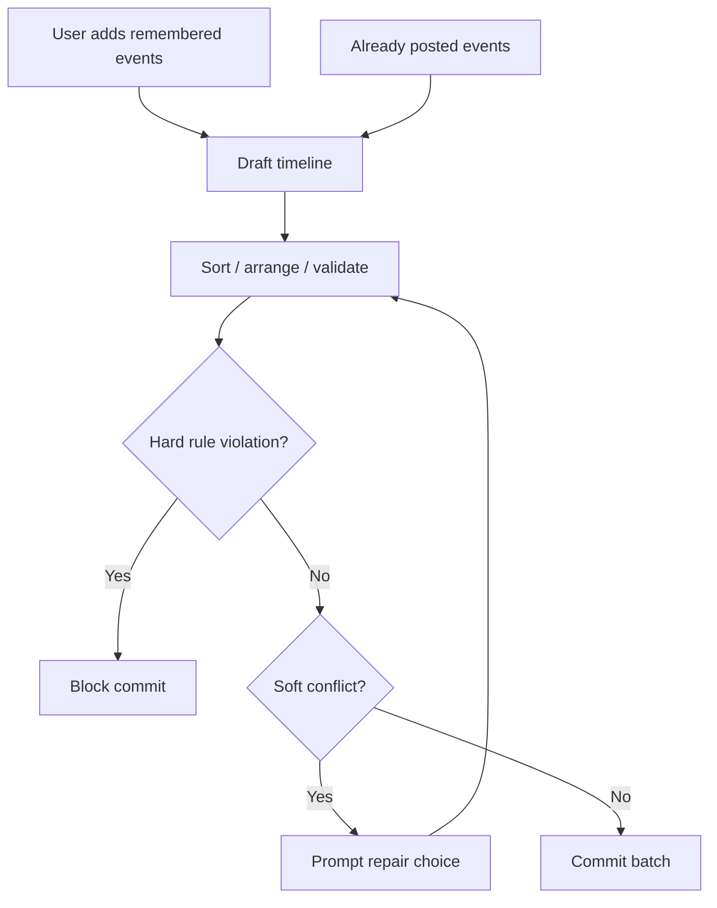
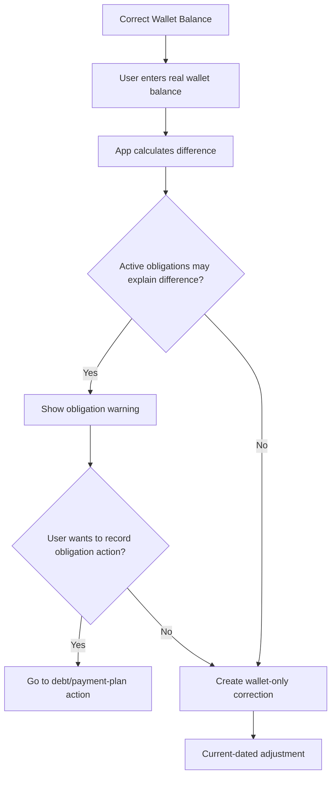

# 0023. Review Today, Reconciliation Windows, and Balance Correction

Date: 2026-07-09

## Status

Accepted

## Context

ADR 0002 defines Sarflog's strict logging and reconciliation model:

- Normal expense/income logging is restricted to today.
- Missed past records must go through reconciliation.
- The current month is open.
- The previous month has a 5-day cleanup window.
- Closed months cannot be rewritten.
- No transaction may be recorded before the relevant wallet epoch.

During product design, we refined how this should feel in the UI and how it should connect to wallet truth, daily habits, immutable ledger rules, and the existing wallet "reconcile balance" action.

The important clarification is this:

> Reconciliation is not an infinite backdating tool. It is only valid while the target date is still inside the open reconciliation window.

Once the reconciliation window expires, the old transaction detail is considered lost to Sarflog's ledger. The app may still restore the wallet's current truth through a current-dated balance correction, but it must not pretend the missed old transaction was recorded on its original date.

## Decision

We separate money repair into five user-facing actions:

```text
Quick Add
Start Session
Review Today
Reconcile
Correct Wallet Balance
```

Each action has a different purpose.

## Action Model

### Quick Add

Quick Add is for one money event that happened today.

It should stay fast and low-friction.

```text
Use when:
- user wants to record one expense today
- user knows the wallet, amount, category, and other required details

Not for:
- missed old expenses
- reconstructing a wallet mismatch
- batch shopping trips
```

### Start Session

Start Session is for a batch of same-moment expense lines, such as grocery shopping, bazaar shopping, or a multi-item purchase.

It is still current-day logging, not reconciliation.

```text
Use when:
- one shopping moment creates multiple expense lines
- the user wants to split a receipt-like moment into categories or items

Not for:
- repairing old wallet drift
- recording many unrelated past events
```

### Review Today

Review Today is the daily habit layer.

It is a global action, not an Expenses-page action. It starts from wallet truth and can involve expenses, income, transfers, refunds, debts, payment plans, and corrections.

Review Today lets the user compare today's Sarflog wallet balance with the real wallet balance. If they match, Sarflog can create a verified daily checkpoint. If they do not match, the user can start a today-scoped repair flow.

```text
Use when:
- user wants to close/check today
- user wants confidence that today's wallet state matches reality
- user wants future reconciliation to have a trusted anchor
```

### Reconcile

Reconcile is the guided repair flow for missed records that are still inside the open reconciliation window.

It is wallet-first, not page-first.

```text
Use when:
- user missed activity in the current month
- user is cleaning up the previous month during days 1-5 of the new month
- the target date is not before the wallet epoch
- the target date is not in a closed period
```

Reconcile can create:

- exact past-dated records, if the user knows what happened
- approximate category records, if the user knows the category but not the exact details
- Unknown/Untracked adjustments, if the user cannot explain the gap

The app must never fabricate categories.

### Correct Wallet Balance

Correct Wallet Balance is the last-resort repair tool for restoring wallet truth after the reconciliation window has expired or when the user does not want to reconstruct missing detail.

This is the current form of "just make my wallet balance match reality."

```text
Use when:
- the user missed the reconciliation window
- the user cannot or will not reconstruct missing transactions
- the user accepts that old detail is lost to Sarflog reports
```

It creates a current-dated balance correction. It does not record the old transaction on its old date.

## Core Flow



## Reconciliation Window Algorithm

All date decisions use the user's effective timezone.

```text
Input:
- user local today
- target transaction date
- relevant wallet creation date
- month close state

Algorithm:
1. If target date is before the relevant wallet epoch:
   reject.

2. If target date is today and the user is using normal add:
   allow normal logging.

3. If target date is in the current month:
   allow reconciliation.

4. If target date is in the previous month and today is day 1-5 of the new month:
   allow reconciliation.

5. If target month was manually closed:
   do not allow reconciliation into that month.

6. If target date is in a closed period:
   do not allow exact old transaction recording.
   offer current-dated balance correction instead.
```

Diagram:



## Closed Window Rule

When the reconciliation window has expired, Sarflog must not let the user record old transactions as old transactions.

Example:

```text
Today: July 20
User remembers: June 28 groceries, 200,000 UZS
June is closed.
```

Sarflog must not allow:

```text
June 28 - Groceries - 200,000 UZS
```

Sarflog may allow:

```text
July 20 - Balance Correction - 200,000 UZS
Note: User remembered missed June 28 groceries.
```

The old June grocery detail is not restored to June reports. It is lost to Sarflog's historical ledger.

This is intentional.

```text
If the user wants detailed reports, they must review or reconcile on time.
If they miss the window, Sarflog can restore current wallet truth, but not historical detail.
```

## Review Today And Verified Checkpoints

Review Today creates a useful habit and a useful data anchor.

When a user completes Review Today for a wallet, Sarflog can record a verified checkpoint:

```text
Wallet A verified at end of July 9:
app balance = real balance
```

Future reconciliation should use the most recent checkpoint as the trusted starting point.



If the user tries to reconcile a past day but earlier days after the last checkpoint were never reviewed, Sarflog should suggest the full unverified range.

Example:

```text
Last verified checkpoint: July 9
User wants to reconcile: July 14

Suggested reconciliation range:
July 10 through July 14
```

This avoids fake one-day reconciliation when older unreviewed days may already be wrong.



## Draft Timeline Before Ledger Commit

Review Today and Reconcile should use a draft layer before committing ledger entries.

The user may remember transactions in a messy order. Sarflog should help organize them before posting immutable ledger facts.

```text
Draft layer:
- can be messy
- can be reordered
- can include already-posted events for review context
- can include new missing draft events

Ledger layer:
- append-only
- posted in validated order
- never rewrites closed-period history
```

Already-posted events shown in a review timeline remain immutable. Dragging them in a review UI must not silently rewrite amount, date, wallet, category, or ledger order. Reordering can only affect display/review metadata unless a future explicit correction flow voids and reposts the event.



## Hard Rules vs Soft Conflicts

### Hard Rules

Hard rules block commit.

- Before wallet epoch.
- Future date for normal money logging.
- Exact old transaction in a closed period.
- Transaction against an archived or unavailable wallet.
- Mutation of posted financial math instead of correction/reversal.

### Soft Conflicts

Soft conflicts do not automatically block truth. They require explanation or repair.

- Timeline temporarily goes negative.
- Spending appears to use protected goal money.
- Budget becomes red.
- User adds missing earlier events that make an already-posted later event look impossible.
- Wallet balance still does not match reality after draft events.

Soft conflicts should produce clear prompts:

```text
This timeline implies the wallet was short before this payment.
Did an income, transfer, or correction happen before it?
```

The user can then:

- add a missing income
- add a missing transfer
- add another missing expense
- keep the truth and accept a repair task
- use a current correction if the allowed window has expired

## Correct Wallet Balance Rules

Correct Wallet Balance is wallet-only unless the user explicitly chooses a separate domain action.

It must not silently change:

- debt remaining amount
- payment-plan rows
- goal contribution status
- expected inflow status
- old budget category history
- old closed-period reports

If active obligations exist in the affected period, Sarflog should warn the user:

```text
This correction changes only your wallet balance.
It will not mark debts, payment plans, goals, or expected inflows as paid.
If this difference includes one of those payments, record it from that obligation instead.
```

Flow:



## Debt And Payment-Plan Nuance

Expired-window balance correction must not backfill old debt or payment-plan payments.

Example:

```text
Today: July 20
User remembers: June 28 car loan payment
June is closed.
```

Sarflog must not allow:

```text
June 28 - Payment-plan payment
```

The user may choose one of two honest current actions:

```text
1. Current wallet balance correction
   - fixes wallet truth
   - does not mark the payment-plan row paid
   - historical obligation detail remains lost

2. Current-dated obligation correction/payment action
   - updates the obligation as of today
   - uses the domain's ledger/reversal/adjustment rules
   - does not pretend the payment was recorded on June 28
```

The app must never infer obligation state from a generic wallet balance correction.

## UI Placement

Expense page:

```text
Primary:
- Quick Add
- Start Session

Secondary/helpful:
- "Missing an old expense? Use Reconcile"
```

Global surfaces such as Dashboard, Wallets, or the sidebar:

```text
- Review Today
- Reconcile
- Correct Wallet Balance
```

Reason:

Reconciliation starts from wallet truth, not from a specific feature page. The missing event may be an expense, income, transfer, refund, debt payment, payment-plan payment, goal movement, or unknown drift.

## Consequences

### Benefits

- Users get a clear daily habit through Review Today.
- Future reconciliation has stable checkpoints.
- Closed-period reports stay stable.
- Users learn that detailed reports require timely review.
- Sarflog can restore current wallet truth without pretending historical detail still exists.
- Debt and payment-plan state cannot be silently corrupted by generic wallet corrections.

### Costs

- The UX must explain data loss kindly and clearly.
- Some users will be frustrated that old detail cannot be restored after the window expires.
- Review Today and Reconcile need a draft/timeline layer.
- The app needs new concepts for verified checkpoints and current corrections.
- Obligation-related correction flows need careful product language.

## Final Rule Summary

```text
Quick Add:
  one event, today only

Start Session:
  batch expense moment, today only

Review Today:
  global daily wallet truth check
  creates verified checkpoints

Reconcile:
  wallet-first repair
  only inside open reconciliation window
  can create exact/approximate/unknown records while window is open

Correct Wallet Balance:
  last-resort current correction
  used when detail is lost or window expired
  wallet-only unless user chooses a separate domain action

Closed window:
  old transaction detail is lost
  no backdating
  no normal reconciliation
  current correction only
```
