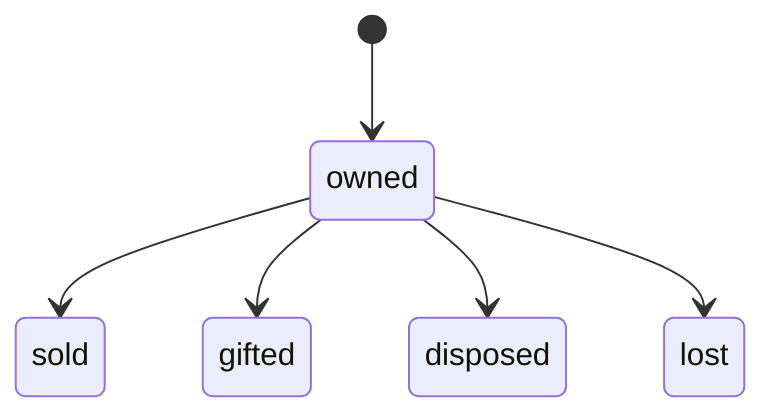
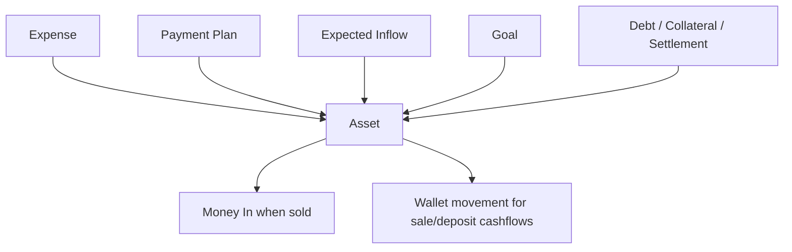
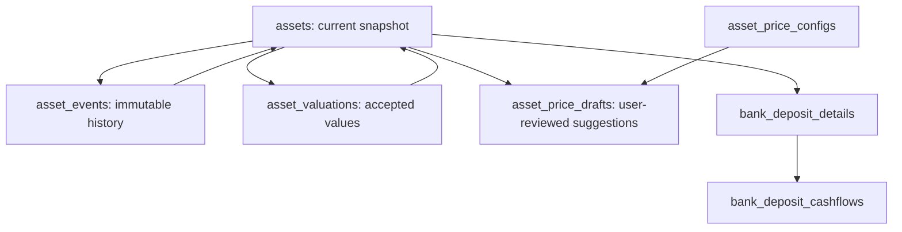
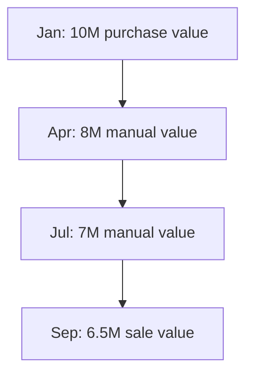
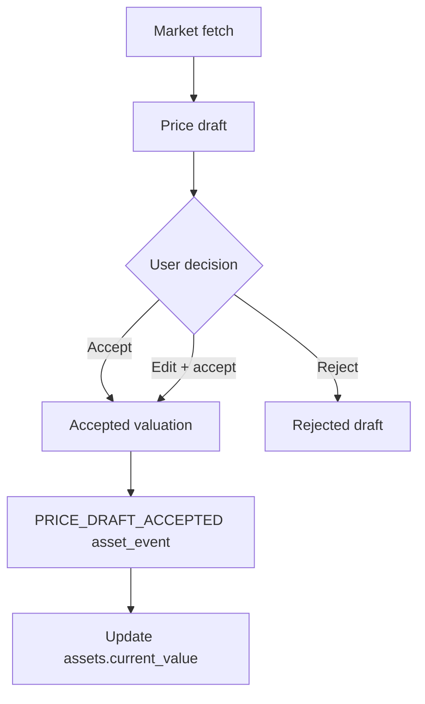
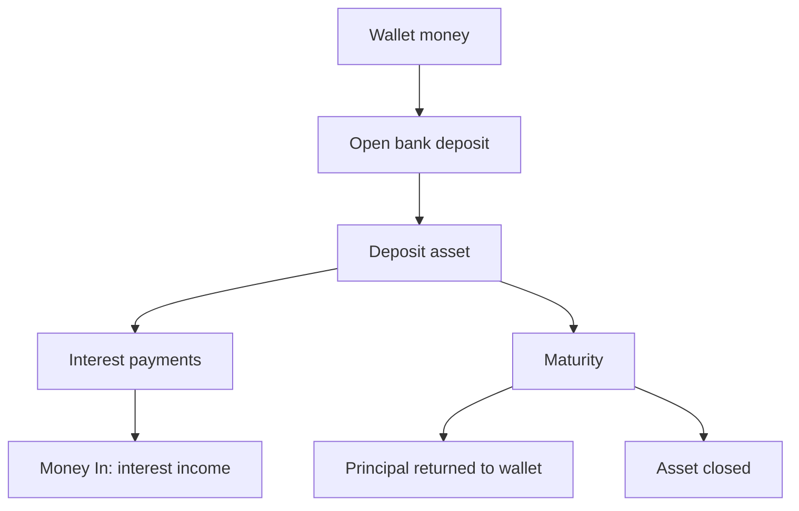
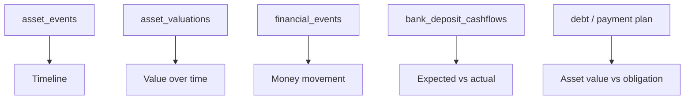
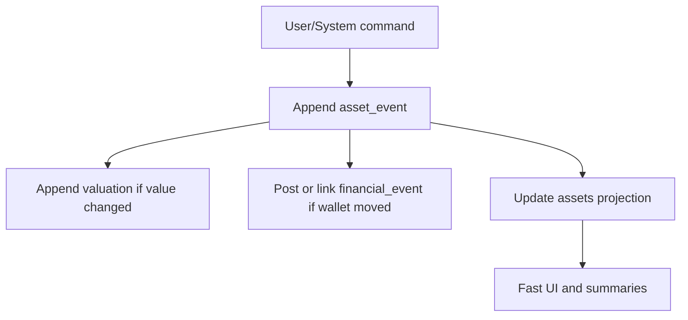

# 0030. Assets as a Financial Support Module

Date: 2026-07-11

## Status

Proposed

## Context

Sarflog is not intended to become a full inventory, insurance, or investment-management product. The Assets module exists to support the core product:

```text
budgets
expenses
goals
wallet truth
expected inflows
debt and payment-plan context
net position
```

The current implementation is useful but shallow. The `assets` table stores a current snapshot:

```text
title
description
purchase_value
current_value
status
origin_event_id
sale_event_id
sold_date
sale_value
```

Current asset lifecycle states are:

```text
owned
sold
gifted
disposed
lost
```



The table answers the current-state question:

```text
What is this asset called, what is it worth now, and is it still owned?
```

It does not yet answer the historical question:

```text
Why did this value/status change, when did it happen, what money event backed it,
and can we reconstruct the asset timeline later?
```

That missing history matters because assets already touch several financial domains.



## Decision

Assets should become a **financial support module**.

They should not become:

```text
home inventory
insurance catalog
market trading platform
full portfolio manager
```

The Assets architecture should support:

```text
1. Current asset snapshot for fast UI and summaries.
2. Append-only asset history for auditability and reconstruction.
3. Accepted valuation history for net-position reporting.
4. User-approved Tier 1 market price suggestions.
5. Bank deposits as a specialized asset subtype.
6. Asset details pages with real charts built only from recorded data.
```

## Current Shallow Points

The current `assets.current_value` field overwrites the prior value.

Example:

```text
Laptop current_value = 7,000,000
```

The system cannot tell from the row alone:

```text
Was this value manually edited?
Was it accepted from a price draft?
Was it the sale value?
Was it corrected after a mistake?
What was the value last month?
```

The current `status` field is also only a label. It records that the asset is `sold`, `gifted`, `disposed`, or `lost`, but not a proper timeline of how that happened.

This is acceptable for MVP behavior, but it is too weak for asset-supported budgets, goals, deposits, expected inflows, and net-position history.

## Target Shape

The recommended model is a hybrid:

```text
assets                  current snapshot / projection
asset_events            append-only asset history
asset_valuations        accepted value history
asset_price_configs     mutable market-price settings
asset_price_drafts      user-reviewable price suggestions
bank_deposit_details    specialized deposit contract facts
bank_deposit_cashflows  expected and realized deposit cashflows
```



### `assets`

`assets` remains the current-state row.

It is optimized for:

```text
asset list
asset detail header
dashboard summaries
current net-position projections
quick filtering by status/type
```

It may be updated as a projection when events are accepted.

### `asset_events`

`asset_events` stores the story of the asset.

It should be append-only.

Candidate fields:

```text
id
owner_id
asset_id
event_type
event_date
amount
value_before
value_after
status_before
status_after
financial_event_id
debt_id
payment_plan_id
price_draft_id
note
metadata
created_at
```

Example events:

```text
ACQUIRED_MANUALLY
ACQUIRED_FROM_EXPENSE
ACQUIRED_FROM_PAYMENT_PLAN
VALUATION_UPDATED
PRICE_DRAFT_ACCEPTED
PRICE_DRAFT_EDITED_ACCEPTED
SOLD
GIFTED
DISPOSED
LOST
DEPOSIT_OPENED
INTEREST_RECEIVED
PRINCIPAL_RETURNED
MATURED_CLOSED
EARLY_WITHDRAWN
USED_IN_DEBT_SETTLEMENT
PLEDGED_AS_COLLATERAL
RELEASED_FROM_COLLATERAL
```

Concrete laptop example:

```text
ACQUIRED_FROM_EXPENSE
date: 2026-01-10
amount: 10,000,000
financial_event_id: expense #123
value_after: 10,000,000

VALUATION_UPDATED
date: 2026-04-10
value_before: 10,000,000
value_after: 8,000,000
note: User reviewed resale value

SOLD
date: 2026-09-01
amount: 6,500,000
financial_event_id: sale income event #456
value_before: 8,000,000
value_after: 6,500,000
status_after: sold
```

Problem solved:

```text
Before: current_value is 6.5M, but the system cannot explain why.
After: the asset was bought, revalued, then sold.
```

### `asset_valuations`

`asset_valuations` stores accepted values over time.

It should be append-only once accepted.

Candidate fields:

```text
id
owner_id
asset_id
valuation_date
value
source
price_draft_id
asset_event_id
note
created_at
```

Sources:

```text
manual
price_draft
sale
deposit_accrual
correction
opening_snapshot
```

This table enables real charts and historical net-position reconstruction.



### `asset_price_configs`

`asset_price_configs` stores user settings for Tier 1 price suggestions.

It is mutable because it is configuration, not financial truth.

Candidate fields:

```text
id
owner_id
asset_id
price_type
symbol
quantity
unit
quote_currency
fetch_frequency
enabled
last_fetched_at
next_fetch_at
provider
created_at
updated_at
```

Supported first:

```text
metals
stocks / ETFs
crypto
FX, if later useful
```

Not supported for automatic fetching:

```text
phones
laptops
furniture
appliances
casual resale items
```

Those should remain manual/user-controlled because value depends heavily on condition, local market, age, accessories, and buyer demand.

### `asset_price_drafts`

`asset_price_drafts` stores suggested values that the user can accept, edit and accept, or reject.

Drafts are not asset truth until accepted.

Candidate fields:

```text
id
owner_id
asset_id
price_config_id
fetched_at
provider
symbol
unit_price
quantity
proposed_value
quote_currency
status
user_adjusted_value
resolved_at
asset_event_id
valuation_id
raw_payload
```

Statuses:

```text
pending
accepted
edited_accepted
rejected
expired
```



This preserves the product rule:

```text
External data suggests. The user decides.
```

## Bank Deposits

Term deposits / fixed deposits belong in Assets as a specialized subtype.

They are not expenses.

Real-world meaning:

```text
The user gives principal to a bank.
The bank promises to return principal later.
The bank pays interest according to contract terms.
```

Financial treatment:

```text
Opening deposit:
wallet decreases, asset increases, net worth unchanged

Interest received:
wallet increases, income/net worth increases

Maturity:
wallet receives principal, asset closes, principal return is not income
```



### `bank_deposit_details`

Candidate fields:

```text
asset_id
bank_name
principal
currency
start_date
maturity_date
annual_rate_bps
interest_mode
payout_frequency
compounding_frequency
early_withdrawal_policy
auto_renew
created_at
updated_at
```

Interest modes:

```text
simple
periodic_payout
compounding
```

Deposits are mathematically modelable:

```text
simple_interest = principal * annual_rate * days / day_count
compound_final = principal * (1 + rate / periods_per_year) ^ periods
```

But bank-specific rounding, taxes, early withdrawal penalties, and variable terms should be user-confirmed through expected/actual cashflows.

### `bank_deposit_cashflows`

Candidate fields:

```text
id
owner_id
asset_id
cashflow_type
due_date
expected_amount
actual_amount
financial_event_id
status
note
created_at
resolved_at
```

Cashflow types:

```text
interest_payment
principal_return
early_withdrawal
penalty
tax_withheld
```

Statuses:

```text
expected
received
missed
cancelled
adjusted
```

Deposit example:

```text
DEPOSIT_OPENED
amount: 10,000,000
financial_event_id: wallet outflow
value_after: 10,000,000

INTEREST_RECEIVED
amount: 200,000
financial_event_id: wallet inflow
value_after: 10,000,000

PRINCIPAL_RETURNED
amount: 10,000,000
financial_event_id: wallet inflow
value_after: 0

MATURED_CLOSED
status_after: matured
```

## Asset Details Page

Each asset should eventually have a details page.

The page must use only real recorded data. No decorative or fake charts.

Useful sections:

```text
summary
timeline
value history
linked money movement
expected vs actual cashflows
asset value vs linked obligation
```



Recommended charts:

```text
1. Value over time
2. Purchase-to-current waterfall
3. Money movement timeline
4. Expected vs actual cashflows for deposits
5. Asset value vs remaining obligation for financed assets
```

Examples:

```text
Value over time:
Jan: 10M purchase
Apr: 8M manual valuation
Jul: 7M valuation
Sep: 6.5M sale

Money movement:
Jan: wallet paid 10M
Sep: wallet received 6.5M

Financed asset:
asset value: 80M
remaining obligation: 55M
net position: +25M
```

## Immutable Ledger Boundary

The Assets module should use a hybrid model.

Mutable/current-state:

```text
assets
asset_price_configs
pending asset_price_drafts
display metadata
```

Append-only/immutable:

```text
asset_events
accepted asset_valuations
realized deposit cashflows
asset sale and closure events
asset debt-settlement events
```

One-line rule:

```text
If it changed wallet truth, net-position truth, or historical asset value, append it.
If it is only a setting or latest display metadata, mutate it.
```



This aligns with ADR 0024:

```text
Wallet-moving asset actions must use the immutable financial ledger.
Asset-specific facts should also keep append-only asset history when they affect value/status history.
```

## Product Boundary

Tier 1 market-aware assets:

```text
metals
stocks / ETFs
crypto
FX, if useful
```

Manual/user-controlled assets:

```text
phones
laptops
furniture
appliances
equipment
other casual resale items
```

For casual assets, Sarflog may provide:

```text
manual valuation
review reminder
simple depreciation hint
user-provided comparable
```

But it should not pretend to know exact resale values.

## Consequences

Positive:

- Assets become useful for budgets, goals, expected inflows, deposits, and net-position reporting.
- Asset details pages can show meaningful timelines and charts from real records.
- Market data can reduce manual effort without silently mutating user truth.
- Bank deposits become understandable: principal is not an expense, interest is income, maturity is principal return.
- Historical asset values become reconstructable.

Costs:

- More tables and service logic are required.
- Asset writes must be centralized through domain services, not scattered across routers.
- Migration must honestly seed opening events/valuations for existing assets.
- Detail-page charts must handle sparse histories gracefully.

Risks:

- Overbuilding into a portfolio/inventory product.
- Treating market prices as truth instead of suggestions.
- Confusing principal return with income for deposits.
- Duplicating asset sale posting logic across Assets and Expected Inflows.

## Migration Direction

1. Keep `assets` as the current snapshot.
2. Add `asset_events`.
3. Backfill one `OPENING_SNAPSHOT` or `ACQUIRED_*` event for every existing asset.
4. Add `asset_valuations`.
5. Backfill one opening valuation per existing asset from `current_value`.
6. Move asset lifecycle writes into an Asset domain service.
7. Ensure direct asset sale and expected-inflow asset sale share one domain-owned posting path.
8. Add detail-page read models from real events and valuations.
9. Add Tier 1 price drafts only after the valuation/event backbone exists.
10. Add bank deposit subtype after asset events and cashflow conventions are clear.

## Open Questions

- Should `assets.status` gain richer states such as `matured`, `withdrawn_early`, or should deposit-specific states live only in deposit details?
- Should `asset_events` be the source of truth for status, with `assets.status` only a projection?
- Should accepted valuations be editable only through correction events?
- Should deposit expected cashflows reuse Expected Inflows, or stay in deposit-specific cashflows and only create Expected Inflows for user-facing planning?
- Which Tier 1 market data provider is acceptable for price drafts, and what stale-price warning policy should be used?

## Summary

The intended shape is:

```text
Assets = current financial object
Asset events = trustworthy history
Valuations = net-position timeline
Price drafts = user-approved automation
Deposits = specialized asset subtype
Details page = real charts from real records
```

This keeps Assets strong enough to support Sarflog's core money workflows without turning the app into an inventory system or investment platform.
