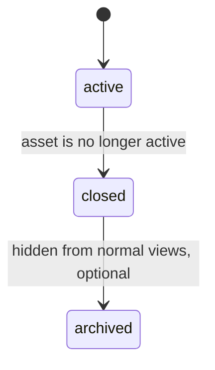
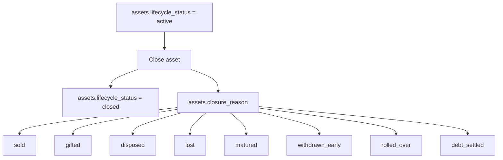
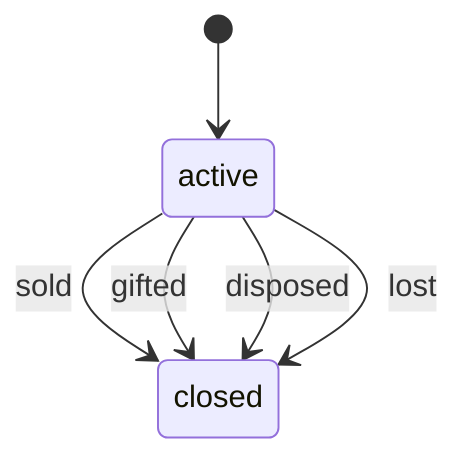
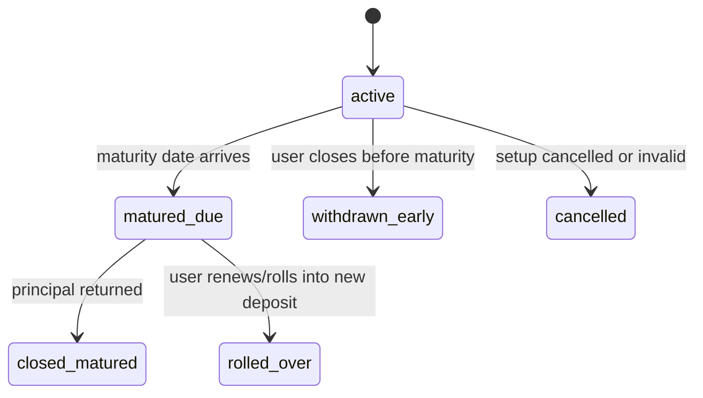
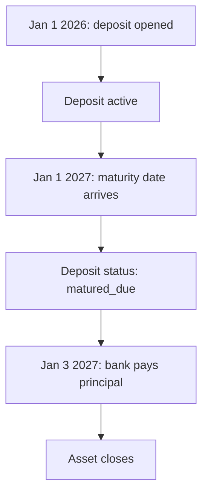
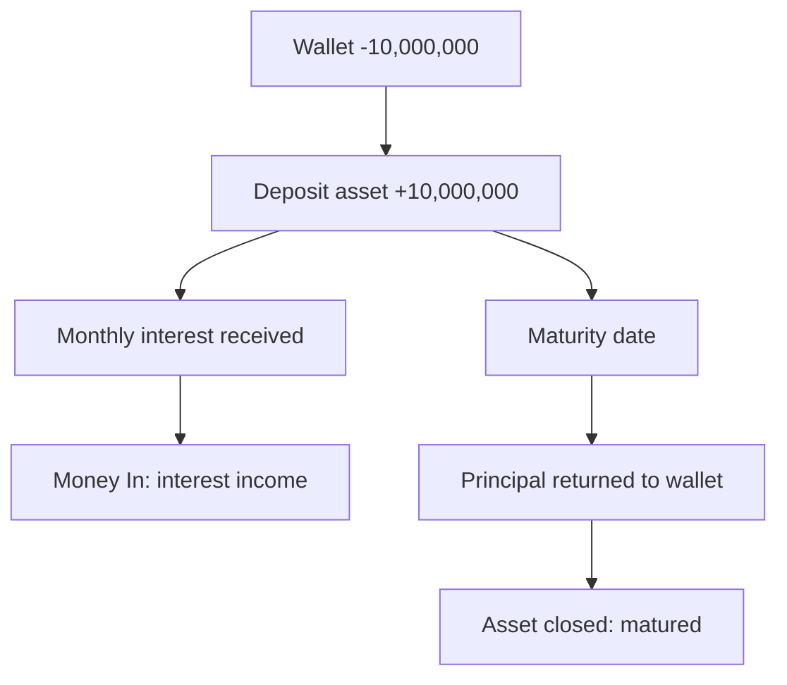
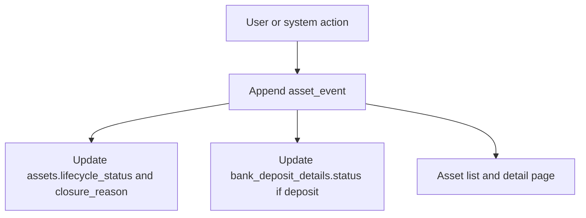

# 0031. Asset Statuses, Closure Reasons, and Deposit Maturity

Date: 2026-07-11

## Status

Proposed

## Context

ADR 0030 defines Assets as a financial support module for Sarflog, not as a full inventory or investment platform.

After that decision, one important modeling question remains:

```text
Should every asset type share the same statuses?
```

The current asset statuses are:

```text
owned
sold
gifted
disposed
lost
```

Those states work reasonably for ordinary owned things:

```text
laptop
phone
bike
furniture
gold bar
equipment
```

But they do not fit bank deposits.

A bank deposit is an asset because the user owns a financial claim against the bank. But a deposit is not usually:

```text
sold
gifted
lost
disposed
```

The normal deposit lifecycle is different:

```text
open deposit
receive interest
reach maturity date
receive principal back
close
or withdraw early
or roll over
```

This ADR separates the generic asset lifecycle from type-specific lifecycle details.

## Decision

Assets should use a simple generic lifecycle status and a separate closure reason.

Recommended generic fields:

```text
assets.lifecycle_status
assets.closure_reason
```

Recommended generic lifecycle statuses:

```text
active
closed
archived, optional later
```

Recommended closure reasons:

```text
sold
gifted
disposed
lost
matured
withdrawn_early
rolled_over
cancelled
debt_settled
```

The generic lifecycle answers:

```text
Is this asset still active in the user's financial picture?
```

The closure reason answers:

```text
Why did it stop being active?
```

Type-specific status should live in the subtype table when a subtype needs its own lifecycle.

For bank deposits:

```text
bank_deposit_details.status
```

Recommended deposit statuses:

```text
active
matured_due
closed_matured
withdrawn_early
rolled_over
cancelled
```

## Why Not Keep One Big Asset Status Enum?

One shared enum would mix unlike meanings:

```text
sold
gifted
lost
matured_due
withdrawn_early
rolled_over
```

These are not the same type of state.

For ordinary assets, `sold`, `gifted`, `disposed`, and `lost` describe how ownership ended.

For deposits, `matured_due` means:

```text
The promised end date has arrived, but the bank has not necessarily paid yet.
```

That is not a closure. It is a due state.

Therefore:

```text
assets.lifecycle_status = active
bank_deposit_details.status = matured_due
```

is valid until the user confirms actual principal return or rollover.

## Generic Asset Lifecycle



The detailed reason is separate.



This lets the Asset list stay simple:

```text
Active assets
Closed assets
```

while the detail page can show:

```text
Closed: sold
Closed: matured
Closed: withdrawn early
Closed: lost
```

## Migration From Current Statuses

The current `assets.status` values can migrate like this:

| Current status | lifecycle_status | closure_reason |
| --- | --- | --- |
| `owned` | `active` | `null` |
| `sold` | `closed` | `sold` |
| `gifted` | `closed` | `gifted` |
| `disposed` | `closed` | `disposed` |
| `lost` | `closed` | `lost` |

During migration, the existing `status` field can remain as compatibility output until frontend and API contracts are updated.

## Ordinary Asset Behavior

For a laptop:



Example:

```text
Asset: Work laptop
Purchased for: 10,000,000 UZS
Current value: 7,000,000 UZS

User sells for: 6,500,000 UZS

assets.lifecycle_status = closed
assets.closure_reason = sold
asset_event = SOLD
financial_event = wallet inflow from sale
```

For an ordinary asset, `sold`, `gifted`, `disposed`, and `lost` are natural closure reasons.

## Deposit Lifecycle

A deposit should not use the ordinary physical-asset closure state machine.

Recommended deposit status machine:



Generic asset and deposit-specific status work together:

| Deposit situation | assets.lifecycle_status | bank_deposit_details.status | assets.closure_reason |
| --- | --- | --- | --- |
| Running normally | `active` | `active` | `null` |
| Maturity date arrived, not paid yet | `active` | `matured_due` | `null` |
| Principal returned at maturity | `closed` | `closed_matured` | `matured` |
| Withdrawn before maturity | `closed` | `withdrawn_early` | `withdrawn_early` |
| Rolled into a new deposit | `closed` or `active`, depending on rollover design | `rolled_over` | `rolled_over` |
| Cancelled setup | `closed` | `cancelled` | `cancelled` |

## Why Not Use `owed` as a Deposit Status?

Conceptually, a deposit means:

```text
The bank owes the user principal, and possibly interest.
```

But `owed` is not a great status name for deposits because it is true for almost the entire deposit lifecycle.

On the first day:

```text
The bank owes the user the principal later.
```

On the maturity date:

```text
The bank owes the user the principal now.
```

Those are different states, but both are "owed."

Better terms:

```text
active       = bank owes later under the running contract
matured_due  = bank should pay now, but payment is not confirmed
closed       = payment/rollover/cancellation resolved the deposit
```

This also avoids confusing deposits with Sarflog's Debt/Receivable language.

## Maturity Date Explained

A maturity date is:

```text
The planned date when a financial agreement reaches its end and the main money is supposed to come back or become due.
```

For a bank deposit:

```text
The maturity date is the day the bank says:
"Your deposit term is finished. We now owe you the principal back, plus any final interest depending on the contract."
```

### Simple Example

```text
Deposit opened: January 1, 2026
Principal: 10,000,000 UZS
Term: 12 months
Maturity date: January 1, 2027
```

On January 1, 2027, the deposit has matured.

That does not mean the wallet automatically received money.

It means:

```text
The bank is supposed to settle the deposit now.
```

Sarflog distinction:

```text
Maturity date = expected/promise date
Actual receipt date = wallet truth
```



If the bank pays on January 3, 2027, wallet truth happened on January 3, not January 1.

## Monthly Interest Deposit Example

```text
Principal: 10,000,000 UZS
Annual rate: 24%
Interest payout: monthly
Term: 12 months
Maturity date: January 1, 2027
```

During the year:

```text
Bank pays interest each month, around 200,000 UZS before bank-specific rounding/tax.
```

At maturity:

```text
Bank returns the 10,000,000 UZS principal.
```

Sarflog treatment:

```text
Monthly interest = income
Returned principal = not income
Deposit closure = asset lifecycle event
```



## Interest At Maturity Example

```text
Principal: 10,000,000 UZS
Annual rate: 24%
Interest payout: at maturity
Term: 12 months
Maturity date: January 1, 2027
```

During the year:

```text
No wallet money comes in.
```

At maturity, the bank may pay:

```text
Principal: 10,000,000 UZS
Interest:   2,400,000 UZS
Total:     12,400,000 UZS
```

Sarflog must split the meaning:

```text
10,000,000 UZS = principal return, not income
2,400,000 UZS = interest income
```

This is why deposit cashflows need component types.

```text
PRINCIPAL_RETURN
INTEREST_PAYMENT
PENALTY
TAX_WITHHELD
```

## Why Sarflog Must Not Auto-Close Deposits on Maturity Date

Maturity is a promise date, not a confirmed wallet event.

Example:

```text
Maturity date: January 1
Bank actually pays: January 3
```

If Sarflog closes the deposit on January 1, the app lies about wallet truth.

Correct behavior:

```text
January 1:
bank_deposit_details.status = matured_due
assets.lifecycle_status = active

January 3:
wallet receives principal
assets.lifecycle_status = closed
assets.closure_reason = matured
bank_deposit_details.status = closed_matured
```

This supports Sarflog's product rule:

```text
Planned dates help planning.
Actual wallet events create financial truth.
```

## Early Withdrawal

Early withdrawal means the user closes the deposit before maturity.

Example:

```text
Deposit principal: 10,000,000 UZS
Maturity date: January 1, 2027
User withdraws: October 1, 2026
```

The bank might:

```text
return principal
pay reduced interest
charge penalty
cancel unpaid future interest
```

Sarflog treatment:

```text
assets.lifecycle_status = closed
assets.closure_reason = withdrawn_early
bank_deposit_details.status = withdrawn_early
asset_event = EARLY_WITHDRAWN
financial_event = actual wallet receipt
```

Any penalty or reduced interest should be explicit, not hidden inside one unexplained number.

## Rollover

Rollover means the matured deposit is renewed into another deposit.

Example:

```text
Old deposit matures for 10,000,000 UZS principal.
User renews it for another 12 months.
```

There are two possible implementation styles:

### Style A: Close old asset and create new asset

```text
old asset:
assets.lifecycle_status = closed
closure_reason = rolled_over

new asset:
new bank deposit with new start/maturity dates
```

This is cleaner for history.

### Style B: Keep same asset and append rollover event

```text
same asset remains active
bank_deposit_details updated to new term
asset_event = ROLLED_OVER
```

This is convenient, but it makes historical contract reconstruction harder unless terms are versioned.

Recommendation:

```text
Prefer Style A when rollover creates materially new contract terms.
```

## Asset Events for Status Changes

Every meaningful status transition should append an asset event.

Examples:

```text
ASSET_CLOSED
DEPOSIT_MATURED_DUE
PRINCIPAL_RETURNED
MATURED_CLOSED
EARLY_WITHDRAWN
ROLLED_OVER
```

The `assets` row is the current projection.

The `asset_events` rows are the explanation.



## UI Behavior

Asset list:

```text
Active
Closed
```

Asset detail header:

```text
Active
Closed: sold
Closed: matured
Closed: withdrawn early
Matured and waiting for principal
```

Deposit detail should show:

```text
Start date
Maturity date
Principal
Rate
Interest payout mode
Next expected interest
Maturity status
Expected vs actual cashflows
```

When maturity date arrives:

```text
Show a reminder/action:
"This deposit has matured. Did the bank return the principal?"
```

Available actions:

```text
Record principal return
Record principal + final interest
Roll over into new deposit
Mark withdrawn early
Dismiss/remind later
```

## Consequences

Positive:

- Generic Assets stay simple.
- Deposit behavior is modeled honestly.
- Maturity date does not get confused with actual wallet receipt.
- Principal return is not mislabeled as income.
- Detail pages can explain status transitions with asset events.
- Future asset subtypes can have their own lifecycle without bloating the base asset enum.

Costs:

- Requires migration from the current `status` field.
- Requires frontend copy changes from `owned/sold/...` to `active/closed + reason`.
- Requires deposit-specific status and action handling.
- Requires careful read models so old assets and new deposit assets render clearly together.

Risk:

- If `closure_reason` becomes a dumping ground, it can become another overloaded status field.
- If deposits are auto-closed on maturity date, wallet truth becomes wrong.
- If rollover updates a deposit in place without events or term versions, contract history becomes confusing.

## Recommendation

Use:

```text
assets.lifecycle_status = active | closed
assets.closure_reason = nullable reason
bank_deposit_details.status = deposit-specific lifecycle
asset_events = append-only explanation of transitions
```

The simple rule:

```text
The base asset says whether it is active.
The closure reason says why it stopped.
The subtype says what lifecycle details matter for that asset type.
The events explain how we got here.
```
