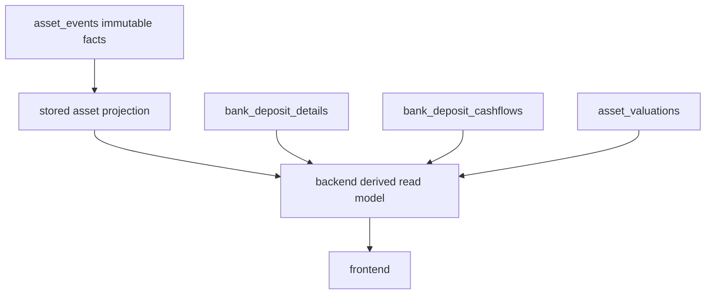
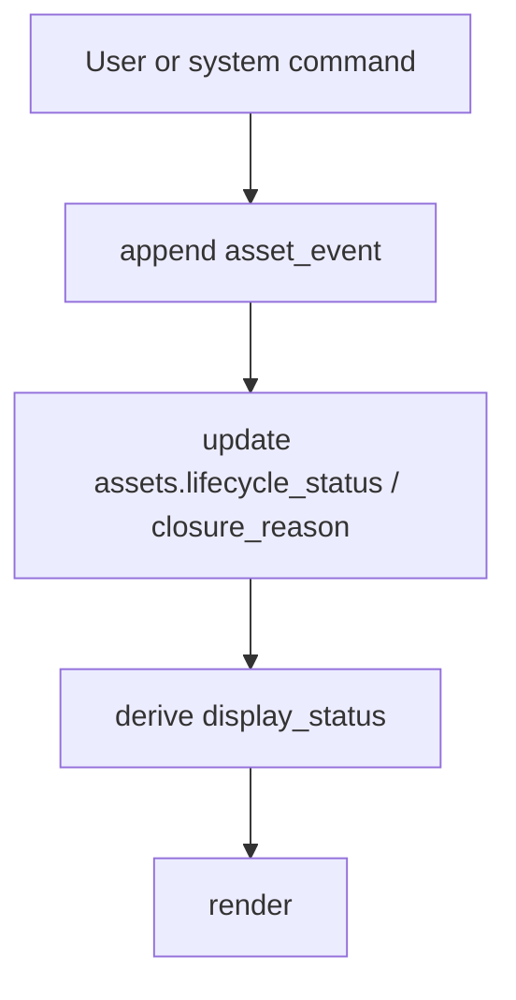

# 0032. Asset Stored Statuses and Derived Display State

Date: 2026-07-11

## Status

Proposed

## Context

ADR 0030 defines Assets as a financial support module. ADR 0031 separates the generic asset lifecycle from type-specific details such as bank deposit maturity.

The next design question is:

```text
Should asset statuses be stored in database tables, or should the backend derive them from events and facts every time?
```

There are two extremes:

```text
1. Store every possible status.
2. Store no status and derive everything from events.
```

Both extremes are risky.

Storing every display status can create stale or contradictory data:

```text
status = matured_due
but principal was already returned
```

or:

```text
status = active
but maturity date passed and no principal return exists
```

Deriving everything from events makes normal list pages expensive and awkward:

```text
Show all active assets
Show closed assets
Exclude closed assets from net-position summaries
Count current active asset value
```

Those queries should not need to replay an entire event timeline for every asset.

## Decision

Use a three-layer model:

```text
1. Immutable source:
   asset_events

2. Stored projection:
   assets.lifecycle_status
   assets.closure_reason
   assets.current_value

3. Derived read model:
   display_status
   display_label
   available_actions
   warnings
```

The database stores durable coarse truth. The backend derives nuanced product state for the frontend.



## Stored Fields

Store query-critical lifecycle fields on `assets`:

```text
assets.lifecycle_status
assets.closure_reason
assets.current_value
```

Recommended lifecycle statuses:

```text
active
closed
```

Optional later:

```text
archived
```

Recommended closure reasons:

```text
sold
gifted
disposed
lost
matured
withdrawn_early
rolled_over
cancelled
debt_settled
```

Why store these?

They support fast, stable queries:

```sql
WHERE lifecycle_status = 'active'
```

and product behavior:

```text
Show active assets
Show closed assets
Exclude closed assets from active net-position views
Filter by closure reason
```

## Derived Fields

The backend should derive richer display state.

Examples:

```text
owned
sold
gifted
disposed
lost
active_deposit
matured_due
waiting_for_principal_return
closed_matured
withdrawn_early
next_interest_due
```

These should generally be response fields, not primary stored truth.

Example API shape:

```json
{
  "id": 42,
  "lifecycle_status": "active",
  "closure_reason": null,
  "display_status": "matured_due",
  "display_label": "Matured, waiting for principal",
  "available_actions": [
    "record_principal_return",
    "roll_over",
    "remind_later"
  ],
  "warnings": []
}
```

The frontend should render the backend read model instead of recreating financial status rules locally.

## Why Date-Sensitive States Should Be Derived

Some states are true only relative to today's date and existing cashflow facts.

Deposit example:

```text
maturity_date = 2027-01-01
principal_return_event_id = null
today = 2027-01-02
```

The correct display state is:

```text
matured_due
```

But this should not require a daily scheduled job to mutate the database exactly at midnight.

Better:

```text
Stored:
assets.lifecycle_status = active
bank_deposit_details.maturity_date = 2027-01-01
principal return has not been recorded

Derived:
display_status = matured_due
display_label = "Matured, waiting for principal"
```

This avoids stale stored statuses.

## Examples

### Sold laptop

Stored:

```text
assets.lifecycle_status = closed
assets.closure_reason = sold
assets.sale_event_id = 456
```

Derived:

```text
display_status = sold
display_label = "Sold"
available_actions = []
```

### Lost phone

Stored:

```text
assets.lifecycle_status = closed
assets.closure_reason = lost
```

Derived:

```text
display_status = lost
display_label = "Lost"
available_actions = []
```

### Deposit before maturity

Stored:

```text
assets.lifecycle_status = active
assets.closure_reason = null
bank_deposit_details.maturity_date = 2027-01-01
principal_return_event_id = null
today = 2026-12-15
```

Derived:

```text
display_status = active_deposit
display_label = "Active deposit"
available_actions = [
  "record_interest",
  "withdraw_early"
]
```

### Deposit after maturity date but not paid

Stored:

```text
assets.lifecycle_status = active
assets.closure_reason = null
bank_deposit_details.maturity_date = 2027-01-01
principal_return_event_id = null
today = 2027-01-02
```

Derived:

```text
display_status = matured_due
display_label = "Matured, waiting for principal"
available_actions = [
  "record_principal_return",
  "record_principal_and_final_interest",
  "roll_over",
  "remind_later"
]
```

### Deposit after principal returned

Stored:

```text
assets.lifecycle_status = closed
assets.closure_reason = matured
principal_return_event_id = 789
```

Derived:

```text
display_status = closed_matured
display_label = "Closed: matured"
available_actions = []
```

## Relationship to Asset Events

Asset events remain the explanation layer.



Examples:

```text
SOLD
LOST
DEPOSIT_MATURED_DUE, optional event if we choose to log reminder state
PRINCIPAL_RETURNED
MATURED_CLOSED
EARLY_WITHDRAWN
ROLLED_OVER
```

Not every derived display state must have an event.

For example:

```text
matured_due
```

can be derived from:

```text
maturity_date <= today
and no principal return exists
and lifecycle_status = active
```

An event is needed when a fact changes:

```text
principal returned
asset closed
value accepted
deposit rolled over
```

## Backend Responsibilities

The backend should own:

```text
display_status derivation
display_label or label key selection
available_actions
warnings
status-driven permissions
```

The frontend should not independently decide:

```text
whether a deposit is matured_due
whether principal is still pending
whether a closed asset can be sold
whether a value draft can be accepted
```

Frontend should render the backend contract.

## Timezone Rule

Date-sensitive derived statuses must use the user's effective timezone.

Examples:

```text
today >= maturity_date
today > expected interest due date
today is after stale-price warning threshold
```

These must use Sarflog's timezone source of truth:

```text
get_effective_user_timezone
today_in_tz(user_tz)
```

Do not derive user-facing asset statuses using server-local `date.today()`.

## Consequences

Positive:

- Fast asset list queries remain simple.
- Rich display statuses stay accurate.
- Date-sensitive states do not require fragile scheduled status mutations.
- Frontend behavior stays consistent because backend owns rules.
- Asset events can rebuild or audit projections later.

Costs:

- Backend read models become more important.
- Tests must cover both stored projection updates and derived display state.
- API responses need versioned/clear fields so the frontend can migrate safely.

Risks:

- If too much logic remains in the frontend, status behavior will drift.
- If `lifecycle_status` becomes too detailed, it repeats the old overloaded status problem.
- If derived status ignores timezone, maturity and due-state behavior will be wrong for global users.

## Recommendation

Store:

```text
assets.lifecycle_status
assets.closure_reason
assets.current_value
```

Derive:

```text
display_status
display_label
available_actions
warnings
```

Use the simple rule:

```text
Store durable coarse truth.
Derive nuanced product state.
Append immutable events for facts that changed history, value, status, or wallet truth.
```
