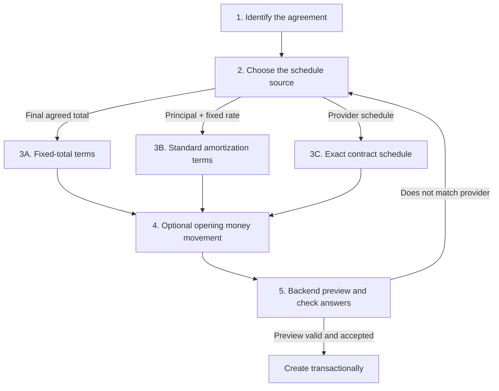

# Payment Plan Creation Wizard: Real-World Research and Product Decision

Date: 2026-07-15

## Decision

The architecture proposed in `payment-plan-mess.md` from line 820 remains a strong foundation. Its most important decision is correct: contract terms, the schedule, user actions, and the financial ledger are different truths and must not be collapsed into one mutable record.

It should be retained with the amendments below. This is refinement, not another architectural restart.

## Evidence from real-world disclosures and form design

Financial disclosures consistently distinguish the facts that determine an obligation:

- The CFPB Loan Estimate separates loan amount, term, product/rate behavior, principal and interest, other payment components, total payment, and closing costs. It also tells borrowers to verify whether a payment can change and whether unusual features exist. Source: [CFPB Loan Estimate explainer](https://www.consumerfinance.gov/owning-a-home/loan-estimate/).
- Truth in Lending disclosures distinguish the interest rate, APR, finance charge, amount financed, payment schedule, and total of payments. Therefore Sarflog must not label APR as the rate used by a standard amortization formula or silently treat all charges as interest. Source: [CFPB auto-loan Truth in Lending explanation](https://www.consumerfinance.gov/ask-cfpb/what-is-a-truth-in-lending-disclosure-for-an-auto-loan-en-787/).
- A standard fixed-payment amortization calculation is valid only under stated assumptions. It is not a universal reproduction of every lender's contract. Source: [CFPB explanation of monthly mortgage payment calculation](https://www.consumerfinance.gov/ask-cfpb/how-do-mortgage-lenders-calculate-monthly-payments-en-1965/).
- Principal and interest are not necessarily the same as the complete amount collected with a periodic payment; other amounts can remain distinct. Source: [CFPB principal-and-interest versus total payment explanation](https://www.consumerfinance.gov/ask-cfpb/on-a-mortgage-whats-the-difference-between-my-principal-and-interest-payment-and-my-total-monthly-payment-en-1941/).
- Uzbekistan's Central Bank consumer guidance says pre-contract information should state the amount and currency, term, fixed or variable interest rate, repayment start/order, liability, early repayment conditions, and other material conditions. The wizard should therefore ask for disclosed contract facts, not infer them from a product label. Source: [Central Bank of Uzbekistan consumer memo](https://cbu.uz/uz/consumer-protection/reminder-of-consumer-banking-services/?mobile=Y).
- Additional-charge research for this project found that later fees normally remain separate charge balances, while origination-known amounts are included in opening principal or contract price only when the agreement says so. Payment allocation order is contract- and jurisdiction-specific. See `payment-plan-additional-charges-real-world-research.md`.

Good government-service form guidance also supports a calm, progressive flow:

- Ask one main question per page and do not ask for the same information twice. Source: [GOV.UK question pages](https://design-system.service.gov.uk/patterns/question-pages/).
- Give users a final check-answers page with direct change links. This improves confidence and reduces submission errors. Source: [GOV.UK check answers](https://design-system.service.gov.uk/patterns/check-answers/).
- A step indicator is useful for a small number of high-level steps, but dynamic or excessively granular steps create noise. Source: [USWDS step indicator](https://designsystem.digital.gov/components/step-indicator/).

## Required architecture amendments

### 1. Lock the schedule model names

- `FIXED_TOTAL`: one final contractual total is divided across the remaining payments.
- `STANDARD_AMORTIZATION`: a deliberately narrow standard fixed-rate, equal-payment calculation.
- `EXACT_CONTRACT`: Sarflog copies the provider's dated schedule rather than inventing a calculation.

Product kind remains separate from schedule model. A vehicle purchase can be fixed-total store financing, a standard bank amortization, or an exact irregular lender schedule.

### 2. Keep principal, interest, and charges distinct

Primary schedule and ledger components are:

- `PRINCIPAL`
- `INTEREST`
- `CHARGE`

The ledger needs `interest_delta` and `balance_after_interest`, and its invariant becomes:

```text
amount_delta = principal_delta + interest_delta + charge_delta
```

Derived plan totals likewise expose remaining principal, interest, charges, and total.

### 3. Add one honest fallback for undisclosed breakdowns

Some exact provider schedules show only each installment total and do not disclose a principal/interest/charge split. Sarflog must not call the entire amount principal or invent an interest split.

Permit `UNSPECIFIED` only for an `EXACT_CONTRACT` installment whose provider breakdown is not available. In the UI, label this as `Provider did not show a breakdown`, not as a fourth financial concept the user must learn.

Rules:

- An installment may contain known principal, interest, and charge components, or one unspecified total.
- It cannot mix `UNSPECIFIED` with known components.
- If the provider later supplies a breakdown, an append-only schedule change replaces the classification without rewriting history.

### 4. Narrow standard amortization instead of pretending

Version one supports only:

- fixed nominal annual interest rate;
- monthly payments;
- equal-payment, fully amortizing calculation;
- no balloon payment;
- no interest-only period;
- no variable rate;
- no daily-accrual, 360-day, grace-period, or lender-specific convention.

The periodic rate is the nominal annual rate divided by 12, and the standard payment formula is:

```text
A = P × r × (1 + r)^n / ((1 + r)^n - 1)
```

For a zero rate, `A = P / n`. Use decimal arithmetic and place the currency rounding remainder into the final installment. If the agreement does not fit these assumptions, route the user to `EXACT_CONTRACT`.

### 5. Do not encode one universal payment waterfall

Store an explicit allocation-policy identifier/version and persist the actual allocations made by every payment. Do not ask a normal user to configure this in the creation wizard. The applicable product/jurisdiction policy belongs in backend policy resolution and can be disclosed later in plan details.

### 6. Remove unrelated creation concerns

The creation flow must not ask about assets, projects, capitalization, write-offs, allocation overrides, or advanced accounting categories. Asset integration is deferred until Payment Plans are stable. Category/project/accounting preferences can be added later from Details without changing the contract or schedule.

### 7. Do not build the optional read projection yet

Keep the projection described in the architecture as a later performance optimization. First prove reconciliation from schedule rows, actions, allocations, and ledger entries.

## Wizard product contract

Use a dedicated page such as `/payment-plans/new`, not a large multi-purpose modal. The functional layout should be a single calm column. This is workflow design, not the future visual-design sprint.

The user sees five high-level stages:



The technical enum is never the question shown to the user.

## Stage 1: Identify the agreement

Main question: **What are you paying over time?**

Options:

- Store purchase / buy now, pay later
- Bank or microloan
- Vehicle financing
- Home financing
- Education financing
- Service contract
- Other scheduled obligation

Then ask only:

- Plan name — required
- Provider — optional
- Agreement date — optional
- Currency — default from the user's app settings, changeable

Display a small boundary note:

> Use a Payment Plan when an agreement has scheduled amounts or due dates. A revolving credit-card balance belongs in Debts.

Product kind provides labels and sensible defaults. It never determines the calculation by itself.

## Stage 2: Choose the source of schedule truth

Main question: **What does your agreement give you?**

Present three plain-language cards in this order:

1. **Exact payment dates and amounts** — “I have the provider's schedule.” This maps to `EXACT_CONTRACT` and is the most faithful option.
2. **Principal, fixed annual rate, and number of monthly payments** — “Sarflog can calculate a standard schedule.” This maps to `STANDARD_AMORTIZATION`.
3. **One final amount split into payments** — “There is no separate interest calculation to reproduce.” This maps to `FIXED_TOTAL`.

Include “Help me choose” guidance:

- If the provider gave exact dated amounts, use them.
- If it gave principal plus a fixed nominal rate and regular monthly term, standard amortization may be used.
- If it gave only a final agreed price/total and a number of payments, use fixed total.

Do not show `FIXED_TOTAL`, `STANDARD_AMORTIZATION`, or `EXACT_CONTRACT` as labels in the normal UI.

## Stage 3A: Fixed-total terms

Ask:

- **What is the final total agreed with the provider?**
- **How much of that total was already paid before the remaining schedule?** Optional; default zero.
- **How many payments are still left?** Do not ask for the original count when some were already paid.
- **How often are they due?**
- **When is the first remaining payment due?**

Backend behavior:

```text
remaining contract amount = final agreed total - already paid
regular installment = remaining amount / remaining payment count
final installment absorbs the integer-currency remainder
```

Disclosure:

> Sarflog is dividing the agreed remaining total. It is not calculating interest.

If seller markup or a fee is already included in the final total and is not separately itemized, the user must not enter it again as a charge.

## Stage 3B: Standard amortization terms

Begin with an eligibility check:

> Is the rate fixed, are payments monthly, and is there no balloon or interest-only period?

If no or unsure, route to exact contract.

Ask:

- **What principal amount is shown in the agreement?** Helper: this is not necessarily cash received.
- **What fixed nominal annual interest rate is shown?** Helper: do not enter APR.
- **How many monthly payments are in the agreement?**
- **When is the first payment due?**

The backend calculates every principal/interest component. The frontend performs no authoritative calculation.

Disclosure:

> This is Sarflog's standard fixed-rate monthly calculation. Compare it with your provider's schedule before creating the plan.

If the preview differs, provide a direct action: **Use my provider's exact schedule instead**.

## Stage 3C: Exact contract schedule

First ask:

**Does the provider show a principal, interest, and fee breakdown for each installment?**

- Yes: show columns for due date, principal, interest, and separate charge.
- No: show due date and total only; store the amount as `UNSPECIFIED`, labelled “Provider did not show a breakdown.”

Then ask how the user wants to enter it:

- Repeat a regular payment and then edit exceptions
- Paste/import a provider schedule
- Enter rows manually

The editor groups components by installment number. It should support fast date generation and copying the previous row; a user must not type 60 dates one by one.

Validation:

- every installment has a due date and positive total;
- known components add up to the installment total;
- an installment cannot mix unspecified and itemized components;
- input order does not determine truth; rows are normalized and ordered by due date/number by the backend;
- duplicate or ambiguous installment identifiers are rejected clearly.

## Known separate charges during creation

Do not make charges a full stage. After the branch terms, ask only when relevant:

**Does the agreement list any separate amount that is not already included above?**

If yes, capture charge kind, amount, due date, and optional note. Create a `CHARGE` schedule component. The review must show it separately.

Never add the same amount both into principal/final total and as a charge.

## Stage 4: Optional opening money movement

This stage records reality in wallets; it does not determine the schedule.

For an upfront payment:

**Do you want to record that payment from a wallet now?**

- Record it now
- It was already recorded
- Track the contract only

For a loan:

**Did loan money actually enter one of your wallets?**

If yes, ask for the actual amount received and destination wallet. Never assume it equals principal: a lender may withhold a fee. Borrowed money is not income.

No asset, project, or capitalization question appears here.

## Stage 5: Mandatory backend preview and check answers

The review page is not decoration. Creation is disabled until the backend returns a valid preview.

Show:

- plan and provider;
- the source of truth: “copied from provider,” “standard fixed-rate calculation,” or “divided from final total”;
- original/final amount, already paid, principal, interest, charges, and unspecified amount as applicable;
- total remaining obligation;
- payment count and frequency;
- first, next, and final due date;
- regular payment and different final payment when rounding applies;
- first three and last schedule installments, with “show full schedule”;
- assumptions and warnings;
- a Change link for every section.

For standard amortization, require an explicit confirmation:

> I compared this preview with my agreement and the payment amounts match.

Do not silently fall back to client math or permit creation when preview fails.

## Backend request shape

Use a discriminated union instead of one large schema full of nullable fields:

```text
CreatePaymentPlanRequest
  common
    name
    provider_name?
    product_kind
    currency
    contract_date?

  schedule = one of
    FixedTotalTerms
      model = FIXED_TOTAL
      final_total_amount
      already_paid_amount
      remaining_payment_count
      frequency
      first_due_date

    StandardAmortizationTerms
      model = STANDARD_AMORTIZATION
      principal_amount
      nominal_annual_rate_bps
      payment_count
      frequency = MONTHLY
      first_due_date
      calculation_method = STANDARD_FIXED_PAYMENT

    ExactContractTerms
      model = EXACT_CONTRACT
      installments[]
        installment_number
        due_date
        components[] OR unspecified_total

  separately_disclosed_charges[]?
  opening_money_movement?
```

The preview endpoint consumes the same schedule union as creation. Its response includes:

- generator/calculation version;
- normalized schedule;
- component totals;
- assumptions and warnings;
- a fingerprint or signed preview token derived from the normalized input.

At creation, the backend revalidates or regenerates the schedule transactionally and verifies the preview fingerprint. This prevents stale preview/create drift.

## Validation and truthfulness rules

- All authoritative amounts and dates are generated or validated by the backend.
- Use integer minor units for stored money and decimal arithmetic for formulas; never binary floating point.
- User-facing “today” and date validation use the effective user timezone.
- Zero interest is valid.
- `already_paid_amount` cannot exceed `final_total_amount`.
- A failed preview is a blocking error, not a missing optional panel.
- The UI never relabels APR as nominal rate.
- The UI never invents a principal/interest split.
- The UI never adds an included fee twice.
- The created schedule, opening ledger entry, and action stream reconcile in one transaction.

## What to remove from the current wizard

- Asset creation and asset eligibility
- Project/subcategory wiring
- The technical schedule-model selector
- One mega-state object with fields from every branch
- Client-side authoritative financial math
- Silent preview failure
- Manual rows limited to principal/charge with no interest
- Creation schemas that mix flat, amortized, and manual fields as nullable values

Reusable low-level controls can remain, but the current interaction model and payload shape should be replaced.

## Acceptance criteria for the future implementation

1. A store plan can be created from a final total without pretending to calculate interest.
2. A simple fixed-rate monthly loan produces a fully reconciling principal/interest schedule.
3. A complex, variable, balloon, daily-interest, or irregular agreement is directed to exact contract.
4. A provider schedule can be captured even when it does not disclose its component split, without falsely labelling the balance.
5. Separately disclosed fees remain charges and are never double counted.
6. Wallet movement is optional and never changes the mathematical meaning of the contract.
7. Preview and creation use the same backend contract and calculation version.
8. The plan can be created without any asset, project, write-off, archive, or advanced-allocation decision.
9. Every created plan reconciles schedule totals, opening ledger components, and derived remaining balance.
10. The review screen states exactly which values came from the user/provider and which were calculated by Sarflog.

## Final recommendation

Keep the four-truth architecture. Apply the amendments above, then treat this wizard contract as an input boundary for the backend rebuild. Implement the backend preview/generators before rebuilding the visual wizard. That sequence allows the later UI/UX sprint to change cards, spacing, mobile layouts, and styling without changing financial truth or endpoint semantics.
