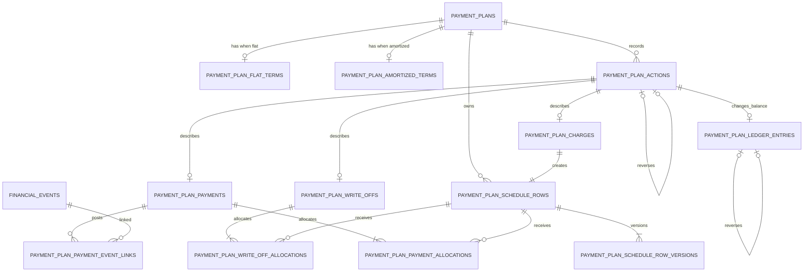
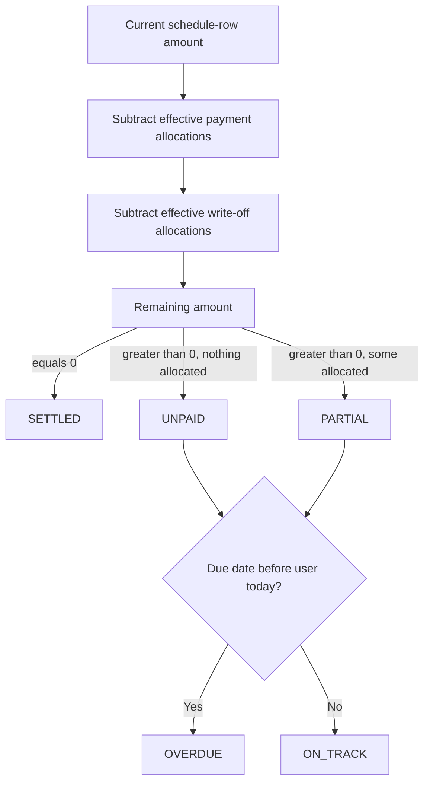
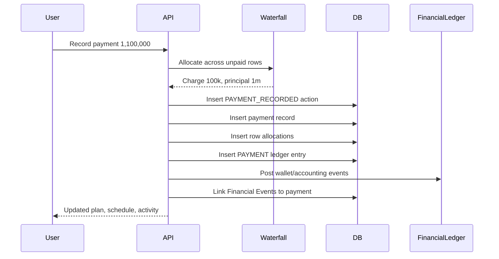
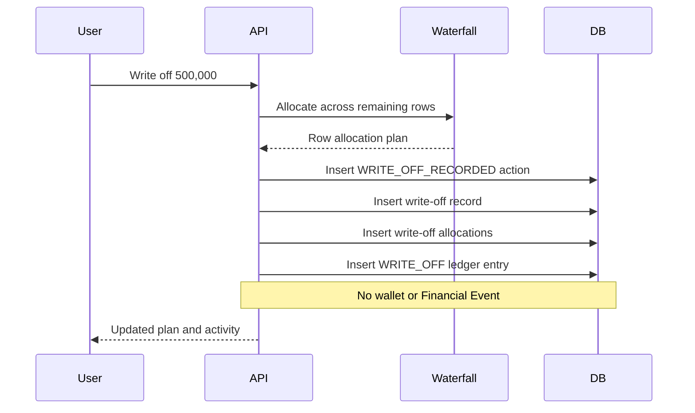
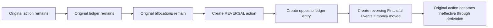
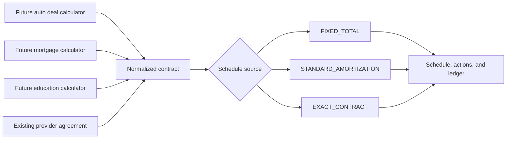
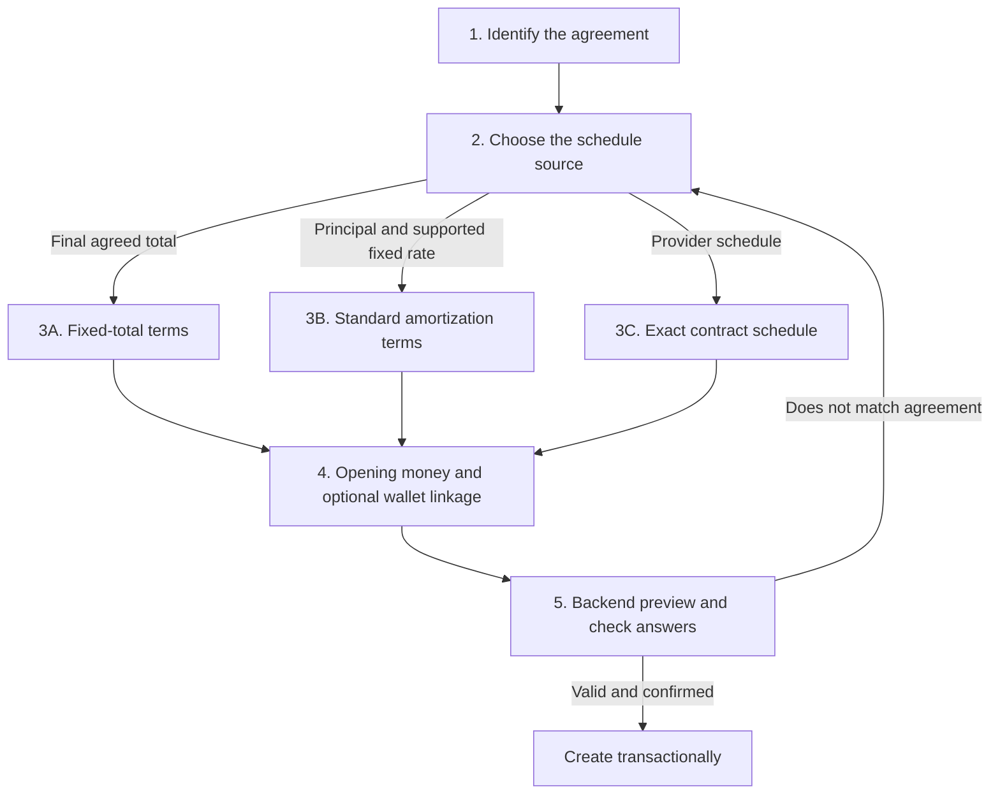

Audit verdict
No—Debts and Payment Plans are not 100% aligned with ADRs 26–29.
Debt backend: largely implemented and well tested.
Debt frontend: mostly wired, but payment-allocation controls and some required wording are missing.
Payment Plan backend: broad foundations exist, but several ADR actions are missing or unsafe.
Payment Plan frontend: not production-complete for amortized/manual schedules, row actions, history, or archive safety.
What the ADRs require
Debt actions
Based on [ADR 26 (line 19)](/C:/Users/me/Desktop/MyPROJECTS/ExpenseTracker/docs/adr/0026-debt-derived-state-and-taxonomy-simplification.md:19) and [ADR 27 (line 144)](/C:/Users/me/Desktop/MyPROJECTS/ExpenseTracker/docs/adr/0027-debt-ledger-actions-principal-charges-and-reversals.md:144), Debt should support:
Action Expected behavior
Record payment Automatic, charges-first, principal-first, or custom allocation
Add charge Add interest, fee, penalty, or similar non-principal balance
Forgive balance Partial/full, explicitly targeting principal or charges
Adjust balance Guarded correction, distinct from payment or forgiveness
Reverse entry Append-only, latest-first reversal; reverse wallet event too
Archive / restore Visibility only; does not change financial lifecycle
Link asset metadata Limited metadata/future asset-settlement support
Create Debt Separate principal, opening charges, and wallet movement

Debt state must be derived:
Ledger facts
↓
remaining principal + remaining charges
↓
OPEN / CLOSED
ON_TRACK / OVERDUE / null
↓
Frontend display
Payment Plan creation and actions
[ADR 28 (line 26)](/C:/Users/me/Desktop/MyPROJECTS/ExpenseTracker/docs/adr/0028-payment-plan-schedule-models-and-contract-review.md:26) requires:
FLAT_TOTAL
AMORTIZED_LOAN
MANUAL_CONTRACT_SCHEDULE
Reviewable schedule preview
Whole-schedule waterfall: oldest date, then charges before principal
[ADR 29 (line 270)](/C:/Users/me/Desktop/MyPROJECTS/ExpenseTracker/docs/adr/0029-payment-plan-row-actions-write-offs-and-architecture-cleanup.md:270) requires:
Row actions Plan actions
Pay row Record waterfall payment
Partial-pay row Add fee/penalty
Write off remaining/custom amount Write off/settle plan balance
Edit due date Edit metadata
Add row note Edit future schedule
View row history Reverse latest ledger action
Archive/unarchive
Delete only while pristine

Target architecture:
Contract
↓
Schedule model
↓
Grouped schedule rows
↓
Payments / charges / write-offs
↓
Action-specific allocations
↓
Immutable plan ledger
↓
Derived balances and settlement state
↓
UI
Coverage map
Legend: ✅ complete, 🟡 partial, ❌ missing, 🔴 correctness/safety defect.
Debt
Requirement Backend Frontend
Derived lifecycle/time state ✅ 🟡 Uses fields, but generally displays “Open” instead of “On track”
Remove DebtProductKind ✅ ✅
Separate archive from state ✅ ✅
Principal + opening charges + wallet movement ✅ 🟡 Form exists, but review summary understates starting balance
Add charge ✅ ✅
Forgiveness by component ✅ ✅
Balance adjustment ✅ ✅
Latest-first append-only reversal ✅ ✅ Active details UI uses it
Explicit payment allocation modes ✅ ❌
Updated deferred-expense wording N/A ❌ Still says “Someone paid for me”
Link formal/asset metadata 🟡 API exists ❌ No active UI

The backend correctly implements the four allocation modes in [schemas.py (line 3560)](/C:/Users/me/Desktop/MyPROJECTS/ExpenseTracker/app/schemas.py:3560) and [debts.py (line 84)](/C:/Users/me/Desktop/MyPROJECTS/ExpenseTracker/app/routers/debts.py:84). But the active payment form sends only amount, date, note, and wallets; it never exposes or sends allocation_mode, principal_amount, or charge_amount in [DebtDetailsDialog.jsx (line 89)](/C:/Users/me/Desktop/MyPROJECTS/ExpenseTracker/frontend/src/features/obligations/components/DebtDetailsDialog.jsx:89).
That means the backend silently uses charges-first. ADR 27 explicitly says the default must be visible.
There is also a dangerous legacy route: DELETE /debts/transactions/{id} deletes Financial Events and the source transaction in [debts.py (line 2008)](/C:/Users/me/Desktop/MyPROJECTS/ExpenseTracker/app/routers/debts.py:2008). That conflicts with the full append-only story, even though it appends Debt ledger reversal rows. The frontend API still exposes it in [debts.js (line 117)](/C:/Users/me/Desktop/MyPROJECTS/ExpenseTracker/frontend/src/lib/api/debts.js:117), although the component using it is currently dead/unmounted code.
Payment Plans
Requirement Backend Frontend
Flat schedule 🟡 First-due-date bug 🟡 Preview available
Amortized schedule 🟡 Generation works, regular payment is wrong 🔴 Preview contract/display broken
Manual schedule 🟡 Backend model exists, totals can diverge 🔴 Payload is incompatible
Schedule preview ✅ endpoint 🟡 Only flat is reliably usable
Waterfall allocation ✅ ✅ plan payment
Installment grouping ✅ field ❌ UI shows separate unrelated rows
Row full payment ✅ ❌ API/hook only
Row partial payment ❌ Direct row action absent ❌
Row custom write-off ✅ ❌ UI only writes off full remainder
Plan write-off ✅ ❌ API/hook exist, no UI
Add charge ✅ ✅
Undo latest payment 🟡 Loses allocation/transaction history ✅
Undo charge 🟡 ❌ API/hook exist, no UI
Generic reverse-latest action ❌ ❌
Edit row due date/note ❌ ❌
View row/plan history 🟡 Data exists ❌ Activity is not rendered
Archive/unarchive 🔴 Guard checks wrong field 🔴 Archived plans can still be paid
Delete pristine 🟡 Flat only 🟡 Amortized plans appear non-pristine
Derived settlement vocabulary 🟡 Both old and new exposed ❌ UI primarily uses legacy status

Most serious confirmed defects

1. Manual schedule creation is broken end-to-end
   Backend expects:
   {
   "due_date": "2026-08-10",
   "component_type": "PRINCIPAL",
   "amount": 1000000,
   "installment_number": 1
   }
   The UI sends:
   {
   "due_date": "2026-08-10",
   "principal_amount": "...",
   "charge_amount": "...",
   "installment_group": "..."
   }
   Compare [the backend schema (line 3844)](/C:/Users/me/Desktop/MyPROJECTS/ExpenseTracker/app/schemas.py:3844) with [the frontend state and request (line 303)](/C:/Users/me/Desktop/MyPROJECTS/ExpenseTracker/frontend/src/features/obligations/components/PaymentPlansTab.jsx:303). The request lacks required amount, so it should receive a validation error.
   Even after fixing that, backend manual creation uses required total_price as principal instead of deriving principal from manual rows in [payment_plans.py (line 853)](/C:/Users/me/Desktop/MyPROJECTS/ExpenseTracker/app/routers/payment_plans.py:853). That can make plan balance disagree with its rows.
2. Amortized preview and display are incorrect
   The preview endpoint requires principal in [schemas.py (line 4034)](/C:/Users/me/Desktop/MyPROJECTS/ExpenseTracker/app/schemas.py:4034). The frontend sends total_price and interest rate, but not principal, in [PaymentPlansTab.jsx (line 367)](/C:/Users/me/Desktop/MyPROJECTS/ExpenseTracker/frontend/src/features/obligations/components/PaymentPlansTab.jsx:367). The UI catches the failure and silently removes the preview.
   Additional problems:
   UI always initializes and sends FLAT_TOTAL, overriding the backend’s bank-loan/mortgage default mapping.
   CHARGE preview rows are shown in the Principal column in [PaymentPlansTab.jsx (line 825)](/C:/Users/me/Desktop/MyPROJECTS/ExpenseTracker/frontend/src/features/obligations/components/PaymentPlansTab.jsx:825).
   Backend sets regular_payment_amount to the first schedule row. For amortized schedules, the first row is normally only interest—not the full installment—in [payment_plans.py (line 920)](/C:/Users/me/Desktop/MyPROJECTS/ExpenseTracker/app/routers/payment_plans.py:920).
   The UI does not group CHARGE and PRINCIPAL rows by installment_number.
   A bank loan can therefore look like six unrelated rows instead of three payments, and its displayed “regular payment” may be only the interest portion.
3. Payment Plan write-off undo can reverse the wrong row
   undo-write-off finds the latest WRITE_OFF for the entire plan, not the requested row, in [payment_plans.py (line 2023)](/C:/Users/me/Desktop/MyPROJECTS/ExpenseTracker/app/routers/payment_plans.py:2023).
   It then changes the selected row while creating a reversal pointing at that plan-wide entry. With write-offs on multiple rows, undoing row A can reference row B’s write-off.
   The latest-first guard also compares only entry_date, not (entry_date, id), in [payment_plans.py (line 2055)](/C:/Users/me/Desktop/MyPROJECTS/ExpenseTracker/app/routers/payment_plans.py:2055). Multiple actions recorded on the same date can bypass ordering protection.
4. Undo is not fully append-only
   Payment Plan payment undo appends reversal ledger entries, but deletes allocation rows and the PaymentPlanTransaction in [payment_plans.py (line 1534)](/C:/Users/me/Desktop/MyPROJECTS/ExpenseTracker/app/routers/payment_plans.py:1534).
   That loses the exact historical explanation of which rows the original payment touched. ADR 29 explicitly says allocations should explain action history.
   Write-offs also create PaymentPlanTransaction records in [payment_plans.py (line 1926)](/C:/Users/me/Desktop/MyPROJECTS/ExpenseTracker/app/routers/payment_plans.py:1926), despite ADR 29 explicitly saying non-payment actions must stop using payment transactions.
5. Archived Payment Plans are not reliably locked
   The archive route correctly sets archived_at in [payment_plans.py (line 2426)](/C:/Users/me/Desktop/MyPROJECTS/ExpenseTracker/app/routers/payment_plans.py:2426).
   But payment, edit, charge, write-off, and undo routes generally check:
   plan.status == PaymentPlanStatus.ARCHIVED
   They do not check archived_at; see [payment_plans.py (line 1403)](/C:/Users/me/Desktop/MyPROJECTS/ExpenseTracker/app/routers/payment_plans.py:1403).
   The frontend repeats the mismatch:
   Details dialog checks stored status in [PaymentPlansTab.jsx (line 1277)](/C:/Users/me/Desktop/MyPROJECTS/ExpenseTracker/frontend/src/features/obligations/components/PaymentPlansTab.jsx:1277).
   Cards recognize archived_at, but the Pay button does not disable itself for archived plans in [PaymentPlansTab.jsx (line 1556)](/C:/Users/me/Desktop/MyPROJECTS/ExpenseTracker/frontend/src/features/obligations/components/PaymentPlansTab.jsx:1556).
   So an archived open plan can still be paid.
6. Payment Plan time and settlement state are not truthfully wired
   List and details responses build enriched plans without passing the user timezone in [payment_plans.py (line 1347)](/C:/Users/me/Desktop/MyPROJECTS/ExpenseTracker/app/routers/payment_plans.py:1347). Therefore the main UI commonly receives time_status: null.
   The summary also treats due-today rows as overdue: pending uses due_date > today, while overdue uses due_date <= today, in [payment_plans.py (line 1120)](/C:/Users/me/Desktop/MyPROJECTS/ExpenseTracker/app/routers/payment_plans.py:1120). ADR 29 says overdue is strictly due_date < today.
   Furthermore, “Paid this month” sums the generic allocation table, which also holds write-offs and reversal allocations. A moneyless write-off can therefore be counted as paid money.
   The model still stores PENDING/PARTIAL/PAID/SKIPPED in [models.py (line 320)](/C:/Users/me/Desktop/MyPROJECTS/ExpenseTracker/app/models.py:320), while the UI labels any row with any write-off amount as “WRITTEN OFF” in [PaymentPlansTab.jsx (line 205)](/C:/Users/me/Desktop/MyPROJECTS/ExpenseTracker/frontend/src/features/obligations/components/PaymentPlansTab.jsx:205). A partially paid, partially written-off, still-open row is therefore mislabeled.
   Recommended repair order
   Protect history and reversals.
   Add one plan-wide reversal service.
   Enforce latest unreversed entry by stable ordering.
   Scope row reversals to the row.
   Never delete original transactions or allocations.
   Introduce write-off-specific allocation/action records.

Fix creation contracts.
Send principal for amortized preview.
Transform each manual installment into explicit CHARGE/PRINCIPAL rows.
Derive manual totals from rows.
Use the entered first due date as the first row.
Calculate installment amount from grouped rows.
Block Create when preview fails.

Fix archive and derived state.
Use archived_at everywhere.
Remove ARCHIVED from stored financial status logic.
Pass timezone into list/details builders.
Make due today ON_TRACK.
Exclude write-offs from paid-money summaries.

Complete the action surface.
Row pay/partial pay.
Custom row write-off.
Edit due date.
Add/view notes and row history.
Plan write-off UI.
Edit future schedule.
Generic reverse-latest action.
Render actual plan activity.

Finish Debt frontend alignment.
Expose all four allocation modes and show charges-first as the default.
Broaden “Someone paid for me” to unpaid work/services/goods/bills.
Show opening principal, opening charges, starting balance, and wallet movement separately in review.
Retire the legacy transaction-deletion client/components.

Verification performed
Debt Docker tests: 71 passed
Payment Plan Docker tests: 82 passed
Frontend production build: passed
No files were changed.
The green tests show that the implemented foundation works according to current coverage. They do not cover the broken frontend payloads, multi-row write-off reversal bug, actual archived_at locking, due-today summary boundary, or missing UI actions. Payment Plans—especially amortized and manual plans—should not yet be considered ADR-complete or fully safe.

Hey—take a breath. You did not waste a month or build everything wrong.
You built a substantial foundation:
Debt ledger architecture is mostly sound.
All four Debt payment-allocation modes exist in the backend.
Three Payment Plan schedule models exist.
Waterfall allocation, charges, write-offs, reversals, derived balances, and archive metadata exist.
153 targeted backend tests pass, and the frontend builds successfully.
The real problem is narrower: several pieces were developed independently but never fully reconciled at the backend–API–UI seams. That creates many visible symptoms from a relatively small number of architectural causes.
It looks like 25 separate problems
↓
But most come from roughly 5 root problems

1. Frontend/backend request contracts drifted
2. Old status architecture remains beside derived state
3. Reversal logic is duplicated instead of centralized
4. Payment and write-off histories share the wrong abstractions
5. UI action coverage stopped halfway through
   So yes, it needs fixing—but this is a cleanup and completion project, not a restart.
   I would tackle it in this order:
   Make reversals and archive behavior safe.
   Repair amortized/manual creation contracts.
   Correct derived statuses, totals, and installment grouping.
   Wire the missing row and plan actions.
   Finish the smaller Debt UI gaps and remove legacy paths.
   Add end-to-end contract tests so this cannot drift again.
   The encouraging part is that we now have a precise map. You are no longer spending tokens guessing, layering patches, or discovering inconsistencies one by one. We know where the danger is and what should remain untouched.
   You created a capable system that grew faster than its integration discipline. That is fixable—and far better than having nothing useful underneath.

3:20 PM

6 annotations

Yes—your memory is correct. The implementation drifted away from the ADR decision.
Debt payment allocation
The backend already supports:
Automatic allocation, currently charges first
Charges first
Principal first
Custom split between principal and charges
It is still one payment with one wallet total, but the user can decide which component that payment reduces. The active frontend sends no allocation choice, so every payment silently uses automatic charges-first.
Deferred-expense wording
Agreed: keep the enum DEFERRED_EXPENSE, but postpone the copy improvement until the larger UI cleanup.
The eventual replacement for “Someone paid for me” should cover:
I received work, services, goods, or another benefit and need to pay later.

That UI task does not block backend stabilization.
Debt–asset integration
Agreed: defer it.
For now, I would remove or hide LINK_ASSET from the active Debt action contract while retaining only whatever dormant schema/database support is harmless. Debt–asset settlement should become a separate later project after Debt is stable.
Legacy Debt routes
Also agreed. DELETE /debts/transactions/{id} and unused frontend clients/components are dangerous because they provide an alternative to the canonical reversal flow.
The safe cleanup sequence is:
Inventory all legacy Debt routes and consumers.
Prove which are unused.
Replace remaining callers with ledger-backed actions.
Add tests asserting the legacy routes no longer exist.
Delete the routes, API wrappers, hooks, dead components, and obsolete schemas together.
We should specifically remove stale frontend functions such as updatePayment, generatePaymentPlans, and deleteTransaction once their absence of legitimate callers is confirmed.
The Payment Plan row-state decision
Your recollection is exactly right. [ADR 29 (line 114)](/C:/Users/me/Desktop/MyPROJECTS/ExpenseTracker/docs/adr/0029-payment-plan-row-actions-write-offs-and-architecture-cleanup.md:114) decided to replace this conceptual model:
PENDING
PARTIAL
PAID
SKIPPED
with:
UNPAID
PARTIAL
SETTLED
The state should be derived from money facts:
remaining = amount - paid_amount - written_off_amount

UNPAID
paid_amount = 0
written_off_amount = 0

PARTIAL
remaining > 0
paid_amount + written_off_amount > 0

SETTLED
remaining = 0
Then the UI derives a more descriptive label:
Financial facts UI label
paid_amount == amount Paid
written_off_amount == amount Written off
Paid and written-off amounts together settle the row Settled
Some amount handled but balance remains Partial
Nothing handled and due date has not passed Unpaid / On track
Nothing or only part handled and due date has passed Unpaid or Partial + Overdue

OVERDUE is not a stored settlement status:
remaining > 0
and due_date < today_in_user_timezone
SKIPPED should disappear completely. A real row cannot mysteriously be “skipped”; it must remain unpaid, be rescheduled, paid, written off, or reversed.
The current implementation still stores the old enum in [models.py (line 320)](/C:/Users/me/Desktop/MyPROJECTS/ExpenseTracker/app/models.py:320). Although the API adds settlement_state, the legacy status remains writable and the frontend still relies on it. That is ADR drift.
The proper fix is not to rename the database enum values. It is to make amounts and allocations the truth:
Schedule row
amount
paid_amount
written_off_amount
due_date

       ↓ derive

settlement_state: UNPAID | PARTIAL | SETTLED
time_status: ON_TRACK | OVERDUE | null
display_label: Paid | Written off | Settled | Partial | Unpaid
Then remove:
PaymentPlanPaymentStatus
The stored row status column
Every assignment such as payment.status = PAID
Every frontend condition using payment.status
All SKIPPED handling
Why Payment Plans keep feeling cursed
The financial concept is not inherently cursed. The module keeps becoming difficult because five different truths have been packed into the same records:
Contract math
Schedule expectations
Wallet payments
Forgiveness/corrections
Current UI status
They need firm boundaries:
Schedule rows → What the contract expects
Payment allocations → What wallet payments settled
Write-off allocations → What was forgiven
Ledger entries → Historical actions and reversals
Derived state → Where each row and plan stands now
Once those boundaries are enforced, most status and undo problems disappear naturally.
The next attempt should not be another broad Payment Plan refactor. It should first freeze these invariants, remove contradictory legacy state, and then implement one vertical action at a time with contract tests. That is how we prevent a fifth rewrite.

Yes—your memory is correct. The implementation drifted away from the ADR decision.
Debt payment allocation
The backend already supports:
Automatic allocation, currently charges first
Charges first
Principal first
Custom split between principal and charges
It is still one payment with one wallet total, but the user can decide which component that payment reduces. The active frontend sends no allocation choice, so every payment silently uses automatic charges-first.
Deferred-expense wording
Agreed: keep the enum DEFERRED_EXPENSE, but postpone the copy improvement until the larger UI cleanup.
The eventual replacement for “Someone paid for me” should cover:
I received work, services, goods, or another benefit and need to pay later.

That UI task does not block backend stabilization.
Debt–asset integration
Agreed: defer it.
For now, I would remove or hide LINK_ASSET from the active Debt action contract while retaining only whatever dormant schema/database support is harmless. Debt–asset settlement should become a separate later project after Debt is stable.
Legacy Debt routes
Also agreed. DELETE /debts/transactions/{id} and unused frontend clients/components are dangerous because they provide an alternative to the canonical reversal flow.
The safe cleanup sequence is:
Inventory all legacy Debt routes and consumers.
Prove which are unused.
Replace remaining callers with ledger-backed actions.
Add tests asserting the legacy routes no longer exist.
Delete the routes, API wrappers, hooks, dead components, and obsolete schemas together.
We should specifically remove stale frontend functions such as updatePayment, generatePaymentPlans, and deleteTransaction once their absence of legitimate callers is confirmed.
The Payment Plan row-state decision
Your recollection is exactly right. [ADR 29 (line 114)](/C:/Users/me/Desktop/MyPROJECTS/ExpenseTracker/docs/adr/0029-payment-plan-row-actions-write-offs-and-architecture-cleanup.md:114) decided to replace this conceptual model:
PENDING
PARTIAL
PAID
SKIPPED
with:
UNPAID
PARTIAL
SETTLED
The state should be derived from money facts:
remaining = amount - paid_amount - written_off_amount

UNPAID
paid_amount = 0
written_off_amount = 0

PARTIAL
remaining > 0
paid_amount + written_off_amount > 0

SETTLED
remaining = 0
Then the UI derives a more descriptive label:
Financial facts UI label
paid_amount == amount Paid
written_off_amount == amount Written off
Paid and written-off amounts together settle the row Settled
Some amount handled but balance remains Partial
Nothing handled and due date has not passed Unpaid / On track
Nothing or only part handled and due date has passed Unpaid or Partial + Overdue

OVERDUE is not a stored settlement status:
remaining > 0
and due_date < today_in_user_timezone
SKIPPED should disappear completely. A real row cannot mysteriously be “skipped”; it must remain unpaid, be rescheduled, paid, written off, or reversed.
The current implementation still stores the old enum in [models.py (line 320)](/C:/Users/me/Desktop/MyPROJECTS/ExpenseTracker/app/models.py:320). Although the API adds settlement_state, the legacy status remains writable and the frontend still relies on it. That is ADR drift.
The proper fix is not to rename the database enum values. It is to make amounts and allocations the truth:
Schedule row
amount
paid_amount
written_off_amount
due_date

       ↓ derive

settlement_state: UNPAID | PARTIAL | SETTLED
time_status: ON_TRACK | OVERDUE | null
display_label: Paid | Written off | Settled | Partial | Unpaid
Then remove:
PaymentPlanPaymentStatus
The stored row status column
Every assignment such as payment.status = PAID
Every frontend condition using payment.status
All SKIPPED handling
Why Payment Plans keep feeling cursed
The financial concept is not inherently cursed. The module keeps becoming difficult because five different truths have been packed into the same records:
Contract math
Schedule expectations
Wallet payments
Forgiveness/corrections
Current UI status
They need firm boundaries:
Schedule rows → What the contract expects
Payment allocations → What wallet payments settled
Write-off allocations → What was forgiven
Ledger entries → Historical actions and reversals
Derived state → Where each row and plan stands now
Once those boundaries are enforced, most status and undo problems disappear naturally.
The next attempt should not be another broad Payment Plan refactor. It should first freeze these invariants, remove contradictory legacy state, and then implement one vertical action at a time with contract tests. That is how we prevent a fifth rewrite.

nah bro I am not liking payment plans at all, especially the UI and creation wizard has become a big big cluttered mess. Let's strip away the entire payment plan creation wizard and rebuild from scratch to make production ready and aligned with how reallife works.Also, I was thinking of ideas of separating Details, View Activities(the timeline) , actions for payment plans as well for Debts. but my bigger concern now is payment plans because i am not being able to sleep at night for the last 2 days stressing about it , it is giving me vibes where you are having diarrhea and nause but cant throw up.So bro let me throw up, let me get all these toxins out of my soul by fixing this payment plans once and forever.You can help me with that? So what is your take on my suggestion?

4:08 PM

Worked for 43s

My senior-engineer read: yes, throw away the existing Payment Plan creation wizard and rebuild that experience from scratch. But keep the valuable backend foundations. This should be a UI/product-contract reset, not a blind demolition of the entire domain.
And bro—if the nausea, diarrhea, or two nights without sleep are literal, please step away and take care of your body or contact a medical professional. The module can wait; your health cannot.
What I would discard versus preserve
Discard
The current creation wizard
Its local state and conditional-step machinery
Frontend schedule calculations
The current manual-row form and payload conversion
Stored PENDING/PARTIAL/PAID/SKIPPED row-state assumptions
The existing Payment Plan details dialog layout
UI actions inferred from old stored status
Dead and duplicated action paths
Preserve
Flat schedule generator
Amortization calculations, after correcting defects
Manual schedule validation concept
Waterfall allocation
Plan-owned ledger
Payment Financial Events
Principal/charge component modeling
Existing migrations and useful tests
archived_at
Schedule preview endpoint, after its contract is corrected
Current module
├── Valuable financial machinery KEEP + HARDEN
├── Contradictory legacy state REMOVE
├── Unsafe reversal/history behavior REBUILD
└── Cluttered creation/details UI REPLACE
Why the wizard became cluttered
It is trying to make one form represent three fundamentally different real-life agreements:
Known final price
Example: 12,000,000 remaining over 12 payments

Interest-bearing loan
Example: 4,000,000 principal at 24% annual interest

Exact provider contract
Example: Copy these specific rows from my bank app
Those users do not have the same information. Putting them through the same questions inevitably creates conditional fields, strange terminology, and invalid combinations.
The replacement should begin with one human question:
How does your provider tell you what to pay?

Then offer:
I know the final total
Store installment, Nasiya, fixed service contract.

I borrowed money with interest
Bank loan, mortgage, auto loan, microloan.

I want to copy the exact schedule
The bank or provider already gave exact payment rows.

Do not show users FLAT_TOTAL, AMORTIZED_LOAN, or MANUAL_CONTRACT_SCHEDULE. Those are backend terms.
The replacement creation flows
Fixed-total plan
Ask only:
What did you buy or contract for?
Who is the provider?
Final agreed price
Amount already paid today
Number and frequency of payments
First due date
Wallet used today, if money moved
Real spending category
Then show a grouped schedule preview.
Interest-bearing loan
Ask:
What is the loan for?
Lender
Principal borrowed
Annual interest rate
Number and frequency of payments
First due date
Did borrowed money enter a wallet?
Real spending category or purpose
Then show:
Installment 1 — August 10
Interest 67,492
Principal 1,334,417
Total 1,401,909
Never show interest and principal as unrelated payment rows.
Exact contract schedule
Ask:
Plan name and provider
Exact installments:due date
principal
interest/fees

Optional note
The plan balance must be calculated from those rows. It should not also require an unrelated total_price that can contradict them.
Future conveniences can include CSV import, pasting rows, and copying dates—but they do not belong in the first production-ready release.
Details, activity, and actions
Your idea to separate them is exactly right.
I recommend one Payment Plan workspace with three clear views:
┌──────────────────────────────────────────────┐
│ Car loan Record payment │
│ Open · Overdue · 8,400,000 remaining │
├──────────────────────────────────────────────┤
│ Overview │ Schedule │ Activity │
└──────────────────────────────────────────────┘
Overview
Show contract facts:
Provider
Schedule type
Remaining principal
Remaining charges
Total remaining
Next installment
Final due date
Annual rate, where applicable
Money originally received or paid
Archive state
Schedule
Show grouped installments:
Installment #3 — September 10 PARTIAL · OVERDUE
Interest 45,000
Principal 1,360,000
Paid 800,000
Written off 0
Remaining 605,000

Actions: Pay · Partial pay · Write off · Change due date · Add note
Activity
Show immutable history:
July 15 Payment −1,000,000
July 13 Fee added +50,000
July 12 Write-off −100,000
July 12 Write-off reversed +100,000
Each item should explain:
What happened
Whether wallet money moved
Which installments were touched
Principal/charge split
Resulting balance
Whether reversal is available
Why reversal is blocked
Plan actions
Keep the common action obvious:
Record payment
Put uncommon actions in a secondary menu:
Add fee or penalty
Write off/settle balance
Edit future schedule
Edit plan details
Reverse latest action
Archive
Delete, only if pristine
This prevents the UI from becoming a wall of buttons.
The non-negotiable domain rules
Before rebuilding the UI, freeze these rules:
Schedule rows state what is contractually due.
Payment allocations state where money was applied.
Write-off allocations state what was forgiven.
Ledger entries preserve historical actions.
Reversals append history; they never erase it.
Settlement state is derived from amounts.
Overdue state is derived from due date and user timezone.
Archive changes visibility only.
Product type and schedule mathematics are separate.
Payment Plans never need a hidden backing Debt.
If we agree on these ten rules, the UI becomes dramatically easier to build.
How to avoid a fifth refactor
Do not immediately delete everything and start coding screens. That emotional release would feel good briefly, but it risks repeating the cycle.
Use this sequence:
Freeze new Payment Plan feature work.
Write one production contract describing the three creation paths and ten invariants.
Correct the backend creation/reversal/state contracts.
Build the new creation experience separately from the old wizard.
Add end-to-end tests for all three paths.
Switch the UI to the replacement.
Delete the old wizard, legacy statuses, dead routes, and obsolete tests.
Rebuild Details/Schedule/Activity using the same contract.
For Debts, we can later reuse the visual shell:
Overview │ Activity │ Actions
But only the shell should be shared. Debt and Payment Plan financial rules must remain separate.
One honest boundary: nothing is “fixed forever.” Real products evolve. But we can make this model stable enough that future work becomes incremental—adding CSV import or a new charge type—rather than requiring another foundational rewrite.
So yes: I support the reset. I would authorize replacing the entire Payment Plan creation and details UI. I would not throw away the good ledger, schedule, waterfall, and test foundations underneath it.

Your overall sequence is right. I would add a small but critical Step 0: freeze the replacement domain contract before deleting database columns, enums, or routes. Otherwise, “deadwood cleanup” can accidentally become refactor number five.
Step 0: Freeze the target model
Step 1: Remove/replace backend deadwood
Step 2: Perfect backend behavior with real-life scenarios
Step 3: Wire API clients, hooks, and cache invalidation
Step 3.5: Build a plain functional UI to exercise everything
Step 4: Dedicated visual/mobile UX sprint later
Step 0: Freeze the model
The target should be:
PaymentPlan
├── Contract metadata
├── ScheduleRow[]
│ ├── installment_number
│ ├── due_date
│ ├── component: PRINCIPAL | CHARGE
│ ├── amount
│ ├── paid_amount
│ └── written_off_amount
├── PaymentTransaction[]
├── PaymentAllocation[]
├── WriteOffAllocation[]
└── LedgerEntry[]
Sources of truth:
Rows = what the contract expects
Allocations = how actions affected rows
Ledger = what happened historically
Derived state = where the plan stands now
Archive = visibility only
No backing Debt. No stored row status. No deleting history.
Step 1: Backend deadwood cleanup
Remove or replace
PaymentPlanPaymentStatus
PENDING
PAID
SKIPPED
Stored row status
Stored plan ARCHIVED status behavior
Conditions checking plan.status == ARCHIVED
Write-offs represented as PaymentPlanTransaction
Write-offs stored in generic payment allocations
Single payment_plan_ledger_entry_id pointer pretending a row has only one historical action
Fragmented undo routes:payment undo
charge undo
row write-off undo

Obsolete mark-paid behavior once proper row payment actions exist
Redundant term fields such as months, once payment_count + frequency is canonical
Redundant monthly_payment_amount versus regular_payment_amount
Overlapping schedule_rule and generation_metadata
Legacy Payment Plan–Debt links, if the usage audit confirms they are no longer needed
Dead frontend/backend schemas and route adapters left from the coupled Debt architecture
Preserve
Payment Plan ledger
Principal/charge component types
Waterfall allocation
Financial Event integration
Schedule generators
installment_number
archived_at
Plan type and schedule model
Useful tests and migrations
For PostgreSQL enums, this needs a deliberate migration—not merely deleting Python members.
Step 2: Make the backend real-life complete
This is where the issues from the audit table belong:
Correct flat first due date.
Correct amortized installment totals.
Derive manual-plan totals exclusively from its rows.
Generate grouped installments.
Add direct row payment and partial-payment actions.
Add custom row write-off.
Add plan-level write-off.
Add due-date rescheduling.
Add row notes.
Add row history.
Add future-schedule editing.
Add one generic latest-action reversal path.
Preserve transactions and allocations during reversal.
Fix archive guards.
Fix pristine deletion for all schedule models.
Derive UNPAID/PARTIAL/SETTLED.
Derive ON_TRACK/OVERDUE.
Correct summaries so write-offs are not counted as payments.
Expose truthful remaining principal, charges, and total.
Do not define “perfect backend” abstractly. Prove it with real scenarios:
Phone purchased for a known final Nasiya price.
Bank loan with principal and annual interest.
Exact schedule copied from a bank contract.
Partial payment covering interest and part of principal.
Early payment crossing multiple installments.
Provider forgives the final balance.
One installment gets rescheduled.
Latest payment is reversed.
Archived plan rejects financial actions.
Closed plan has no overdue status.
If all ten work through tests and API responses, the backend is genuinely ready for the frontend.
You do not need final UI design to build correct endpoints
This is the key to your dilemma.
Backend endpoints should describe business actions, not buttons or layouts:
Record payment
Pay row
Write off row
Write off plan
Add charge
Reschedule row
Update metadata
Reverse latest action
Archive
Restore
The frontend may later display those as:
Buttons
Three-dot menus
Swipe actions
Mobile bottom sheets
Keyboard commands
The backend does not care.
For reading data, expose screen-independent read models:
Compact plan summary
Plan overview
Grouped schedule
Activity timeline
Available actions
For example:
GET /payment-plans
→ compact card/row summaries

GET /payment-plans/{id}
→ full overview

GET /payment-plans/{id}/schedule
→ grouped installments

GET /payment-plans/{id}/activity
→ immutable timeline

GET /payment-plans/{id}/actions
→ allowed/blocked actions with reasons
The exact route split can be finalized in Step 0, but this separation prevents visual redesigns from forcing backend rewrites.
Step 3: API and hooks
Every backend command gets:
One API client function
One mutation hook
Correct error localization
A declared cache invalidation map
A frontend contract test
For example, recording a plan payment may invalidate:
payment-plan list
payment-plan summary
plan overview
plan schedule
plan activity
wallets
expenses
budgets
A write-off invalidates the plan surfaces, but not wallets or paid-money reports.
That distinction is exactly why payment and write-off actions must be separate in the backend.
Step 3.5: Build a boring functional UI
This resolves the risk of waiting a month for the design sprint.
Do not build the polished UI yet. Build a deliberately plain integration surface that proves:
Every query renders.
Every action can be executed.
Disabled actions show backend reasons.
Mutations refresh the correct data.
Error cases are understandable.
Mobile widths do not make actions inaccessible.
Then your future UI sprint can change layout, spacing, typography, animations, and responsive design without changing financial behavior.
Your compact-card idea is better
The screenshot confirms that the current Payment Plan card is far too large. It displays overview information, progress details, next payment, and six actions simultaneously. It is almost a details page pretending to be a card.
Your Expenses-row model is the stronger direction:
┌─────────────────────────────────────────────────────────────┐
│ Laptop OPEN · OVERDUE ⋯ │
│ Uzum · Monthly │
│ 910,000 remaining Next: Jun 29 · 50,000 │
└─────────────────────────────────────────────────────────────┘
Suggested interaction:
Clicking the row/card opens Details.
Keep one optional primary action visible: Pay.
Put secondary actions in the three-dot menu.
On mobile, the three-dot menu becomes a bottom sheet.
Do not put Edit, Delete, Charge, Archive, and multiple summary boxes directly on every card.
Three-dot menu:
View details
Record payment
Add fee or penalty
Write off/settle
Edit plan
Edit future schedule
View activity
Archive
Delete — only when pristine
The backend-provided available_actions decides what appears or is disabled.
Details, Activity, and Actions
Your separation idea is good. I would make it:
Payment Plan Details
├── Overview
├── Schedule
└── Activity
Actions should not become a separate page. They belong contextually:
Plan actions in the header three-dot menu
Row actions beside each installment
Reversal actions inside Activity items
Later, Debts can reuse this visual shell:
Compact list row → Details page → Activity timeline
But Debt and Payment Plan business logic must remain separate underneath.
Final recommendation
Adopt your three-step direction with two refinements:
Add Step 0 so we know what replaces the deadwood before deleting it.
Add Step 3.5—a plain integration UI—so we validate endpoint usability without spending the upcoming UI/UX sprint now.
You can safely postpone visual polish. You cannot postpone defining the user actions the backend must support.
Before executing destructive Step 1 migrations, one decision is required: must existing Payment Plan development data survive, or may we reset/rebuild that data during the cleanup?

The Payment Plan architecture I would actually build
I would rebuild it around four truths:
CONTRACT → What agreement exists?
SCHEDULE → What is due and when?
ACTIONS → What did the user do?
LEDGER → How did the obligation mathematically change?
The current mistake is making one row/table answer all four questions.
High-level architecture
┌──────────────────────┐
│ PAYMENT PLAN │
│ Identity + ownership │
└──────────┬───────────┘
│
├─────────────── Contract terms
│ ├── Flat-total terms
│ └── Amortized-loan terms
│
├─────────────── Schedule
│ ├── Stable row identity
│ └── Append-only row versions
│
├─────────────── Business actions
│ ├── Payment
│ ├── Charge
│ ├── Write-off
│ ├── Schedule change
│ ├── Archive/restore
│ └── Reversal
│
├─────────────── Allocations
│ ├── Payment → rows
│ └── Write-off → rows
│
└─────────────── Immutable ledger
├── Principal delta
├── Charge delta
└── Reversal relationship
Proposed relational diagram



1. payment_plans
   This table contains only shared contract identity.
   payment_plans
   ────────────────────────────────────────
   id BIGINT PK
   owner_id FK users
   name VARCHAR(100)
   provider_name VARCHAR(100) NULL
   plan_type ENUM
   schedule_model ENUM
   currency CHAR(3)
   contract_date DATE
   expense_category ENUM/FK NULL
   expense_subcategory_id FK NULL
   project_id FK NULL
   project_subcategory_id FK NULL
   archived_at TIMESTAMPTZ NULL
   created_at TIMESTAMPTZ
   updated_at TIMESTAMPTZ
   plan_type
   Product language:
   STORE_INSTALLMENT
   PRODUCT_FINANCING
   BANK_LOAN
   MORTGAGE
   AUTO_LOAN
   EDUCATION_LOAN
   SERVICE_CONTRACT
   OTHER
   schedule_model
   Mathematical behavior:
   FLAT_TOTAL
   AMORTIZED_LOAN
   MANUAL_CONTRACT_SCHEDULE
   Do not store here:
   status
   remaining_amount
   months
   monthly_payment_amount
   regular_payment_amount
   total_price
   down_payment
   schedule_rule
   debt_id
   asset_id
   Those either belong to subtype terms, are derived, or are future integrations.
2. Contract-term tables
   Different schedule models require different facts. Do not put every possible field into one nullable table.
   Flat-total terms
   payment_plan_flat_terms
   ────────────────────────────────────────
   plan_id PK/FK
   final_total_amount BIGINT > 0
   upfront_paid_amount BIGINT >= 0
   payment_count INTEGER > 0
   frequency ENUM
   first_due_date DATE
   Constraint:
   upfront_paid_amount <= final_total_amount
   Scheduled opening amount:
   final_total_amount - upfront_paid_amount
   This works for:
   Nasiya
   Store installments
   Fixed service contracts
   Buy-now-pay-later products
   Amortized-loan terms
   payment_plan_amortized_terms
   ────────────────────────────────────────
   plan_id PK/FK
   principal_amount BIGINT > 0
   annual_rate_bps INTEGER >= 0
   payment_count INTEGER > 0
   frequency ENUM
   first_due_date DATE
   calculation_method ENUM
   rounding_method ENUM
   Use integer basis points:
   19.90% = 1990 basis points
   24.00% = 2400 basis points
   Possible calculation methods:
   STANDARD_FIXED_PAYMENT
   Do not pretend to support daily interest, 360-day years, grace periods, or lender-specific formulas until those are explicitly implemented.
   Manual schedule
   No separate financial terms table is required. The entered schedule rows are the contract truth.
   Optional contract metadata can remain on payment_plans or a future document/reference table.
3. Stable schedule-row identity
   Rename the old PaymentPlanPayment concept.
   A scheduled row is not a payment. It is something that is due.
   payment_plan_schedule_rows
   ────────────────────────────────────────
   id BIGINT PK
   plan_id FK
   installment_number INTEGER
   component_type ENUM
   charge_kind ENUM NULL
   origin_action_id FK payment_plan_actions
   created_at TIMESTAMPTZ
   Component types:
   PRINCIPAL
   CHARGE
   Charge kinds:
   INTEREST
   LATE_FEE
   SERVICE_FEE
   PENALTY
   INSURANCE
   OTHER
   Constraint:
   component_type = PRINCIPAL → charge_kind must be null
   component_type = CHARGE → charge_kind may be populated
   Do not store:
   paid_amount
   written_off_amount
   remaining_amount
   status
   paid_date
   One ledger_entry_id
   One event_id
   Those facts come from actions and allocations.
4. Append-only schedule-row versions
   A row keeps the same identity even if its due date or contractual amount changes.
   payment_plan_schedule_row_versions
   ────────────────────────────────────────
   id BIGINT PK
   schedule_row_id FK
   revision_number INTEGER
   due_date DATE
   amount BIGINT > 0
   created_by_action_id FK payment_plan_actions
   created_at TIMESTAMPTZ
   Constraints:
   UNIQUE(schedule_row_id, revision_number)
   revision_number > 0
   amount > 0
   Current version:
   highest revision_number for that schedule_row_id
   Example:
   Row #55, revision 1
   Due: August 10
   Amount: 1,000,000

Row #55, revision 2
Due: August 17
Amount: 1,000,000
Reason: Provider moved the due date
Nothing is deleted. The schedule history remains understandable.
If an amount changes, the same database transaction must also create the appropriate financial ledger adjustment. 5. Business action stream
This is the human story of the plan.
payment_plan_actions
────────────────────────────────────────
id BIGINT PK
plan_id FK
owner_id FK users
action_type ENUM
target_schedule_row_id FK NULL
reverses_action_id FK NULL
effective_date DATE
source ENUM
note VARCHAR(500) NULL
idempotency_key VARCHAR NULL
created_at TIMESTAMPTZ
Action types:
PLAN_CREATED
PAYMENT_RECORDED
CHARGE_ADDED
WRITE_OFF_RECORDED
BALANCE_ADJUSTED
SCHEDULE_CHANGED
NOTE_ADDED
METADATA_UPDATED
ARCHIVED
RESTORED
REVERSAL
Sources:
USER
SYSTEM
IMPORT
Important constraints:
UNIQUE(reverses_action_id)
UNIQUE(owner_id, idempotency_key) WHERE idempotency_key IS NOT NULL
This table powers the Activity timeline.
July 15 Payment recorded −1,000,000
July 14 Due date changed
July 12 Late fee added +50,000
July 11 Write-off recorded −100,000
July 11 Write-off reversed +100,000 6. Immutable financial ledger
payment_plan_ledger_entries
────────────────────────────────────────
id BIGINT PK
plan_id FK
action_id UNIQUE FK
entry_type ENUM
amount_delta BIGINT != 0
principal_delta BIGINT
charge_delta BIGINT
balance_after_total BIGINT >= 0
balance_after_principal BIGINT >= 0
balance_after_charges BIGINT >= 0
reverses_entry_id UNIQUE FK NULL
effective_date DATE
created_at TIMESTAMPTZ
Ledger types:
OPENING
PAYMENT
CHARGE_ADDED
WRITE_OFF
ADJUSTMENT
REVERSAL
Critical constraint:
amount_delta = principal_delta + charge_delta
Example:
OPENING
principal_delta: +4,000,000
charge_delta: +120,000
amount_delta: +4,120,000

PAYMENT
principal_delta: −900,000
charge_delta: −100,000
amount_delta: −1,000,000

REVERSAL
principal_delta: +900,000
charge_delta: +100,000
amount_delta: +1,000,000
Do not store:
POSTED
REVERSED
Mutable reversal status
An entry is reversed when another entry references it through reverses_entry_id. 7. Real payment actions
payment_plan_payments
────────────────────────────────────────
id BIGINT PK
plan_id FK
action_id UNIQUE FK
total_amount BIGINT > 0
payment_date DATE
external_reference VARCHAR NULL
created_at TIMESTAMPTZ
A payment means actual money was paid or received.
It must never represent:
Write-off
Forgiveness
Balance correction
Charge creation
Schedule edit 8. Payment allocations
payment_plan_payment_allocations
────────────────────────────────────────
id BIGINT PK
payment_id FK
schedule_row_id FK
amount BIGINT > 0
created_at TIMESTAMPTZ
Constraint:
UNIQUE(payment_id, schedule_row_id)
Example:
Payment: 1,100,000

Allocation:
Aug interest 100,000
Aug principal 900,000
Sep interest 80,000
Sep principal 20,000
The waterfall service creates these allocations. 9. Payment-to-Financial-Event links
One real payment can cover both principal and charges, which may require different accounting classifications.
payment_plan_payment_event_links
────────────────────────────────────────
id BIGINT PK
payment_id FK
financial_event_id FK
component_type ENUM
amount BIGINT > 0
Example:
Payment action: 1,000,000

Financial Event A:
900,000 principal payment
Category: original expense category

Financial Event B:
100,000 interest payment
Category: debt charges
The Payment Plan records one user action while accounting preserves correct classifications. 10. Write-offs
payment_plan_write_offs
────────────────────────────────────────
id BIGINT PK
plan_id FK
action_id UNIQUE FK
total_amount BIGINT > 0
write_off_date DATE
reason VARCHAR(500) NULL
created_at TIMESTAMPTZ
A write-off never has a wallet Financial Event.
Write-off allocations
payment_plan_write_off_allocations
────────────────────────────────────────
id BIGINT PK
write_off_id FK
schedule_row_id FK
amount BIGINT > 0
created_at TIMESTAMPTZ
Constraint:
UNIQUE(write_off_id, schedule_row_id)
Payment allocations and write-off allocations remain separate, so reports cannot accidentally count forgiveness as paid money. 11. Charges
payment_plan_charges
────────────────────────────────────────
id BIGINT PK
plan_id FK
action_id UNIQUE FK
schedule_row_id UNIQUE FK
charge_kind ENUM
amount BIGINT > 0
due_date DATE
created_at TIMESTAMPTZ
Adding a charge creates, in one database transaction:
CHARGE_ADDED action +
CHARGE schedule row +
Schedule row version 1 +
CHARGE_ADDED ledger entry
No wallet money moves until that charge is paid.
Derived row state
For each schedule row:
current_amount =
amount from latest schedule-row version

effective_paid =
sum(payment allocations)
excluding payments reversed by a REVERSAL action

effective_written_off =
sum(write-off allocations)
excluding write-offs reversed by a REVERSAL action

remaining =
current_amount - effective_paid - effective_written_off
Then:
UNPAID
effective_paid = 0
effective_written_off = 0

PARTIAL
remaining > 0
and effective_paid + effective_written_off > 0

SETTLED
remaining = 0
Time state:
SETTLED → null

remaining > 0 and due_date < user_today
→ OVERDUE

remaining > 0 and due_date >= user_today
→ ON_TRACK
Diagram:



Derived plan state
remaining_principal =
sum remaining PRINCIPAL rows

remaining_charges =
sum remaining CHARGE rows

remaining_total =
remaining_principal + remaining_charges
Lifecycle:
remaining_total > 0 → OPEN
remaining_total = 0 → CLOSED
Time:
CLOSED → null

OPEN with any overdue row → OVERDUE

OPEN without overdue rows → ON_TRACK
Archive:
archived_at != null → archived
Archive never changes lifecycle, time status, rows, allocations, or ledger entries.
Payment flow



Write-off flow



Reversal flow



Nothing is deleted:
Original payment remains
Original allocations remain
Original ledger entry remains
Original events remain
Reversal action appended
Reversal ledger appended
Reversal events appended
Optional read projection for fast cards
Do not contaminate the core tables with cached UI fields.
If list performance later needs help, add:
payment_plan_projections
────────────────────────────────────────
plan_id PK/FK
last_ledger_entry_id FK
remaining_principal BIGINT
remaining_charges BIGINT
remaining_total BIGINT
next_due_date DATE NULL
next_due_amount BIGINT NULL
overdue_row_count INTEGER
open_row_count INTEGER
updated_at TIMESTAMPTZ
This table is disposable and rebuildable.
Core rows + allocations + ledger
↓
Rebuildable projection
↓
Compact card API
If the projection is wrong, rebuild it. Never treat it as financial truth.
Compact-card response
The backend can return:
{
"id": 42,
"name": "Laptop",
"provider_name": "Uzum",
"plan_type": "STORE_INSTALLMENT",
"lifecycle_status": "OPEN",
"time_status": "OVERDUE",
"archived": false,
"remaining_total": 910000,
"remaining_principal": 860000,
"remaining_charges": 50000,
"next_installment": {
"installment_number": 5,
"due_date": "2026-07-20",
"remaining_amount": 83000
},
"available_actions": [
"RECORD_PAYMENT",
"ADD_CHARGE",
"WRITE_OFF",
"EDIT_METADATA",
"EDIT_FUTURE_SCHEDULE",
"ARCHIVE"
]
}
That response supports a compact card, a table row, mobile UI, or any future design without changing the financial model.
Non-negotiable database invariants
Every balance-changing action has exactly one ledger entry.
Every reversal references exactly one original action and ledger entry.
Original actions, allocations, and ledger entries are never deleted.
Payments and write-offs use separate tables.
Wallet events exist only for real money movement.
Schedule rows never store settlement status.
Plan lifecycle and overdue state are derived.
Archive uses only archived_at.
Manual-plan totals come exclusively from schedule rows.
A schedule change affecting obligation value creates a matching ledger adjustment.
Component deltas always sum to total delta.
Row-derived remaining totals must reconcile with the ledger balance.
This is the architecture I would sign off on before rebuilding the Payment Plan backend.

---

# Canonical Payment Plan Decisions After Architecture Review

Date consolidated: 2026-07-15

## Authority of this section

This section consolidates and supersedes conflicting Payment Plan ideas earlier in this document. The earlier discussion remains useful history, but implementation must follow this section when names, component types, wizard behavior, or scope disagree.

The architecture does **not** need another restart. Its central separation remains correct:

```text
CONTRACT  -> What agreement exists?
SCHEDULE  -> What is expected to be due, and when?
ACTIONS   -> What happened after creation?
LEDGER    -> How did the tracked obligation change?
```

The rebuild must refine that foundation rather than collapse these truths back into one mutable table.

## Rebuild mission and order

The agreed implementation order is:

1. Remove Payment Plan deadwood from the backend: legacy routes, actions, stored statuses, enums, schemas, and tests that encode the abandoned model.
2. Rebuild and perfect the backend tables, services, calculations, actions, invariants, and preview/create contract.
3. Wire the finished backend through the frontend API layer, query hooks, mutations, and cache invalidation.
4. Replace the existing creation wizard with the functional workflow in this section.
5. Present the finished behavior through compact cards, Details, Schedule, Activity, and action menus.
6. Perform the dedicated visual/mobile UI/UX sprint later without changing financial truth.

This project is still in development. Existing Payment Plan data does not need to be preserved. Destructive table replacement is acceptable when implementation begins, but immutable history is required inside the new model once records are created.

## Product boundary: recorder, not origination engine

Sarflog v1 records an agreement the user already has. It is not yet an underwriting, quoting, affordability, or deal-negotiation engine.

Product-specific calculators ask many variables because they derive a possible contract. For example, an auto calculator may use vehicle price, incentives, trade-in value, negative trade-in equity, sales tax, registration, add-ons, and down payment to derive the amount financed. A signed auto agreement already states the resulting amount financed.



Do not pollute the Payment Plan core with every possible product calculator input. Specialized calculators may be built later as adapters that produce the same normalized creation contract.

## Product kinds

The earlier proposal listed:

- `STORE_INSTALLMENT`
- `PRODUCT_FINANCING`
- `BANK_LOAN`
- `MORTGAGE`
- `AUTO_LOAN`
- `EDUCATION_LOAN`
- `SERVICE_CONTRACT`
- `OTHER`

The recommended user-facing list is simpler:

- Store installment / buy now, pay later
- Bank or microloan
- Vehicle financing
- Home financing
- Education financing
- Service contract
- Other scheduled obligation

`PRODUCT_FINANCING` overlaps the other product kinds and should not remain a separate user-facing option unless a concrete non-overlapping use case is found during backend schema design.

Product kind is contextual language only. It does not choose the mathematics. The same product kind may use different schedule models:

| Real product | Possible schedule model | Example |
|---|---|---|
| Store purchase | `FIXED_TOTAL` | One final sale price divided over 12 months |
| Store purchase | `EXACT_CONTRACT` | Provider gives irregular dated installments |
| Vehicle financing | `STANDARD_AMORTIZATION` | Fixed-rate monthly bank loan |
| Vehicle financing | `EXACT_CONTRACT` | Daily-interest, balloon, or lender-specific schedule |
| Mortgage | `STANDARD_AMORTIZATION` | Simple fixed-rate fully amortizing mortgage |
| Mortgage | `EXACT_CONTRACT` | Variable rate, interest-only period, balloon, or provider schedule |
| Service contract | `FIXED_TOTAL` | Fixed contract total after a deposit |
| Service contract | `EXACT_CONTRACT` | Milestone payments with different dates and amounts |

## Final schedule-model names

The canonical enum names are:

- `FIXED_TOTAL`
- `STANDARD_AMORTIZATION`
- `EXACT_CONTRACT`

They replace the earlier names `FLAT_TOTAL`, `AMORTIZED_LOAN`, and `MANUAL_CONTRACT_SCHEDULE`.

### `FIXED_TOTAL`

Use when the agreement provides one final contractual amount and the remaining amount is divided over a known number of payments.

```text
remaining scheduled amount = final contractual total - amount already paid
regular amount = remaining scheduled amount / remaining payment count
```

Use integer currency units. The final installment absorbs the division remainder.

This is appropriate for many store installments, BNPL arrangements, and fixed service contracts. Sarflog is dividing a disclosed total; it is not inventing an interest calculation.

### `STANDARD_AMORTIZATION`

Use only when the agreement fits the supported standard fixed-payment model.

Canonical payment formula:

```text
M = P * [r * (1 + r)^n] / [(1 + r)^n - 1]
```

Where:

- `P` is the starting principal or amount financed shown in the agreement.
- `r` is the interest rate per payment period.
- `n` is the number of payments.
- `M` is the equal periodic principal-and-interest payment.

The formula is commonly called the fixed-payment amortization formula, annuity payment formula, loan-payment formula, or the present-value-of-an-annuity formula solved for payment. The multiplier is the capital recovery factor. Financial software commonly exposes it as `PMT`.

It follows from equating the original principal to the present value of the future equal payments:

```text
P = M/(1+r) + M/(1+r)^2 + ... + M/(1+r)^n
```

For each period:

```text
interest = beginning principal * periodic rate
principal paid = payment - interest
ending principal = beginning principal - principal paid
```

For a zero rate, payment is `principal / payment_count`.

This formula is legitimate and commonly used for standard fully amortizing fixed-rate loans and mortgages. It is not universal for all credit contracts.

Version one supports only:

- fixed nominal annual interest rate;
- monthly payments;
- payments due at the end of each regular period;
- equal-payment, fully amortizing calculation;
- no balloon payment;
- no interest-only period;
- no variable rate;
- no negative amortization;
- no daily-interest or 360-day convention;
- no irregular first period or lender-specific grace-period behavior.

When any assumption does not match the agreement, use `EXACT_CONTRACT`.

Never ask for APR as if it were the nominal rate used by this formula. APR may include fees and has a different disclosure purpose.

Use decimal arithmetic for calculations, never binary floating point. Preserve the regular contractual payment where possible and place currency rounding adjustment in the final installment.

### `EXACT_CONTRACT`

Use when the provider supplies the actual dated schedule or the agreement does not fit Sarflog's deliberately narrow standard calculation.

The provider schedule is the contract truth. Sarflog must not invent a different calculation merely because the product is called a loan or mortgage.

The editor must support:

- repeating a regular installment and editing exceptions;
- pasting/importing a provider schedule;
- direct row entry;
- automatic recurring-date generation;
- copying a previous row;
- grouped installment components.

A user must not be forced to type dozens or hundreds of dates individually.

## Canonical financial components

The primary schedule and ledger component types are:

- `PRINCIPAL`
- `INTEREST`
- `CHARGE`

Interest is not a charge subtype. Later fees, penalties, insurance amounts, and other separately owed costs are charges, not interest.

The immutable ledger therefore requires:

```text
principal_delta
interest_delta
charge_delta
amount_delta

amount_delta = principal_delta + interest_delta + charge_delta
```

It also requires component-specific after-balances or equivalent reliably derived projections.

### Honest fallback for undisclosed exact schedules

Some exact provider schedules show only an installment total and do not disclose its principal, interest, and charge split. Sarflog must not label the whole amount as principal or fabricate an interest breakdown.

Permit `UNSPECIFIED` only as a disclosure-state fallback for an `EXACT_CONTRACT` installment whose component breakdown is unavailable.

Rules:

- The UI label is `Provider did not show a breakdown`.
- An installment may contain known `PRINCIPAL`, `INTEREST`, and `CHARGE` components, or one `UNSPECIFIED` total.
- An installment cannot mix an unspecified total with itemized components.
- If a provider breakdown is later supplied, record an append-only schedule revision rather than rewriting history.

`UNSPECIFIED` is not presented as a normal fourth financial concept in the standard wizard.

## Outstanding principal versus remaining scheduled payments

For an amortized loan, the ending balance shown in an amortization table is remaining principal. It is not the sum of remaining principal plus all future scheduled interest and charges.

The API and UI must distinguish at least:

```text
outstanding_principal
remaining_scheduled_interest
remaining_charges
remaining_unspecified_amount
remaining_scheduled_total
```

Do not label `remaining_scheduled_total` as current loan balance or payoff amount. A true payoff amount may depend on accrued interest, payment timing, prepayment rules, and lender calculations that Sarflog v1 does not reproduce.

The Payment Plan ledger may track scheduled obligation changes, but user-facing labels must disclose that basis. A future payoff feature requires its own explicit accrual and prepayment model.

## Frequency and payment-count decisions

Frequency and payment count remain relevant, but their authority depends on schedule model.

| Schedule model | Frequency | Payment count |
|---|---|---|
| `FIXED_TOTAL` | Required to generate due dates | Required as remaining payment count |
| `STANDARD_AMORTIZATION` v1 | Fixed to monthly | Required as contractual monthly payment count |
| `EXACT_CONTRACT` | Optional entry convenience; stored dates are truth | Derived from entered installment groups |

For fixed-total date generation, supported real-world cadence concepts may include:

- weekly;
- every two weeks;
- twice monthly;
- monthly;
- quarterly;
- annually;
- custom exact dates.

`BIWEEKLY` and `SEMIMONTHLY` must never be treated as synonyms:

- Biweekly means every 14 days, normally 26 payments per year.
- Semimonthly means twice per calendar month, normally 24 payments per year.

Quarterly means every three calendar months, not every fixed number of days.

Although the amortization formula can mathematically use any correct periodic rate, real agreements may compound and collect on different schedules, accrue daily, or define special first periods. Do not expose weekly, biweekly, or quarterly standard amortization merely by changing `12` to `52`, `26`, or `4`. Add each future calculation convention only with an explicit contract and dedicated tests.

## Product-specific variables: what belongs in core

The core Payment Plan stores the normalized repayment truth, not every fact used to originate or quote the product.

### Core contract variables

These may determine the Payment Plan:

- amount financed/principal;
- final contractual total;
- already-paid amount when relevant;
- nominal interest rate when applicable;
- payment count;
- frequency/date rule when Sarflog generates dates;
- exact payment dates and amounts;
- principal/interest breakdown when disclosed;
- separately owed charges.

### Origination or purchase variables outside the core

Examples:

- vehicle sticker price;
- cash incentives;
- trade-in value;
- negative equity on a trade-in;
- jurisdiction-specific sales tax;
- title and registration;
- dealer add-ons;
- home purchase price;
- seller credits;
- closing-cost calculation;
- points and underwriting assumptions.

These may be inputs to future specialized calculators. Once a signed agreement exists, their result is normally represented by the disclosed amount financed or exact schedule.

### Contextual variables outside the core

Examples:

- vehicle make/model;
- property address;
- collateral details;
- loan-to-value ratio;
- school/program details;
- warranty details.

These belong to future asset, property, education, or product-specific integrations. Asset integration is explicitly deferred until Payment Plans are stable.

### Product mapping

| Product | Core truth required now | Complex or contextual information |
|---|---|---|
| Store/BNPL | Final total, amount paid at checkout, remaining schedule | Exact provider dates when irregular |
| Bank/microloan | Principal, supported rate/term, or exact schedule | Provider-specific daily/variable behavior uses exact |
| Vehicle financing | Amount financed shown in agreement, supported rate/term, or exact schedule | Price, tax, trade-in, add-ons, and vehicle details remain outside core |
| Home financing | Principal, supported rate/term, or exact schedule | Escrow, taxes, insurance, property, and closing calculations remain separate |
| Education financing | Supported simple terms or exact schedule | Deferment, subsidy, grace periods, and variable behavior use exact until modeled |
| Service contract | Final total, deposit, and remaining schedule | Milestone schedules use exact |
| Other | Disclosed contractual schedule | Exact contract is the safety path |

## Additional charges

Real-world additional-charge handling follows these rules:

- A later fee normally remains a separate `CHARGE` balance and schedule component.
- A bill may combine principal, interest, and a charge into one total due without changing their separate accounting identity.
- An origination-known fee or seller markup is included in opening principal or final contract price only when the agreement says so.
- Do not add an amount both inside principal/final total and again as a charge.
- Adding a later charge creates an append-only action, charge row, schedule-row version, and ledger entry in one transaction.
- Payment allocation order is contract- and jurisdiction-specific. There is no universal charges-first waterfall.
- Store an allocation-policy identifier/version and persist every actual payment allocation.
- Uzbekistan Civil Code Article 248 is direct evidence that a universal charges-first waterfall would be wrong for covered Uzbek credit and microloan cases.

Capitalization is intentionally out of the v1 scope. The user does not need it in the creation wizard or first backend rebuild. If later required, it must be an explicit restructure action with revised schedule terms, not a silent mutation.

Detailed research is saved in `payment-plan-additional-charges-real-world-research.md`.

## Upfront money and down payments: corrected canonical model

The wizard **must** account for upfront money. The earlier treatment as mainly optional wallet history was incomplete.

However, `down_payment` must not become one ambiguous universal column because upfront money can have different legal and mathematical meanings.

| Upfront fact | Real example | Treatment |
|---|---|---|
| Down payment outside the loan | Cash paid toward a vehicle or home purchase | Helps determine original amount financed; is not a later loan repayment |
| Deposit against a final contract total | Furniture or service deposit | Reduces the remaining fixed-total schedule |
| First installment | BNPL payment at checkout | Is a real schedule installment and may already be settled |
| Trade-in contribution | Vehicle trade-in equity | Helps determine amount financed; is not a loan payment |

### Conditional wizard question

For relevant product kinds, ask:

> Did you pay or contribute anything when this agreement started?

Options:

- No
- Yes, a down payment or deposit
- Yes, the first installment
- Something else was contributed upfront

When relevant, capture:

- amount;
- effective date;
- contribution kind;
- whether it was already completed;
- optional wallet/event linkage;
- treatment determined by the selected schedule branch.

Do not show this question when it is irrelevant, such as an ordinary cash bank loan with no purchase contribution.

### Treatment by schedule model

#### Standard amortization

Example:

```text
Vehicle price                         50,000
Down payment                         -10,000
Amount financed shown in agreement    40,000
```

The amortization formula uses `P = 40,000`.

The down payment economically helped determine the principal, but Sarflog must not calculate `40,000 - 10,000` again. The signed amount financed is the schedule source of truth. The down payment may still be retained as origination context and linked to its real wallet outflow.

#### Fixed total

Example:

```text
Final contract total        12,000
Deposit already paid        -2,000
Remaining scheduled amount  10,000
```

Here the upfront amount directly reduces what Sarflog schedules.

#### Exact contract

If a checkout payment is installment one and was already paid, keep it as installment one and create the corresponding settled payment history. Do not also subtract it as a second independent down payment.

If there was a separate auto/home down payment outside the lender schedule, retain it as origination context without allocating it against the loan schedule.

### Required data distinction

The final table names can be locked during schema implementation, but the domain must represent these different outcomes explicitly:

```text
opening contribution
├── kind
│   ├── DOWN_PAYMENT
│   ├── DEPOSIT
│   ├── TRADE_IN_CONTRIBUTION
│   └── OTHER
├── amount
├── effective_date
├── treatment
│   ├── OUTSIDE_FINANCED_PRINCIPAL
│   └── REDUCES_OPENING_FIXED_TOTAL
└── optional financial-event link

first installment already paid
└── normal PAYMENT_RECORDED action and schedule allocation
```

This prevents double subtraction, losing the real wallet outflow, treating a mortgage down payment as a lender repayment, or treating a BNPL first installment as unrelated history.

## Canonical creation wizard

Use a dedicated route such as `/payment-plans/new`, not another large multi-purpose modal. The functional layout should be one calm column. Pixel polish belongs to the later UI/UX sprint; workflow correctness does not.

Use five high-level stages:



The wizard asks one primary contractual decision at a time. It never asks the user to understand internal enum names.

### Stage 1: identify the agreement

Ask:

> What are you paying over time?

Then capture:

- product kind;
- plan name, required;
- provider, optional;
- agreement date, optional;
- currency, defaulted from user settings but changeable.

Show a boundary note:

> Use a Payment Plan for an agreement with scheduled payments. A revolving credit-card balance belongs in Debts.

### Stage 2: choose the source of schedule truth

Ask:

> What information does your agreement give you?

Plain-language choices:

1. `Exact payment dates and amounts` - maps to `EXACT_CONTRACT`.
2. `Principal, fixed annual rate, and number of monthly payments` - maps to `STANDARD_AMORTIZATION`.
3. `One final agreed amount split into payments` - maps to `FIXED_TOTAL`.

Guidance:

- Prefer the provider's exact dated schedule when available.
- Use standard amortization only when every supported assumption matches.
- Use fixed total when the agreement gives a final amount without a separate interest calculation to reproduce.

### Stage 3A: fixed-total questions

Ask:

- What is the final total agreed with the provider?
- How much of that total was already paid?
- How many payments are still left?
- How often are they due?
- When is the first remaining payment due?

Use `remaining_payment_count`, not an ambiguous original `payment_count`, when earlier payments have already occurred.

Disclosure:

> Sarflog is dividing the disclosed remaining total. It is not calculating interest.

### Stage 3B: standard-amortization questions

Eligibility gate:

> Is the nominal rate fixed, are payments monthly and due after each period, and is there no balloon or interest-only period?

If no or unsure, direct the user to exact contract.

Ask:

- What principal or amount financed is shown in the agreement?
- What fixed nominal annual interest rate is shown? Do not enter APR.
- How many monthly payments does the agreement require?
- When is the first payment due?

Disclosure:

> This is Sarflog's standard fixed-rate monthly calculation. Compare it with the provider's schedule before creating the plan.

Provide `Use my provider's exact schedule instead` when the preview differs.

### Stage 3C: exact-contract questions

First ask:

> Does the provider show principal, interest, and fee amounts for each installment?

- If yes, collect due date, principal, interest, and separate charge components.
- If no, collect due date and provider total and store the breakdown as unspecified.

Then offer repeat/edit, paste/import, or manual entry.

Validation:

- every installment has a due date and positive total;
- itemized components reconcile to installment total;
- unspecified and itemized components cannot be mixed in one installment;
- duplicates and ambiguous installment identifiers are rejected clearly;
- backend normalization determines canonical order.

### Known separate charges during creation

Do not make charges an entire wizard stage. Ask only when relevant:

> Does the agreement list a separate amount that is not already included above?

If yes, capture charge kind, amount, due date, and optional note. Show it separately in review.

### Stage 4: opening money and wallet linkage

Capture the upfront/down-payment distinction described above, then ask only the relevant wallet question.

For an actual upfront wallet payment:

- Record it now.
- It was already recorded.
- Track the contract only.

For loan proceeds:

> Did loan money actually enter one of your wallets?

If yes, ask for the actual amount received and destination wallet. Do not assume cash received equals principal because a lender may withhold a fee. Borrowed money is not income.

Do not ask about assets, projects, capitalization, write-offs, archive behavior, or allocation-policy overrides during creation.

### Stage 5: mandatory backend preview and check answers

Creation is disabled until the backend returns a valid preview. A missing preview is a blocking error, not an optional empty panel.

Show:

- plan and provider;
- schedule source: copied from provider, standard fixed-rate calculation, or divided final total;
- original/final amount and amount already paid;
- opening contribution and its treatment when relevant;
- principal;
- scheduled interest;
- charges;
- unspecified amount when applicable;
- outstanding principal;
- remaining scheduled total;
- payment count and cadence;
- first, next, and final due date;
- regular payment and any rounding-adjusted final payment;
- assumptions and warnings;
- a Change link for each section.

For standard amortization require explicit confirmation:

> I compared this schedule with my agreement and the payment amounts match.

Never silently use client-side math when the backend preview fails.

## Review schedule table

The screenshot-style amortization table is the correct pattern for standard amortization, with additional real-world columns:

| # | Due date | Beginning principal | Interest | Principal | Charge | Total due | Ending principal |
|---:|---|---:|---:|---:|---:|---:|---:|

The table adapts by schedule model rather than inventing information:

- `STANDARD_AMORTIZATION`: show beginning principal, interest, principal paid, separate charge, total due, and ending principal.
- `FIXED_TOTAL`: show opening scheduled balance, contract amount due, separate charge, total due, and ending scheduled balance. Do not pretend to calculate interest.
- Itemized `EXACT_CONTRACT`: show disclosed principal, interest, and charge components.
- Unitemized `EXACT_CONTRACT`: show due date, provider total, and remaining scheduled total with `Breakdown not provided`.

For large schedules, show a compact first-three-plus-final view initially and make the entire schedule accessible before confirmation.

## Backend preview and creation contract

Use a discriminated union, not one schema containing nullable fields from every schedule model.

```text
CreatePaymentPlanRequest
  common
    name
    provider_name?
    product_kind
    currency
    contract_date?

  schedule = one of
    FixedTotalTerms
      model = FIXED_TOTAL
      final_total_amount
      already_paid_amount
      remaining_payment_count
      frequency
      first_due_date

    StandardAmortizationTerms
      model = STANDARD_AMORTIZATION
      principal_amount
      nominal_annual_rate_bps
      payment_count
      frequency = MONTHLY
      first_due_date
      calculation_method = STANDARD_FIXED_PAYMENT

    ExactContractTerms
      model = EXACT_CONTRACT
      installments[]
        installment_number
        due_date
        components[] OR unspecified_total

  opening_contribution?
  separately_disclosed_charges[]?
  opening_money_movement?
```

The preview endpoint consumes the same union as creation and returns:

- normalized input;
- calculation/generator version;
- full generated schedule;
- component totals;
- assumptions;
- warnings;
- input fingerprint or signed preview token.

At creation, the backend revalidates or regenerates the schedule transactionally and verifies the preview fingerprint. This prevents preview/create drift.

The frontend never performs authoritative financial math.

## Derived state and legacy status removal

Do not store the legacy schedule-row statuses `PENDING`, `PARTIAL`, `PAID`, or `SKIPPED` as mutable truth.

Derive settlement state:

- `UNPAID`
- `PARTIAL`
- `SETTLED`

Derive time state:

- `ON_TRACK`
- `OVERDUE`

Derive plan lifecycle:

- `OPEN`
- `CLOSED`

Archive is orthogonal and represented only by `archived_at`.

The user's effective timezone determines user-facing today, due, and overdue behavior. Technical audit timestamps remain timezone-aware UTC.

## Canonical actions and history behavior

The rebuilt backend must support explicit business actions rather than generic mutable CRUD:

- create plan;
- record full or partial plan payment;
- record full or partial installment payment;
- add a separate charge;
- record a full or partial write-off;
- change editable future schedule facts with append-only versions;
- update metadata;
- add note;
- archive and restore;
- reverse an eligible previous action.

Reversal appends an opposite action, ledger entry, allocations/effect, and reversing wallet events when money moved. Original history is never deleted.

Payment and write-off remain separate concepts and tables. A write-off never creates wallet movement or counts as paid money.

Delete old generic/legacy transaction routes, including abandoned patterns such as direct destructive transaction deletion. New routes must express the actual action and reversal semantics.

Deletion, if retained at all, is only for a truly pristine development-era plan with no meaningful actions beyond creation. Normal correction uses reversal or archive.

## Payment allocation

A real payment may cover multiple installments and components. Persist explicit allocations from payment to schedule rows/components.

Do not hard-code one global waterfall. Resolve an allocation-policy version from contract/product/jurisdiction rules and retain the actual allocations created. Advanced manual allocation can be exposed later without changing the payment schema.

## UI information architecture after backend stabilization

Payment Plan cards should be compact. They are summaries, not miniature detail pages.

Recommended card content:

- name and provider;
- lifecycle/time indicator;
- outstanding principal or remaining scheduled total with an unambiguous label;
- next due date and total due;
- compact progress;
- primary Pay action;
- three-dot menu for secondary actions.

Details should contain separate areas:

- Overview / Details
- Schedule
- Activity timeline

The Activity timeline is powered by the append-only action stream. Secondary actions such as edit metadata, add charge, write-off, archive, restore, and eligible reversal belong in the three-dot action menu or contextual schedule-row menu.

Do not integrate Assets into Payment Plans until this module is stable and reconciles correctly.

## Non-negotiable truthfulness rules

- Backend preview is mandatory before creation.
- Preview and creation use the same normalized contract and generator version.
- Authoritative date and money calculations live on the backend.
- User-facing dates use the effective user timezone.
- Monetary formula work uses decimal arithmetic; stored amounts use integer minor units where applicable.
- Zero interest is valid.
- APR is not silently substituted for nominal interest rate.
- Provider-only totals are not falsely labelled as principal.
- Included fees are not counted again as charges.
- A down payment is not subtracted twice.
- A mortgage or vehicle down payment is not falsely treated as a lender repayment.
- A BNPL first installment is not lost as unrelated history.
- Outstanding principal is not confused with remaining scheduled payments.
- Borrowed money is not income.
- Failed preview never falls back silently to client-side math.
- Schedule totals, action effects, allocations, and ledger totals reconcile under their declared balance basis.

## What must be removed from the current creation wizard

- Asset creation and asset eligibility
- Project/subcategory coupling
- Technical schedule-model labels shown to users
- One mega-state object holding fields for all branches
- Client-authoritative financial calculations
- Silent preview failure
- Manual rows that support principal/charge but omit interest
- Creation payloads that mix incompatible flat, amortized, and exact fields as nullable values
- Irrelevant action decisions such as write-off, archive, allocation override, or capitalization during creation

Reusable primitive controls may survive, but the current wizard interaction model and payload shape should be replaced.

## Acceptance criteria for the rebuild

1. A fixed-total store/service plan can be created without pretending to calculate interest.
2. A supported fixed-rate monthly loan produces a reconciling principal/interest schedule using backend decimal math.
3. Variable, balloon, interest-only, daily-interest, irregular, or otherwise unsupported agreements are directed to exact contract.
4. An exact provider schedule can be stored when its component breakdown is absent without fabricating principal or interest.
5. A down payment, deposit, trade-in contribution, and first installment are not treated as interchangeable concepts.
6. A signed principal is never reduced by the same down payment twice.
7. Separately disclosed fees remain charges and included fees are not duplicated.
8. Wallet movement is optional and never changes the mathematical meaning of the contract.
9. Preview and create cannot drift.
10. Every created plan reconciles schedule, actions, allocations, and ledger under documented semantics.
11. The UI distinguishes outstanding principal from remaining scheduled payments and never claims to know a payoff amount it cannot calculate.
12. Creation requires no asset, project, capitalization, write-off, archive, or advanced-allocation decision.
13. The review screen clearly identifies which facts came from the provider/user and which were calculated by Sarflog.

## Supporting research notes

- `payment-plan-creation-wizard-real-world-research.md`
- `payment-plan-additional-charges-real-world-research.md`

Primary references used during the discussion include CFPB guidance on Loan Estimates, Closing Disclosures, auto-loan amount financed, amortization, BNPL structures, down payments, and the distinction between principal/interest and total collected payments; GOV.UK question-page and check-answers patterns; USWDS step-indicator guidance; and Uzbekistan rules relevant to payment allocation.

This canonical section is the baseline to convert into ADRs, schemas, services, endpoints, tests, frontend API contracts, and the rebuilt creation wizard.
