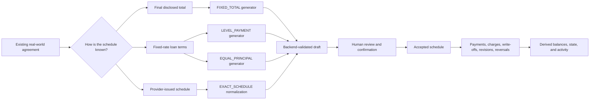
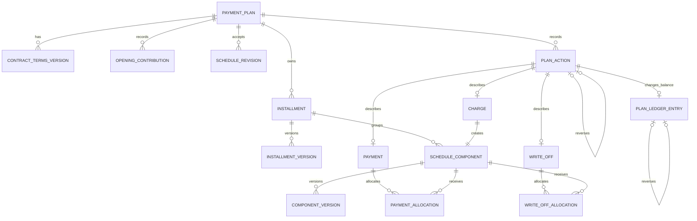
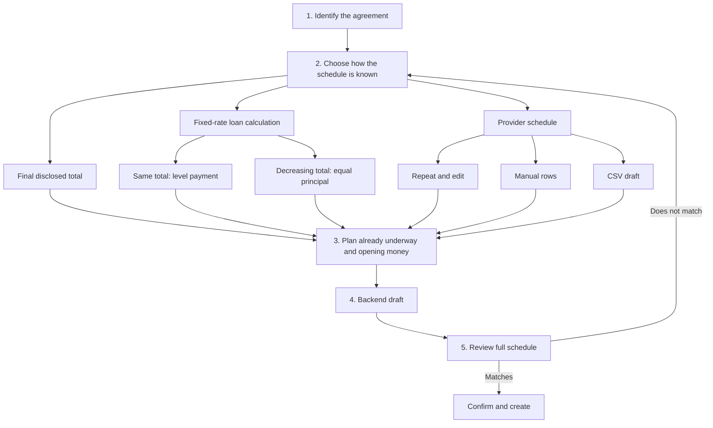

# Payment Plans Clean Rebuild and Private Beta Specification

**Status:** Ready for implementation planning  
**Product stage:** Private beta  
**Consolidated:** 2026-07-16  
**Authority:** This specification consolidates the Payment Plan discussion, research notes, and accepted ADR direction. Where it conflicts with the old Payment Plan implementation or Payment Plan portions of ADRs 0005, 0028, and 0029, this specification is the intended replacement decision. Wallet Epoch, timezone, Financial Event, and immutable wallet-ledger rules remain authoritative.

## Executive Decision

Sarflog will keep Payment Plans and rebuild them as a bounded private beta.

The beta will not attempt to reproduce every lender's servicing engine. It will:

1. calculate a few explicitly supported schedules;
2. accept an exact provider schedule when calculation is unsupported or does not match;
3. require a backend-validated draft and human review before creation;
4. preserve payments, write-offs, charges, schedule revisions, and reversals as explainable history;
5. provide explicit escape hatches instead of guessing.

The product promise is:

> Sarflog tracks scheduled obligations and can generate only the schedule calculations it explicitly supports. The provider's agreement remains authoritative.

The product does **not** promise:

> Sarflog can reproduce every bank, store, mortgage, vehicle, microloan, or jurisdiction-specific calculation.

The private beta may be removed if the backend proof cannot maintain the reconciliation invariants in this specification.

### Conflict-resolution register

| Earlier or ambiguous idea | Canonical decision in this specification |
|---|---|
| `STANDARD_AMORTIZATION` as the only bank calculation | Use `LEVEL_PAYMENT` for annuity and `EQUAL_PRINCIPAL` for classic/differentiated repayment. |
| Interest represented as a `CHARGE` | `PRINCIPAL`, `INTEREST`, and `CHARGE` are distinct. |
| Every fixed-total installment is principal | Use `UNSPECIFIED` unless the agreement discloses a trustworthy classification. |
| Exact/manual schedule is a financial formula | `EXACT_SCHEDULE` is an authoritative provider-schedule strategy; manual/CSV/PDF are input methods. |
| PDF and CSV are both required in the first beta | Manual, repeat-and-edit, and Sarflog-template CSV ship first. PDF is later, experimental, and draft-only. |
| Charges-first is a universal waterfall | No universal waterfall exists. Persist the declared policy/version and actual allocations. |
| Missed payments automatically grow the schedule | They remain overdue until the user records a provider charge or provider revision. |
| Capitalization is either ignored forever or calculated automatically | Record provider-reported reclassification/revision; never calculate its trigger automatically. |
| `PENDING`, `PARTIAL`, `PAID`, and `SKIPPED` are stored row truth | Derive `UNPAID`, `PARTIAL`, and `SETTLED`; derive time state separately. |
| `ACTIVE`, `PAID`, and `ARCHIVED` are competing plan statuses | Derive `OPEN`/`CLOSED`; store archive only as `archived_at`. |
| `remaining_amount` is a universal balance | Expose component balances and `remaining_scheduled_total`; never call it payoff. |
| Existing Payment Plan data requires a complex migration | Development data may be discarded; build a clean schema and keep unrelated domains safe. |

## Problem Statement

The current Payment Plan module tries to represent contract identity, schedule generation, settlement status, wallet payments, write-offs, charges, and UI projections through overlapping mutable fields and legacy routes. This has produced contradictory totals, unsafe reversals, stored statuses that disagree with money facts, frontend/backend payload drift, and a creation wizard that asks unrelated questions in one cluttered flow.

The deeper product problem is that real payment arrangements are not governed by one universal calculation. Store installments may disclose only a final repayable total. Banks may use level-payment annuity schedules, equal-principal schedules, daily interest, variable rates, balloons, grace periods, or provider-specific rules. Additional charges and payment allocation also vary by contract and jurisdiction.

Sarflog must therefore be useful without pretending to know financial rules it does not know. It must preserve wallet truth, work for plans that existed before the user joined Sarflog, and avoid corrupting balances when a provider later changes a schedule.

## Solution

### The four truths

The rebuilt module separates four different truths:

```text
CONTRACT  -> What agreement exists?
SCHEDULE  -> What does the current accepted agreement say is due, and when?
ACTIONS   -> What did the user, provider, import, or system record?
LEDGER    -> How did the tracked scheduled obligation change?
```

These truths must never be collapsed back into one mutable Payment Plan row.

### System boundary



### Beta creation strategies

The canonical schedule strategy values are:

- `FIXED_TOTAL`
- `LEVEL_PAYMENT`
- `EQUAL_PRINCIPAL`
- `EXACT_SCHEDULE`

`LEVEL_PAYMENT` replaces the ambiguous name `STANDARD_AMORTIZATION`. Both level-payment and equal-principal loans amortize, so “standard amortization” is not precise enough.

CSV and PDF are ingestion methods, not schedule strategies:

```text
Schedule strategy: EXACT_SCHEDULE
Input method:      MANUAL | REPEAT_AND_EDIT | CSV | PDF
```

The private beta includes manual, repeat-and-edit, and Sarflog-template CSV input. PDF import is a later experimental phase and must always produce an unconfirmed draft.

### Stable core versus extensible calculators

The schedule, action, allocation, ledger, and derived-state model is the stable core. Calculation strategies are adapters that produce the same normalized schedule.

A newly discovered financial formula is not automatically added to the wizard. Until deliberately researched, specified, and tested, the agreement uses `EXACT_SCHEDULE`.

The architecture fails its fitness test if adding a new calculator requires redesigning payment history, schedule settlement, or ledger invariants. Adding a calculator is acceptable only when it produces the existing normalized schedule contract.

## Domain Vocabulary

**Payment Plan**  
A closed-end scheduled obligation. It is independent from Debt and never requires a hidden backing Debt.

**Product kind**  
Contextual language describing what the agreement is for. Product kind does not select the mathematics.

**Schedule strategy**  
The declared method by which the accepted schedule was produced.

**Schedule revision**  
An append-only accepted replacement or change to contractual future schedule facts.

**Installment**  
One dated payment group. An installment can contain principal, interest, charges, or one unspecified provider total.

**Schedule component**  
One amount inside an installment, classified as `PRINCIPAL`, `INTEREST`, `CHARGE`, or `UNSPECIFIED`.

**Unspecified amount**  
A provider-disclosed installment amount for which the provider did not disclose a principal, interest, and charge breakdown. It is a disclosure state, not a fabricated financial category.

**Outstanding principal**  
The remaining scheduled principal component. It is not the same as remaining scheduled payments or a provider payoff quote.

**Remaining scheduled total**  
The sum of all unsettled current schedule components. It must never be labelled as a legal payoff amount.

**Payment**  
Real money recorded as paid toward the plan. A wallet-backed payment creates Financial Event wallet legs.

**Imported settlement baseline**  
Historical settlement recorded only to establish the current plan state. It has no wallet effect and does not rewrite pre-epoch wallet history.

**Write-off**  
An amount the user no longer needs to pay. It reduces the scheduled obligation without moving wallet money and never counts as cash paid.

**Provider revision**  
A user-recorded change reported by the provider, such as revised future installments, a formally capitalized amount, or a replacement schedule. Sarflog records the supplied change but does not invent the provider's rule.

## User Stories

1. As a user, I want to create a plan from a known final repayable total, so that I can track store installments without pretending the total is a bank-loan principal.
2. As a user, I want Sarflog to divide a remaining fixed total into installments, so that simple BNPL and service agreements are quick to enter.
3. As a user, I want the final installment to absorb currency rounding, so that generated rows reconcile exactly.
4. As a user, I want to calculate a fixed-rate level-payment loan, so that an ordinary annuity agreement can be previewed.
5. As a user, I want to calculate an equal-principal loan, so that a “classic” or differentiated bank schedule can be previewed.
6. As a user, I want the wizard to explain level-payment and equal-principal patterns in plain language, so that I do not need to know banking terminology.
7. As a user, I want unsupported loan behavior to direct me to my provider's schedule, so that Sarflog does not guess.
8. As a user, I want to copy exact dated installments, so that irregular real-world schedules remain usable.
9. As a user, I want to enter provider totals without a component breakdown, so that Sarflog does not fabricate principal or interest.
10. As a user, I want to enter itemized principal, interest, and charges when disclosed, so that the schedule matches the agreement.
11. As a user, I want to repeat a regular installment and edit exceptions, so that entering a long provider schedule is practical.
12. As a user, I want to import a Sarflog CSV template into a draft, so that I do not type dozens of rows.
13. As a user, I want an imported file to have no financial effect before confirmation, so that parsing errors cannot corrupt the app.
14. As a future user, I want PDF extraction to produce a reviewable draft only, so that OCR or table errors cannot silently create obligations.
15. As a user, I want to see whether values came from me, the provider, or Sarflog's calculation, so that I know what I am reviewing.
16. As a user, I want to see every generated assumption, so that I can detect when my agreement is incompatible.
17. As a user, I want to compare a calculated schedule with my provider before creation, so that a formula mismatch is caught early.
18. As a user, I want to switch directly from a mismatching calculation to exact schedule entry, so that I am never trapped in the wrong model.
19. As a user, I want creation blocked when backend preview fails, so that missing client math cannot create a false schedule.
20. As a user, I want my down payment, deposit, trade-in contribution, and first installment treated differently, so that amounts are not subtracted twice.
21. As a user, I want a signed amount financed to remain the formula principal, so that an earlier down payment is not deducted from it again.
22. As a user, I want a deposit against a fixed contract total to reduce the remaining schedule, so that the plan starts from reality.
23. As a user, I want a first installment paid at checkout to remain an installment, so that progress and history are not lost.
24. As a user, I want to record an opening wallet movement only when money actually moved, so that contract math and wallet history remain separate.
25. As a user, I want loan proceeds recorded as borrowed money rather than income, so that income reporting remains truthful.
26. As a new Sarflog user, I want to create a plan that began before I joined, so that I can track the payments still ahead.
27. As a new Sarflog user, I want a remaining-schedule import, so that I can begin without reconstructing years of history.
28. As an advanced user, I want to import the full schedule and mark historical rows settled without wallet effects, so that the provider schedule remains visible without violating Wallet Epoch.
29. As a user, I want pre-epoch settlements clearly labelled as imported history, so that they are not counted as Sarflog wallet payments.
30. As a user, I want to pay an entire installment, so that the common action is simple.
31. As a user, I want to make a partial installment payment, so that the schedule reflects what actually happened.
32. As a user, I want to make a plan-level payment across installments, so that early or larger payments can be recorded.
33. As a user, I want to review how a custom payment will be allocated before saving, so that Sarflog does not silently choose a provider rule.
34. As a user, I want to enter the provider-reported component allocation when known, so that principal, interest, and charge balances remain faithful.
35. As a user, I want every payment allocation preserved, so that reversing a payment restores the exact original effect.
36. As a user, I want payments to use real wallets only when I choose them, so that wallet balances remain correct.
37. As a user, I want wallet-backed payments to obey Wallet Epoch and normal posting rules, so that historical cash is not double-counted.
38. As a user, I want an assessed late fee added separately, so that it does not silently become principal or interest.
39. As a user, I want recurring or known contractual charges displayed with their installment while remaining separate components, so that one bill does not erase accounting identity.
40. As a user, I want provider charges distinguished from unrelated bank-account fees, so that only the correct obligation increases.
41. As a user, I want to write off part or all of one installment, so that waivers and forgiveness can be recorded without fake payments.
42. As a user, I want to write off part or all of the remaining plan, so that real settlements for less can be represented.
43. As a user, I want paid and written-off totals shown separately, so that cash history does not lie.
44. As a user, I want provider-reported future schedule changes recorded without deleting the previous schedule, so that the history is explainable.
45. As a user, I want a provider-reported capitalization recorded as an explicit component reclassification, so that principal can change without inventing cash movement.
46. As a user, I want Sarflog not to decide automatically when capitalization happens, so that provider-specific rules are not guessed.
47. As a user, I want missed payments to remain overdue unless I record a provider change, so that Sarflog does not secretly compound or reschedule them.
48. As a user, I want settled rows protected from ordinary edits, so that history cannot be rewritten.
49. As a user, I want future unallocated rows changed through a schedule revision, so that contractual changes remain auditable.
50. As a user, I want an eligible action reversed without deleting it, so that mistakes are repairable and history remains visible.
51. As a user, I want older dependent actions blocked from arbitrary reversal, so that later allocations cannot be left impossible.
52. As a user, I want the reversal explanation to tell me whether to reverse newer actions or record a provider revision, so that I use the right repair path.
53. As a user, I want plan lifecycle derived from the remaining scheduled obligation, so that statuses cannot disagree with balances.
54. As a user, I want overdue derived from due dates in my timezone, so that due-today installments are not incorrectly late.
55. As a user, I want archive to affect visibility only, so that filing a plan does not change its financial truth.
56. As a user, I want archived plans locked from financial actions until restored, so that hidden plans cannot change accidentally.
57. As a user, I want a closed plan to reopen if a legitimate later provider charge or revision creates a balance, so that derived lifecycle follows reality.
58. As a user, I want remaining principal, scheduled interest, charges, unspecified amounts, and total shown separately, so that different balances are not conflated.
59. As a user, I want Sarflog to avoid the word “payoff” unless it has a true provider payoff calculation, so that I am not misled.
60. As a user, I want a compact plan card, so that the list is not a wall of detail and buttons.
61. As a user, I want Overview, Schedule, and Activity separated, so that contract facts, due rows, and history are easy to understand.
62. As a user, I want common payment actions visible and uncommon actions in a three-dot menu, so that the interface stays calm.
63. As a mobile user, I want secondary actions available through an accessible bottom sheet, so that compact cards remain usable on small screens.
64. As a user, I want unavailable actions to show backend-provided reasons, so that UI rules cannot drift from domain rules.
65. As a developer, I want product kind separate from schedule strategy, so that a mortgage, vehicle, or store agreement is not forced into one formula.
66. As a developer, I want preview and creation to use one normalized backend contract, so that calculations cannot drift.
67. As a developer, I want all schedule strategies to produce one canonical installment/component structure, so that new calculators do not redesign the ledger.
68. As a developer, I want every balance-changing action to reconcile schedule allocations and component ledger deltas, so that corruption is rejected transactionally.
69. As a developer, I want idempotent command endpoints and concurrency protection, so that retries cannot duplicate money or charges.
70. As a tester, I want route-level tests for every supported creation and action flow, so that frontend/backend integration remains stable.
71. As a tester, I want randomized invariant tests, so that unusual payment, write-off, reversal, and revision sequences cannot create impossible balances.
72. As a product owner, I want an explicit beta kill gate, so that the module is removed or reduced before UI investment if reconciliation cannot be proven.

## Implementation Decisions

### 1. Product boundary and superseded concepts

- Payment Plans are independent from Debts at database, domain, API, and UI levels.
- No Payment Plan creates or requires a backing Debt.
- Asset integration is deferred until Payment Plans are stable.
- Product-specific origination calculators are outside the core. Vehicle price, trade-in value, tax, home closing costs, escrow assumptions, and similar fields may later feed a normalized Payment Plan adapter.
- Existing development Payment Plan data does not need migration. The rebuild may drop and recreate Payment Plan tables and PostgreSQL enums. Unrelated domains must not be damaged.
- The legacy schedule names `FLAT_TOTAL`, `AMORTIZED_LOAN`, and `MANUAL_CONTRACT_SCHEDULE` are replaced.
- Stored plan statuses `ACTIVE`, `PAID`, and `ARCHIVED` are removed as financial truth.
- Stored row statuses `PENDING`, `PARTIAL`, `PAID`, and `SKIPPED` are removed.
- Generic destructive transaction deletion and fragmented “undo latest payment/charge/write-off” routes are removed.
- `months`, duplicate regular/monthly payment amounts, generic `schedule_rule`, and direct mutable `remaining_amount` are not core authorities.

### 2. Product kind, creation path, strategy, and input method are separate

The backend stores product context independently from schedule behavior.

Recommended product kinds:

```text
STORE_INSTALLMENT
BANK_OR_MICROLOAN
VEHICLE_FINANCING
HOME_FINANCING
EDUCATION_FINANCING
SERVICE_CONTRACT
OTHER
```

The UI exposes three calm creation paths:

```text
ONE_FINAL_TOTAL
CALCULATE_FIXED_RATE_LOAN
USE_PROVIDER_SCHEDULE
```

The second path asks which repayment pattern the agreement uses:

```text
Same principal-and-interest total each month -> LEVEL_PAYMENT
Equal principal with decreasing totals       -> EQUAL_PRINCIPAL
```

The provider-schedule path persists `EXACT_SCHEDULE`. Its input method is stored separately for provenance.

Product kind may influence explanatory copy and defaults, but never silently selects a calculation.

### 3. Normalized persistence model

The clean relational model consists of these responsibilities:



Responsibilities:

- `PaymentPlan` stores shared identity, ownership, currency, product kind, optional provider/agreement metadata, and archive timestamp.
- Strategy-specific contract terms use a discriminated contract rather than one nullable mega-table.
- `ScheduleRevision` records why, when, and from what source a schedule was accepted or changed.
- `Installment` provides stable logical identity and grouping.
- Append-only installment/component versions preserve due-date, amount, activation, and classification history.
- `PlanAction` provides the human Activity story.
- `PlanLedgerEntry` provides component-level scheduled-obligation movement.
- Payments and write-offs have separate allocation tables.
- Optional list projections are deferred until correctness is proven. Any future projection is disposable and rebuildable.

The exact physical normalization may be adjusted during schema implementation, but the responsibilities and invariants may not be collapsed.

The current accepted schedule is derived from the latest effective, unreversed installment/component versions. Reversing an eligible schedule revision restores the prior effective versions and the exact opposite ledger effect; it does not delete either revision.

### 4. Canonical financial components

Schedule and ledger component types are:

```text
PRINCIPAL
INTEREST
CHARGE
UNSPECIFIED
```

Rules:

- Interest is never a charge subtype.
- Charges are non-interest fees, insurance, penalties, or other separately classified costs.
- `UNSPECIFIED` is permitted when a provider/fixed-total agreement discloses a contractual installment total without a trustworthy breakdown.
- An installment may contain itemized known components or one unspecified total, never both.
- A `FIXED_TOTAL` installment defaults to `UNSPECIFIED` unless the agreement explicitly discloses a valid component classification.
- UI copy for fixed total may say “contract installment.” UI copy for imported exact rows says “provider did not show a breakdown.” Neither is called principal.
- If a provider later supplies a breakdown, an accepted schedule revision retires/reclassifies the unspecified component without rewriting history.

### 5. Scheduled-obligation ledger

The Payment Plan ledger tracks changes to the accepted scheduled obligation. It is not a provider payoff ledger and is not the wallet ledger.

Every balance-changing action has one aggregate component ledger entry with:

```text
amount_delta
principal_delta
interest_delta
charge_delta
unspecified_delta
```

Invariant:

```text
amount_delta = principal_delta
             + interest_delta
             + charge_delta
             + unspecified_delta
```

At least one component delta must be non-zero. `amount_delta` itself may be zero for a provider-reported component reclassification such as capitalization:

```text
interest_delta   = -50,000
principal_delta  = +50,000
amount_delta     = 0
```

The old database constraint requiring `amount_delta != 0` must not survive.

Ledger entry types include:

```text
OPENING
IMPORTED_BASELINE
PAYMENT
CHARGE_ADDED
WRITE_OFF
SCHEDULE_ADJUSTMENT
COMPONENT_RECLASSIFICATION
CORRECTION
REVERSAL
```

Original ledger entries are never deleted or mutated to simulate reversal. A reversal stores exact opposite component deltas and references the original entry.

### 6. Schedule calculation: `FIXED_TOTAL`

Use when the agreement discloses one final contractual amount and no separate interest calculation needs to be reproduced.

```text
remaining contract amount
    = final contractual total
    - opening amount that legally reduces that total
    - imported settled installments included in that total

regular installment
    = integer division of remaining contract amount by remaining payment count
```

The final installment absorbs the currency remainder.

The first generated installment is due on `first_due_date` exactly.

The formula above describes the recommended remaining-only path. In an advanced full-history import, Sarflog retains or imports the original complete schedule and uses `IMPORTED_BASELINE` allocations to settle past installments. It must not also subtract those installments before creating the full schedule.

Sarflog must disclose:

> Sarflog is dividing the disclosed contract total. It is not calculating interest.

The optional cash/reference price of a product does not determine this schedule and must not be used to derive an interest rate.

### 7. Schedule calculation: `LEVEL_PAYMENT`

This is the fixed total-payment annuity method.

Version-one eligibility:

- fixed nominal annual rate;
- monthly payments;
- equal combined principal-and-interest payment;
- fully amortizing to zero principal;
- payment due at the end of each regular period;
- no balloon;
- no interest-only period;
- no variable rate;
- no daily accrual or 360-day convention;
- no irregular first period;
- no automatic delinquency compounding or capitalization.

Formula:

```text
M = P * [r * (1 + r)^n] / [(1 + r)^n - 1]
```

Where:

- `P` is the signed/disclosed amount financed or starting principal;
- `r` is the nominal annual rate divided by 12;
- `n` is the monthly payment count;
- `M` is the regular combined principal-and-interest payment.

For each installment:

```text
interest            = beginning principal * periodic rate
principal component = regular payment - interest
ending principal    = beginning principal - principal component
```

At zero interest, principal is divided across the payment count. Calculations use high-precision decimal arithmetic. Stored money uses integer smallest currency units. The final principal component absorbs residual rounding so ending principal is exactly zero.

The UI asks for nominal annual rate, not APR. If the agreement says APR but not the nominal rate required by the calculation, the user is directed to exact schedule entry.

### 8. Schedule calculation: `EQUAL_PRINCIPAL`

This is the “classic,” differentiated, linear, or equal-principal repayment method.

It uses the same version-one eligibility boundaries as `LEVEL_PAYMENT`.

```text
regular principal component = principal / payment count
interest for installment     = beginning principal * periodic rate
total installment            = principal component + interest
```

The principal component remains approximately equal; the final component absorbs currency remainder. Interest and total payment decrease as principal falls.

The UI describes it as:

> The principal portion stays level. The first total payment is highest, and later payments decrease.

### 9. Date and frequency rules

- Payment due dates are date-only contractual facts.
- User-facing today, overdue, and validation use the effective user timezone.
- Audit timestamps use timezone-aware UTC.
- `first_due_date` is always installment one; generators must not add an extra period to it.
- Monthly generation is anchored to the original requested day, not chained from a clamped prior date. A schedule beginning on January 31 uses the last valid day in February and returns to March 31 where possible.
- Quarterly and annual generation use calendar arithmetic, not fixed day counts.
- `BIWEEKLY` means every 14 days and must never mean twice monthly.
- The initial beta supports monthly calculated loans only.
- Fixed-total generation may support weekly, every-two-weeks, monthly, quarterly, and annual cadences after each date rule has dedicated tests.
- Twice-monthly, business-day shifting, holiday calendars, and unusual cadences use exact schedule until explicitly implemented.

### 10. Upfront money and opening contributions

One ambiguous `down_payment` field is forbidden.

Opening contribution kinds include:

```text
DOWN_PAYMENT
DEPOSIT
TRADE_IN_CONTRIBUTION
OTHER
```

Treatment values include:

```text
OUTSIDE_FINANCED_PRINCIPAL
REDUCES_FIXED_TOTAL
```

A first installment already paid is not an opening contribution. It is a normal installment plus a payment/imported-baseline allocation.

Examples:

- Vehicle price 50,000, down payment 10,000, signed amount financed 40,000: loan calculation uses `P = 40,000`; it never subtracts 10,000 again.
- Service contract total 12,000, deposit 2,000: fixed-total remaining schedule is 10,000.
- BNPL checkout installment: retain installment one and mark it settled through the correct wallet or imported-history path.

Wallet linkage is optional context and never changes the schedule calculation.

### 11. Current versus pre-existing plans and Wallet Epoch

The wizard asks whether the plan is new/current or already underway.

For an existing plan, offer:

1. **Enter only what remains** — recommended. Store optional historical start/original total as reference metadata. The opening plan ledger equals the remaining accepted schedule.
2. **Import the full schedule** — advanced. Past settled installments are recorded through `IMPORTED_BASELINE` actions and allocations with no wallet Financial Event.

Rules:

- Historical provider dates may predate the user's wallets because schedule facts are not wallet transactions.
- Imported settlements may predate Wallet Epoch only when they create no wallet legs.
- Any actual wallet-backed payment must satisfy Wallet Epoch and normal logging/reconciliation rules.
- Imported settlements do not count as Sarflog-recorded cash paid, wallet spending, or budget spending.
- A historical settlement cannot be changed into a wallet-backed payment merely by editing it. Record a current correction through the appropriate wallet flow if wallet reality is wrong.

### 12. Exact schedule and imports

`EXACT_SCHEDULE` is the required escape hatch for:

- provider-issued rows;
- variable rates;
- daily interest;
- irregular first periods;
- balloons;
- interest-only periods;
- grace periods;
- unusual rounding;
- daily microloans;
- any calculated preview that does not match.

Manual and repeat-and-edit entry are supported in the private beta.

The beta CSV contract is a Sarflog-provided long-format template:

```text
installment_number,due_date,component_type,amount,charge_kind,note
1,2026-08-01,PRINCIPAL,80000,,
1,2026-08-01,INTEREST,15000,,
1,2026-08-01,CHARGE,5000,SERVICE_FEE,
2,2026-09-01,UNSPECIFIED,100000,,Provider total only
```

Validation rejects:

- missing or invalid dates;
- non-positive amounts;
- unknown currency/component/charge values;
- duplicate component identifiers;
- ambiguous installment grouping;
- itemized and unspecified components mixed in one installment;
- totals that do not reconcile;
- files beyond documented size/row limits.

CSV import creates an ephemeral draft only. No plan, wallet event, ledger entry, or live schedule exists until backend validation and user confirmation succeed.

PDF import is not required for the first private beta. When added, it must:

- be explicitly labelled experimental;
- handle text and scanned documents as untrusted input;
- create a draft only;
- show extracted source-page references where possible;
- never infer undisclosed component classifications;
- require the same complete review and confirmation as manual/CSV input;
- define secure file retention and deletion behavior before release.

### 13. Mandatory preview and atomic creation

Preview and create accept the same discriminated request contract:

```text
CreatePaymentPlanRequest
  common
    name
    provider_name?
    product_kind
    currency
    agreement_date?
    existing_plan_mode

  schedule = one of
    FixedTotalTerms
    LevelPaymentTerms
    EqualPrincipalTerms
    ExactScheduleTerms

  opening_contributions[]?
  opening_money_movements[]?
  known_separate_charges[]?
  imported_settlements[]?
```

The preview response includes:

- normalized request;
- schedule strategy and input source;
- generator/normalizer version;
- full grouped schedule;
- principal, interest, charge, and unspecified totals;
- outstanding principal and remaining scheduled total with distinct labels;
- first and final due date;
- assumptions, warnings, and unsupported-feature declarations;
- opening-contribution treatment;
- provenance for provider/user/calculated values;
- a signed or server-verifiable fingerprint with expiry.

Creation requires the fingerprint and revalidates or regenerates the schedule inside one transaction. A stale or mismatched fingerprint is rejected. The frontend never performs authoritative schedule math.

Calculated loan creation requires explicit confirmation:

> I compared this schedule with my agreement and the payment amounts match.

Provider imports require explicit confirmation:

> I checked the dates and amounts against my provider's schedule.

User confirmation does not bypass backend reconciliation.

### 14. Review table

The final review uses a grouped installment table.

For calculated loans:

| # | Due date | Beginning principal | Interest | Principal | Charges | Total due | Ending principal |
|---:|---|---:|---:|---:|---:|---:|---:|

For fixed total:

| # | Due date | Contract installment | Separate charges | Total due | Remaining scheduled total |
|---:|---|---:|---:|---:|---:|

For exact itemized schedules, show disclosed components. For unspecified schedules, show provider total and “Breakdown not provided.”

Long schedules initially show the first three and final installment, but the complete schedule must be available before confirmation.

### 15. Additional charges

A normal post-origination charge is separate from principal and interest.

Adding a charge atomically creates:

```text
CHARGE_ADDED action
CHARGE record
schedule component and first version
CHARGE_ADDED ledger entry
```

Minimum charge facts:

- amount;
- charge kind;
- assessed date;
- due date;
- optional related installment;
- optional provider basis/reference/note.

Initial charge kinds:

```text
ORIGINATION_FEE
SERVICE_FEE
INSURANCE
ADMINISTRATIVE_FEE
LATE_FEE
RETURNED_PAYMENT_FEE
PENALTY
COLLECTION_COST
LEGAL_FEE
OTHER
```

Rules:

- Do not duplicate a fee already included in principal or fixed total.
- Provider-assessed returned-payment fees belong to the plan; unrelated bank-account NSF fees belong to the wallet/expense domain.
- A later fee never silently changes principal or recalculates interest.
- A charge can be visually grouped with an installment without losing component identity.

### 16. Capitalization and provider revisions

Sarflog does not automatically calculate capitalization, delinquency compounding, or provider restructure rules.

The escape hatch is an explicit provider-reported schedule revision. If the provider reports that 50,000 interest became principal, Sarflog records:

```text
COMPONENT_RECLASSIFICATION
interest_delta  = -50,000
principal_delta = +50,000
amount_delta    = 0
```

The revision preserves the original interest assessment and produces the provider-supplied future schedule. It never treats ordinary unpaid interest or a charge as capitalized merely because time passed.

If the user cannot provide revised provider figures, Sarflog records the existing schedule and directs the user to update it when the provider supplies new amounts.

### 17. Payments and allocation

Payments, allocations, and wallet events are separate records.

Primary flows:

- pay the next/full selected installment;
- partially pay a selected installment;
- record a custom plan-level payment with allocation preview.

There is no universal hidden charges-first waterfall.

Rules:

- Full selected-installment payment allocates all remaining components of that installment.
- Partial payment against an itemized installment requires either provider-reported component allocation or an explicitly selected, previewed policy.
- Unspecified installments can be reduced without fabricating a component split.
- Plan-level payment proposes allocations using the plan's declared, versioned allocation policy and shows them before confirmation.
- Manual allocation is the escape hatch when the provider reports a different application.
- The selected policy identifier/version and every resulting allocation are persisted.
- Reversal restores the exact recorded allocations; it never reruns today's policy.
- Payments cannot exceed the supported remaining schedule unless an explicit unapplied-credit model is designed later.
- Early settlement of future scheduled interest is only schedule tracking. Sarflog does not claim the resulting total is a legal payoff; the user should record a provider revision if the lender recalculates.

Payment and write-off allocations are never stored in one generic table.

### 18. Wallet and budget integration

- Contract creation alone does not create wallet money.
- A real upfront payment, loan disbursement, or installment payment may create Financial Events when the user explicitly records the movement.
- Borrowed proceeds are not income.
- Wallet-backed payment creation uses the existing shared posting seam and its Wallet Epoch, budget, goal-protection, and timezone validation.
- A single Payment Plan payment may link to more than one Financial Event when Sarflog must preserve different accounting classifications.
- Contract category/project/asset decisions are not required during schedule creation.
- Payment-time classification and optional plan defaults are separate from contract math.
- Write-offs, charges when assessed, schedule revisions, imported baselines, archive, and metadata updates create no wallet legs.

### 19. Business actions

Canonical actions are:

```text
PLAN_CREATED
IMPORTED_BASELINE_RECORDED
PAYMENT_RECORDED
CHARGE_ADDED
WRITE_OFF_RECORDED
SCHEDULE_REVISED
COMPONENT_RECLASSIFIED
CORRECTION_RECORDED
METADATA_UPDATED
NOTE_ADDED
ARCHIVED
RESTORED
REVERSAL
```

Each action stores source (`USER`, `SYSTEM`, `IMPORT`), effective date, audit timestamp, optional note/reference, owner, idempotency key, and reversal relationship where applicable.

Actions power the Activity timeline. Balance-changing actions have a ledger entry. Metadata and notes do not.

### 20. Write-offs

- Row/installment write-off may be full or partial.
- Plan-level write-off may be full or partial and requires an allocation preview.
- Write-off allocations are explicit and component-aware.
- Write-offs never create wallet events and never count as paid money.
- A fully settled component may be paid, written off, or a combination; the UI derives the descriptive label from allocations.
- Write-off reversal appends the exact opposite ledger/allocation effect and preserves the original records.

### 21. Schedule changes

- Ordinary metadata edits do not alter schedule math.
- Settled schedule components are immutable.
- Simple due-date/amount changes apply only to eligible future unallocated components and create append-only versions.
- Partially settled or structurally replaced schedules require the provider-revision workflow, which carries forward existing allocations and previews the before/after component reconciliation.
- Retiring a future component cannot reduce its current amount below effective paid plus written-off allocations.
- Every schedule revision that changes total/component obligation creates a matching aggregate ledger effect.
- Schedule revision and ledger effect commit atomically.

### 22. Reversal and correction

- One generic reversal command replaces payment-, charge-, and write-off-specific undo routes.
- Reversal eligibility uses stable ordering by creation timestamp and identifier, not date alone.
- The default rule is latest unreversed dependent balance-changing action within one plan.
- Reversal preserves the original action, allocations, Financial Events, and ledger entries.
- Wallet-backed reversal uses the shared Financial Event void/reversal seam.
- If the real world changed later, the user records a charge, write-off, correction, or provider revision rather than pretending the earlier action was a mistake.
- Metadata remains directly editable with an Activity action where useful.

### 23. Derived state and totals

For each current schedule component:

```text
remaining = current scheduled amount
          - effective payment allocations
          - effective write-off allocations
```

Settlement state:

```text
UNPAID   -> no effective settlement allocations
PARTIAL  -> remaining > 0 and some effective settlement exists
SETTLED  -> remaining = 0
```

Time state:

```text
SETTLED                                  -> null
remaining > 0 and due_date < user_today  -> OVERDUE
remaining > 0 and due_date >= user_today -> ON_TRACK
```

Due today is `ON_TRACK`, not overdue.

Plan lifecycle:

```text
remaining_scheduled_total > 0 -> OPEN
remaining_scheduled_total = 0 -> CLOSED
```

Archive is orthogonal:

```text
archived_at != null -> archived
```

Archived plans remain financially open or closed underneath. Financial actions are blocked until restore. A legitimate later charge/revision on a non-archived closed plan may create a balance and therefore derive `OPEN` again.

Required public totals:

```text
outstanding_principal
remaining_scheduled_interest
remaining_charges
remaining_unspecified_amount
remaining_scheduled_total
cash_paid_total
written_off_total
imported_settlement_total
overdue_total
due_today_total
```

No response labels `remaining_scheduled_total` as payoff balance.

### 24. API contract

The canonical external surface is action-oriented and screen-independent.

Read operations:

```text
GET /payment-plans
GET /payment-plans/summary
GET /payment-plans/{plan_id}
GET /payment-plans/{plan_id}/schedule
GET /payment-plans/{plan_id}/activity
GET /payment-plans/{plan_id}/actions
```

Draft/creation operations:

```text
POST /payment-plans/preview
POST /payment-plans/imports/csv/preview
POST /payment-plans
```

Business commands:

```text
PATCH /payment-plans/{plan_id}/metadata
POST  /payment-plans/{plan_id}/payments
POST  /payment-plans/{plan_id}/write-offs
POST  /payment-plans/{plan_id}/charges
POST  /payment-plans/{plan_id}/schedule-revisions/preview
POST  /payment-plans/{plan_id}/schedule-revisions
POST  /payment-plans/{plan_id}/notes
POST  /payment-plans/{plan_id}/actions/{action_id}/reverse
POST  /payment-plans/{plan_id}/archive
POST  /payment-plans/{plan_id}/restore
DELETE /payment-plans/{plan_id}
```

Row/installment targets are fields in the payment/write-off/revision commands or nested action routes chosen during implementation; they must use the same domain service and not duplicate action semantics.

Command requirements:

- ownership enforcement;
- idempotency key;
- current plan version/precondition;
- backend-derived effective timezone;
- structured reason codes;
- one transaction with row locking or equivalent optimistic concurrency;
- response containing updated overview, affected schedule, activity item, and available actions or identifiers sufficient to refetch them.

Delete is allowed only for a truly pristine plan: no wallet event, no imported settlement, no payment, no charge, no write-off, no accepted revision beyond creation, and no dependent integration. Normal removal is archive; normal repair is reversal/revision.

### 25. Frontend creation workflow

Use a dedicated page, not the current multi-purpose modal.



Stage-one product labels:

- Store purchase / buy now, pay later
- Bank or microloan
- Vehicle financing
- Home financing
- Education financing
- Service contract
- Other scheduled obligation

The wizard asks one primary question at a time. It does not ask about assets, projects, write-offs, archive, capitalization rules, or allocation-policy overrides.

The frontend maintains branch-specific state or a discriminated form model, not one object containing every strategy's nullable fields.

### 26. Frontend information architecture

Cards/list rows are compact and contain:

- name and provider;
- open/closed and on-track/overdue indicator;
- one unambiguous remaining amount label;
- next due date and amount;
- optional primary Pay action;
- three-dot secondary-action menu.

The details workspace contains:

```text
Overview | Schedule | Activity
```

- Overview shows contract facts, source, assumptions, balances, and archive state.
- Schedule shows grouped installments and contextual row actions.
- Activity shows immutable actions, component deltas, wallet movement, allocations, resulting balances, and reversal availability.
- Plan actions live in the header/three-dot menu.
- Row actions live beside the installment.
- Reversal actions live on eligible Activity entries.

The first UI is deliberately functional. Visual polish, responsive redesign, and mobile-specific composition are a later UI/UX sprint.

### 27. Frontend API wiring and cache invalidation

Every backend command receives one API function, one mutation hook, localized structured errors, and an explicit invalidation map.

Canonical query keys use one spelling only. Legacy dash/underscore compatibility keys are removed when old consumers are deleted.

Invalidation rules:

- Payment: list, summary, overview, schedule, activity, actions, wallets, expenses, budgets, relevant goals/projects.
- Write-off: list, summary, overview, schedule, activity, actions; not wallets or cash-paid reports.
- Charge: list, summary, overview, schedule, activity, actions; not wallets until paid.
- Schedule revision/component reclassification: list, summary, overview, schedule, activity, actions; not wallets.
- Archive/restore: list, overview, activity, actions.
- Metadata: list and overview/activity where the edit is shown.
- Preview/import draft: no live-data invalidation.

### 28. Legacy cleanup

The rebuild removes or replaces:

- hidden Payment Plan–Debt links;
- old stored plan/row status enums;
- direct mutable balance fields as authority;
- interest represented as `CHARGE`;
- all-row charges-first assumptions;
- legacy mark-paid route once canonical payment commands exist;
- fragmented undo-latest routes;
- destructive transaction/allocation deletion;
- write-offs represented as payment transactions;
- generic payment allocations reused for write-offs;
- one-ledger-pointer-per-row assumptions;
- asset/project fields in creation;
- client-authoritative preview math;
- silent preview failure;
- nullable mega-schemas mixing all schedule strategies;
- manual schedule payloads incompatible with backend rows;
- dead API wrappers, hooks, components, schemas, translations, and tests that preserve removed behavior.

Useful test scenarios and shared posting/ledger seams are preserved, but assertions are rewritten against this specification.

### 29. Rollout and beta gates

Implementation order:

1. Drop/recreate Payment Plan schema and enums for the clean model.
2. Build calculation/normalization services and preview contract.
3. Build schedule/action/ledger reconciliation with route-level tests.
4. Build payments, write-offs, charges, revisions, reversals, archive, and derived reads.
5. Wire API functions, hooks, structured errors, and invalidation.
6. Build the plain functional wizard and Details/Schedule/Activity workspace.
7. Run the private beta behind a feature flag.
8. Add experimental PDF import only after the core beta proves stable.
9. Perform the dedicated visual/mobile sprint later.

Kill/reduce the module before public release if:

- randomized action sequences can violate reconciliation;
- one schedule strategy requires special payment/ledger tables;
- reversal cannot restore exact previous effective state;
- imported history cannot remain wallet-epoch safe;
- unsupported contracts cannot be routed to exact schedule without false claims;
- frontend and backend preview/create contracts cannot be kept identical.

## Testing Decisions

### Primary testing seam

The highest useful existing seam is the public FastAPI route layer. Route tests exercise schema validation, timezone resolution, ownership, database transactions, Financial Event posting, schedule derivation, and serialized responses together.

Pure calculation services receive focused deterministic tests, but implementation details such as private helper calls are not the main contract. The preview endpoint is the single highest creation seam: creation must consume the same normalized contract and generator version.

Existing Payment Plan route, ledger, migration, immutable-ledger guardrail, timezone, wallet, budget, and expense-posting tests provide prior art. Migration tests that preserve old Payment Plan data are replaced with clean-schema tests because development data preservation is explicitly unnecessary.

### Required deterministic examples

1. **Uzum-style fixed total:** `27,090 × 6 = 162,540 UZS`; the schedule is unspecified contract installments and the difference from a cash/reference price is not called interest.
2. **Fixed-total remainder:** total not divisible by payment count; final row absorbs exactly the remainder.
3. **Level payment:** a known fixed-rate monthly reference schedule matches payment, interest, principal, and final zero balance within declared rounding.
4. **Equal principal:** principal component is constant except final remainder; interest and total payments decline.
5. **Zero-rate calculated loan:** schedule divides principal and reaches exact zero.
6. **Exact itemized schedule:** provider principal, interest, and charges reconcile.
7. **Exact unspecified schedule:** total-only rows are accepted without fabricated components.
8. **Historical remaining-only plan:** no historical wallet events are created.
9. **Historical full import:** imported settlements close past rows without wallet/budget effects.
10. **Down payment:** signed amount financed is not reduced twice.
11. **Deposit:** fixed total is reduced once.
12. **Checkout installment:** first installment remains in schedule and is settled once.
13. **Additional charge:** charge increases charge and total balances only.
14. **Partial payment:** exact allocations and component balances reconcile.
15. **Multi-installment payment:** previewed allocations match committed allocations.
16. **Write-off:** reduces obligation without wallet movement or paid-money inflation.
17. **Reversal:** restores exact action allocations and component balances without deletion.
18. **Provider schedule revision:** future schedule and ledger delta reconcile while settled history remains unchanged.
19. **Capitalization report:** total delta is zero while interest decreases and principal increases.
20. **Archive:** all financial mutations are blocked until restore.
21. **Due today:** remains on track in `Asia/Tashkent` and explicit boundary timezones.
22. **Closed plan:** has no time status and can reopen only through a legitimate positive provider action.

### Property and invariant tests

Generate randomized valid sequences of:

- payments;
- targeted and plan-level allocations;
- partial/full write-offs;
- charge additions;
- eligible reversals;
- future schedule revisions;
- component reclassifications;
- archive/restore transitions.

After every committed action assert:

```text
component remaining >= 0

component remaining
  = current component amount
  - effective payment allocations
  - effective write-off allocations

plan remaining scheduled total
  = sum of all current component remaining amounts

plan remaining scheduled total
  = principal + interest + charge + unspecified balances

ledger amount delta
  = sum of component deltas

cash paid
  = effective real payment amounts only

wallet effect
  = effective linked Financial Event wallet legs
```

Reversing any eligible action must return all effective schedule, ledger, allocation, wallet, and derived-state values to the exact pre-action values.

### Import tests

- Valid UTF-8 CSV template.
- Column order independent where headers are valid.
- Invalid/missing headers.
- Duplicate installments/components.
- Itemized/unspecified mixing.
- Extremely large row/file rejection.
- Locale-formatted numbers rejected or normalized only under an explicit documented parser.
- Draft expiry and stale confirmation.
- No live records before confirmation.
- Future PDF parser contract tests use page fixtures and require human confirmation; PDF is not a beta-core test gate.

### Frontend contract tests

- Every creation branch sends only its discriminated payload.
- Failed preview blocks confirmation and never uses local fallback math.
- Review renders grouped installment totals correctly.
- Level-payment interest and principal are not rendered as separate installments.
- CSV import remains a draft until confirmation.
- Available actions and reason codes control menus/disabled states.
- Payment mutation invalidates wallet/budget surfaces; write-off and charge assessment do not.
- Archived plans expose restore but not financial mutations.
- Compact cards and all actions remain accessible at representative mobile widths.

### Verification environment

Follow the project Docker-first workflow for migrations, backend tests, and frontend builds. Timezone-dependent tests use the project's test helpers and explicit `X-Timezone` boundaries.

## Acceptance Criteria

1. All four schedule strategies create one canonical grouped schedule representation.
2. Fixed-total plans never label provider markup or undisclosed totals as interest or principal.
3. Level-payment and equal-principal generators use backend decimal math and exact final reconciliation.
4. Unsupported calculated-loan assumptions block calculation and direct the user to exact schedule.
5. Manual and CSV provider schedules create drafts that require backend validation and human confirmation.
6. Exact schedules can use total-only installments without fabricated components.
7. Preview and create cannot drift in normalized input or generator version.
8. Down payments, deposits, contributions, and first installments cannot be double-counted.
9. Pre-existing plans can be represented without any pre-epoch wallet movement.
10. Principal, interest, charges, unspecified amounts, scheduled total, paid cash, and write-offs remain separately explainable.
11. Payments, write-offs, charges, and revisions have distinct action and allocation histories.
12. No universal hidden payment waterfall exists.
13. A normal charge does not mutate principal or interest.
14. Provider-reported capitalization can be recorded without automatically calculating its trigger.
15. Reversal is append-only and restores exact original allocations and wallet effects.
16. Row settlement, overdue state, plan lifecycle, and archive state are derived under the documented rules.
17. Outstanding principal and remaining scheduled total are never confused with a provider payoff quote.
18. The functional UI exposes every supported backend action without recreating the current oversized cards or wizard mega-state.
19. Legacy statuses, unsafe routes, duplicate undo paths, Debt coupling, and dead frontend clients are absent.
20. Deterministic, route-level, timezone, wallet, and randomized invariant tests pass before the private beta is enabled.

## Out of Scope

- Universal reproduction of lender contracts.
- Automatic daily-interest microloan calculation.
- Variable-rate or adjustable-rate calculation.
- Negative-amortization generation.
- Automatic delinquency interest, compound default interest, or penalty calculation.
- Automatic capitalization decisions.
- Balloon, interest-only, graduated-payment, income-driven, or revolving-credit generators.
- Legal payoff quotations or prepayment-penalty calculation.
- Arbitrary provider CSV-layout recognition in the first beta.
- PDF import in the first private-beta core; it is a later experimental draft source.
- Automated holiday/business-day calendars.
- Twice-monthly calculated date generation until explicitly specified.
- Mortgage escrow, tax, insurance, property, closing-cost, or affordability engines.
- Vehicle price, trade-in, incentive, tax, registration, or dealer-add-on origination engines.
- Asset integration.
- Project/subcategory coupling inside Payment Plan creation.
- Final visual design, animation, and comprehensive mobile UX polish.
- Production migration of existing Payment Plan records.
- Treating credit cards, overdrafts, or other revolving balances as Payment Plans.

## Further Notes

### Why this remains usable despite incomplete financial coverage

The beta is not safe because the user clicks Confirm. It is safe because:

1. generated calculations have narrow declared assumptions;
2. imports create drafts only;
3. the backend rejects internal inconsistency;
4. the user checks provider parity;
5. exact schedule and provider revision paths contain unsupported behavior;
6. wallet truth is isolated from contract history;
7. all effective financial and schedule changes remain reversible or superseded through explicit history.

### Handling newly discovered real-world cases

For any newly discovered agreement, ask:

```text
Can an existing generator reproduce it under declared assumptions?
    Yes -> preview and compare with the provider.
    No  -> use exact provider schedule.

Can its payments, charges, revisions, and reversals use the canonical core?
    Yes -> the architecture survives.
    No  -> stop implementation and reassess before adding special tables.
```

### Beta positioning

Recommended copy:

> Payment Plans is in private beta. Sarflog can calculate supported fixed schedules or track the exact schedule supplied by your provider. Always compare calculated amounts with your agreement. Sarflog does not provide legal payoff quotes or automatically reproduce provider-specific penalties, variable rates, or daily-interest rules.

### Decision summary

- Keep Payment Plans.
- Rebuild the backend before polishing the UI.
- Ship a bounded private beta.
- Support fixed total, level payment, equal principal, and exact schedule.
- Ship manual/repeat/CSV exact entry first.
- Add PDF only as a later draft-only experiment.
- Never guess unsupported provider mathematics.
- Preserve a provider-revision escape hatch without corrupting wallet or schedule history.
