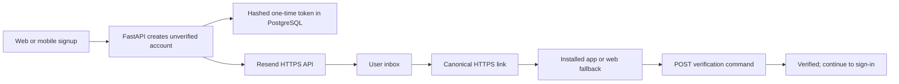

# Specification: Auth Round 1 — Account Creation and Email Verification

**Status:** Draft for discussion  
**Source roadmap:** [auth-rounds.md](./auth-rounds.md)  
**Risk register:** [AUTH-ISSUES-AND-EDGE-CASES.md](./AUTH-ISSUES-AND-EDGE-CASES.md)  
**Target:** Shared FastAPI backend, existing React web client, and Expo mobile client

## Problem Statement

Sarflog has working pieces of local account registration and email verification, but they do not yet form one dependable web-and-mobile journey.

Development email delivery is confusing and unnecessarily broad. The backend prefers the Resend HTTP API but also contains a generic SMTP fallback, development examples still point to Mailtrap, project documentation describes SMTP configuration, and tests disable both paths independently. This makes it unclear which provider is authoritative, increases the number of secret/configuration paths, and can hide provider failures behind a second delivery attempt.

The verification journey is also browser-shaped. Verification email links target the web frontend, the client performs a state-changing GET request, focused verification/resend tests are missing, and the Expo application has no signup/check-email/verification routes or production App Link/Universal Link association. A new mobile user therefore cannot complete first-party account creation inside the intended app journey.

From the user's perspective, the problem is simple: creating an account must reliably produce one verification email, the link must open the right Sarflog experience, verification must be deliberate and secure, and failures must provide an understandable recovery path.

## Solution

Round 1 will establish one account-creation and verification journey shared by web and mobile.

FastAPI will remain the only system allowed to generate verification tokens, decide account verification, and use Resend credentials. Resend's HTTPS API will become the only active runtime email transport in development, staging, and production. Active Mailtrap and generic SMTP configuration, code, fallback behavior, test setup, and current documentation will be removed. Development and production will use separate restricted Resend keys and sender identities.

The existing signup and resend commands will continue to create or replace hashed, expiring one-time verification tokens. Verification will become a deliberate POST command. Emails will contain a canonical HTTPS link: an installed mobile app may claim it through Android App Links or iOS Universal Links, while browsers and devices without the app retain the existing web fallback.

The React web flow will be migrated without losing its current functionality. Expo will gain a localized signup screen, check-email/resend state, verification route, and success action leading to sign-in. Round 1 ends at the sign-in screen; it does not issue or store mobile session tokens.

## User Stories

1. As a new web user, I want to create an account with a username, email, and password, so that I can begin using Sarflog.
2. As a new mobile user, I want to create the same account from the Expo app, so that I do not need the website to register.
3. As a new user, I want my email normalized consistently, so that capitalization or whitespace does not create duplicate identities.
4. As a new user, I want duplicate username and email errors to be understandable, so that I can correct the signup form.
5. As a new user, I want password and username requirements shown before submission, so that I can recover from validation errors quickly.
6. As a new user, I want a clear check-email state after signup, so that I know registration is not yet complete.
7. As a new user, I want the check-email screen to show the address I submitted, so that I can notice a typo.
8. As a new user, I want Sarflog to send one verification email through the configured development or production provider, so that delivery behavior is predictable.
9. As a new user, I want the verification email to identify Sarflog and explain the action, so that I can recognize a legitimate message.
10. As a new user, I want the verification link to expire, so that an old leaked email cannot verify my account indefinitely.
11. As a new user, I want older verification links invalidated after a new link is issued, so that only the latest recovery path remains active.
12. As a new user, I want a used verification link rejected, so that the credential cannot be replayed.
13. As a new user, I want to resend verification when the first email is delayed or lost, so that I am not permanently blocked.
14. As a user, I want resend responses not to reveal whether another person's account exists, so that email addresses cannot be enumerated.
15. As a user, I want resend attempts rate-limited with a recoverable message, so that abuse is constrained without leaving me confused.
16. As a mobile user with Sarflog installed, I want the email's HTTPS link to open the verification screen in the app, so that the journey feels native.
17. As a mobile user without a valid App Link association, I want the link to open a safe web fallback, so that I can still verify.
18. As a desktop user, I want the same HTTPS link to open the web verification page, so that mobile support does not break web registration.
19. As a user, I want opening the link to display a confirmation state before account mutation, so that automated previews do not consume my token.
20. As a user, I want verification to happen only through an explicit confirmation command, so that GET prefetching cannot change account state.
21. As a user, I want a clear success state after verification, so that I know I may now sign in.
22. As a user, I want invalid, expired, replaced, and already-used links to produce a safe recovery path, so that I can request another email.
23. As a user, I want signup and verification text in Uzbek, Russian, and English, so that the first product journey respects my language.
24. As a screen-reader user, I want form errors, pending states, success messages, and actions announced correctly, so that I can complete registration independently.
25. As a mobile user, I want keyboard, safe-area, and small-screen behavior to preserve every form action, so that registration works on real phones.
26. As a developer, I want one runtime email transport, so that development behavior matches production architecture.
27. As a developer, I want automated tests to use a fake email boundary, so that tests are deterministic and never send real emails.
28. As a developer, I want a controlled manual Resend procedure, so that I can prove actual delivery without making CI depend on Resend.
29. As an operator, I want separate development and production Resend keys, so that access and logs can be isolated.
30. As an operator, I want Resend keys restricted to sending and the intended domain where possible, so that accidental exposure has limited impact.
31. As an operator, I want the backend to fail clearly when Resend configuration is missing, so that a broken deployment does not pretend to send mail.
32. As an operator, I want delivery failures logged without raw verification tokens or secrets, so that failures can be investigated safely.
33. As a security reviewer, I want Resend credentials absent from web and mobile bundles, so that installed clients cannot be abused to send email.
34. As a security reviewer, I want raw verification tokens stored only in the email/link and never in PostgreSQL, logs, analytics, or crash reports, so that server-side exposure is reduced.
35. As a maintainer, I want existing web signup and resend behavior regression-tested, so that mobile enablement does not break current users.
36. As a product owner, I want Round 1 to stop at verified-account creation, so that session and Google complexity do not overwhelm the first slice.

## Implementation Decisions

1. **FastAPI owns verification.** Clients may collect input and display states, but only FastAPI creates tokens, validates them, sets `is_verified`, applies rate limits, and decides error semantics.

2. **Resend HTTPS API is the sole active runtime email transport.** Development, staging, and production use the same transport implementation. Generic SMTP sending and automatic SMTP fallback are removed.

3. **Mailtrap is removed from active project configuration and documentation.** Current runtime code, settings, environment examples, test setup, and onboarding documentation must not require or advertise Mailtrap.

4. **Environment credentials stay separate.** Development/staging and production use separately named Resend keys. Keys use sending-only and domain-restricted permission where available. Real values are never written to repository documentation.

5. **Resend is backend-only.** Neither React web nor Expo receives a Resend key or calls Resend directly. Both call FastAPI; FastAPI calls Resend.

6. **Existing centralized email functions remain the outbound test seam.** Round 1 does not introduce a broad notification framework. Verification and password-reset template functions continue to call one centralized delivery function backed only by Resend.

7. **Automated tests never call Resend.** Tests substitute the centralized outbound email seam and inspect the recipient and redacted link behavior. A separate controlled manual check proves actual Resend delivery.

8. **Provider retries must be idempotent for the same logical email event.** A transport retry for one issued token uses one stable idempotency identity. A user-requested resend creates a new token and therefore a new logical email event.

9. **Delivery failure does not roll back the created account.** PostgreSQL account/token creation is authoritative and must not depend on a remote provider transaction. The signup result must make “account created but email was not dispatched” recoverable without encouraging duplicate signup. Existing user fields remain backward-compatible while an explicit verification-delivery outcome is added.

10. **Missing or invalid production-like Resend configuration fails visibly.** The application must not log a verification link as if that were email delivery. Local automated tests use the fake boundary; interactive development uses configured Resend.

11. **Verification tokens remain opaque, random, hashed at rest, one-time, and time-limited.** Issuing a new verification token consumes all older unused tokens for the same user. The current 48-hour lifetime remains unless a separate decision changes it.

12. **Verification becomes a POST command.** The canonical verification API accepts the token in a request body. GET may render or route a screen but does not verify an account. The current web caller is migrated in the same slice.

13. **Existing emailed frontend links remain usable during the migration.** Because the email opens a client page that then calls the API, current links can continue working after the page changes from GET to POST. Any direct state-changing GET API is removed once all in-repo callers migrate.

14. **The email uses a canonical HTTPS link.** It does not use a custom app scheme. Android App Links and iOS Universal Links may claim the HTTPS route when the app is installed; otherwise the web route remains the fallback.

15. **Link hosts are environment-specific and allowlisted.** Development-build testing, staging, and production use explicit approved hosts. The app and website prove domain association through the platform-required files/configuration.

16. **Expo Router owns native link routing.** The verification path maps to a dedicated mobile screen that parses but does not log the token and sends it to FastAPI only after the deliberate verification action.

17. **Web remains supported.** The existing React signup, check-email/resend, and verification pages are updated to the shared contracts and remain valid fallbacks.

18. **Round 1 does not authenticate the user.** Successful verification navigates to sign-in. It does not issue access/refresh tokens, write SecureStore, or bypass Round 2 session design.

19. **Resend remains enumeration-resistant.** Resend-verification continues to return a generic result for missing or already-verified accounts. Rate-limit metadata remains available for recoverable client messages.

20. **User-visible copy ships in three languages.** Labels, validation, delivery failure, check-email, resend cooldown, verification success/failure, accessibility labels, and recovery actions require Uzbek, Russian, and English key parity.

21. **No database migration is expected.** The existing user, identity, and verification-token models can support Round 1. A migration is added only if implementation proves a schema change is unavoidable.

22. **Observability is redacted.** Logs may include a provider request ID and high-level outcome. They do not include API keys, raw tokens, complete email links, passwords, or provider credentials. Email-address logging follows the project's chosen PII policy.

23. **Current password-reset sending must remain compilable and behaviorally compatible.** Removing SMTP affects the centralized transport used by password reset, but Round 1 does not redesign the reset journey. A regression test proves it still delegates to Resend without sending real mail.

24. **The round is backward-compatible at the client boundary.** Any expanded signup response preserves existing user fields so the current web client can migrate without a flag day.

## Testing Decisions

1. **Test externally observable behavior.** Tests assert account state, token lifecycle, response shape, dispatched-message intent, client state, navigation, and recovery behavior. They do not assert private helper call order or Resend implementation details that users cannot observe.

2. **Use the existing centralized outbound-email boundary as the primary seam.** Backend route tests replace this seam with a fake result. A small transport-level test covers request construction, redaction, idempotency identity, success, timeout, provider rejection, and missing configuration without reaching the network.

3. **Backend signup tests cover:** successful unverified account creation, normalized email, duplicate email/username, weak credentials, rate limiting, token creation, dispatch intent, and recoverable provider failure.

4. **Backend resend tests cover:** generic responses for missing/already-verified users, replacement of older tokens, rate limiting, provider success/failure, and no account enumeration.

5. **Backend verification tests cover:** successful POST verification, missing token, malformed token, expiry, replacement, reuse, nonexistent user, deliberate state change, and proof that GET no longer verifies.

6. **Password-reset transport regression covers:** the existing reset email function still delegates to the Resend-only gateway while regular tests remain network-free.

7. **Web tests cover:** signup navigation to check-email, delivery-failure recovery, resend pending/cooldown/error/success states, POST verification, expired/reused-token recovery, and success navigation to sign-in.

8. **Mobile unit/component tests cover:** validation, loading, disabled actions, localized copy, keyboard-safe interaction, check-email state, resend cooldown, delivery failure, verification confirmation, invalid/expired token, success, and accessibility roles/announcements.

9. **Mobile route/link tests cover:** a canonical verification URL maps to the verification screen, query parameters are parsed without being logged, cold-start and warm-start links behave consistently, and web fallback assumptions are explicit.

10. **Localization parity is testable.** Every Round 1 key must exist in Uzbek, Russian, and English. English fallback is not accepted as completion.

11. **Regular verification runs inside project-standard environments.** Backend tests and the web production build run through Docker. Mobile Jest/type/lint checks run from the Expo project using its configured toolchain.

12. **One controlled manual Resend acceptance check is required.** A development account sends to an approved inbox, the message arrives from the intended staging sender, and the link completes verification. API keys and raw tokens are not captured in screenshots or logs.

13. **Platform link verification is explicit.** Android App Link behavior is verified on a development build. iOS Universal Link configuration and behavior must be verified before public release; if no iOS device/build is available during Round 1, that fact remains an open release blocker rather than being silently marked passed.

14. **Highest-seam Round 1 acceptance:** create an account, receive the email, open the link on the intended client, deliberately verify, reject token reuse, and reach sign-in. Run once for web and once for an Android development build, with iOS tracked according to availability.

## Out of Scope

- Password sign-in implementation for mobile.
- Access-token creation, refresh-token delivery, rotation, replay handling, or Expo SecureStore.
- Authenticated route guards and session restoration.
- Forgot-password and reset-password UI/link redesign.
- The final decision on immediate access-JWT invalidation after password reset.
- Google OAuth/OpenID Connect and provider account linking.
- Sign out of all devices.
- Marketing, broadcast, newsletter, inbound email, or contact-list features.
- Replacing backend-owned templates with a broad remote-template system.
- A general-purpose notification service or message bus.
- Transactional outbox, worker queue, or guaranteed asynchronous delivery unless implementation proves synchronous delivery cannot meet the round's reliability requirement.
- Full bounce/complaint webhook automation; safe test-event procedures may be documented for a later operational round.
- Final visual design of all auth screens.
- Rewriting archived historical documents merely to remove old Mailtrap mentions; active runtime/configuration/onboarding documentation is the cleanup authority.

## Further Notes

- Round 1 deliberately combines a small infrastructure prefactor with one user journey. The Resend-only transport is necessary because a verification flow cannot be trusted while the active development provider is ambiguous.
- “Resend verification” is product language for sending another verification email; it must not be confused with the Resend provider name in code or user-facing copy.
- The development setup discussion must establish the verified staging domain/sender, development key permissions, secret storage location, approved test inbox, and deployment environment variables before implementation begins.
- The implementation discussion should also confirm the canonical staging and production HTTPS hosts used by verification links and platform associations.
- Source risks for this round are AUTH-004, AUTH-005, and the verification/resend portion of AUTH-009.
- Round 2 begins only after a newly created account can reach the verified state through both the web fallback and the mobile journey.

