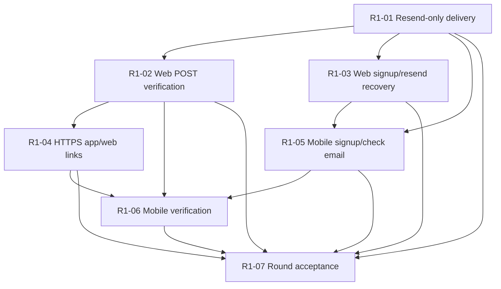

# Tickets: Auth Round 1 — Account Creation and Email Verification

These tracer-bullet tickets implement [auth-round-1-spec.md](./auth-round-1-spec.md). They are ordered by genuine blocking edges; work any ticket whose blockers are all complete. The file is a draft for discussion before implementation.

## Non-Negotiable Round 1 Quality Contract

Testing is implementation work in every ticket, not a cleanup phase after the screens exist.

- [ ] Each behavior is implemented as a small red-green-refactor slice: one failing public-behavior test, the minimum implementation, then cleanup while green.
- [ ] Backend auth tests use an isolated test PostgreSQL database and Redis namespace. They never create, drop, or mutate tables in the developer's active Docker database.
- [ ] Backend verification runs through Docker and uses a fake outbound-email boundary. Automated tests never contact Resend or another live provider.
- [ ] Web-affecting tickets add focused React tests for the changed behavior even though the broader legacy web test suite still needs later cleanup.
- [ ] Every mobile-affecting ticket passes `npm run verify`: Expo dependency compatibility, TypeScript, lint/test rules, layout policy, Jest integration tests, and the coverage ratchet.
- [ ] The mobile global coverage floor may only rise. New `src/features/auth/**` code adds a path-specific threshold of at least 90% statements, functions, and lines and 85% branches; enumerated security states still require explicit behavior tests regardless of percentage.
- [ ] Mobile API tests use the installed MSW boundary. Any unhandled request fails the test instead of reaching FastAPI, Resend, or the internet.
- [ ] Uzbek, Russian, and English resources are imported into the shared locale-parity contract test in the same change as the copy.
- [ ] `.only`, skipped/disabled tests, commented-out tests, and snapshot-only proof are not accepted. Test lint rules enforce the first three automatically.
- [ ] Each release-critical mobile journey added in this round extends the tracked Maestro flows and is exercised on the EAS Android and iOS test builds.
- [ ] Flaky behavior is a defect. A quarantine requires an owner, reason, and removal condition; deleting or weakening the assertion is not a fix.

The current implementation frontier remains R1-01. The quality contract does not authorize starting later tickets before their blockers are complete.

## Ticket R1-01: Deliver a development verification email through Resend only

**What to build:** A developer can create an unverified account through FastAPI in the development environment and receive its verification email through the Resend HTTPS API, with one authoritative transport path and a recoverable delivery outcome.

**Blocked by:** None — can start immediately.

- [x] Resend HTTPS is the only active runtime email transport in development, staging, and production configuration.
- [x] Active Mailtrap values, generic SMTP settings, SMTP fallback code, and current SMTP onboarding instructions are removed.
- [x] `smtplib`, `_send_email_via_smtp`, SMTP settings, and the hardcoded `staging-mail.sarflog.uz` email footer are removed from active code and configuration.
- [x] Local development sends from `Sarflog Development <onboarding@resend.dev>` only to the Resend account's approved inbox; no DNS/domain verification is required for this local acceptance check.
- [x] Docker explicitly supplies backend-only `RESEND_API_KEY` and `EMAIL_FROM` configuration to FastAPI, and the API container is recreated after configuration changes.
- [x] Development and production use separate backend-only Resend keys with sending-only/domain-restricted permission where available.
- [x] The development key remains only in the ignored backend `.env`; it is absent from Git, Docker image layers, web/mobile environment variables, screenshots, logs, and test output.
- [x] Missing or invalid Resend configuration fails visibly and does not log raw verification links as a substitute for delivery.
- [x] Account creation is not rolled back when the remote delivery attempt fails; the API exposes a recoverable account-created/delivery-failed outcome without breaking existing user fields.
- [x] Transport retries for one logical email use a stable idempotency identity; a user-requested resend remains a new logical event.
- [x] Automated tests use a fake outbound-email boundary and never contact Resend.
- [x] The backend auth test harness is proven isolated from the active development database before signup/token lifecycle tests run.
- [x] Transport tests cover request construction, success, timeout, provider rejection, missing configuration, idempotency identity, and redacted diagnostics without making a network request.
- [x] Existing password-reset email construction still delegates through the Resend-only boundary.
- [x] A controlled manual development send reaches an approved inbox without exposing the key or token in logs.

## Ticket R1-02: Verify a web account through a deliberate POST command

**What to build:** A user who opens a Sarflog verification email in a browser sees the existing web verification experience and deliberately verifies the account through a POST command; automated GET requests cannot consume the token.

**Blocked by:** Ticket R1-01: Deliver a development verification email through Resend only.

- [x] The canonical verification command accepts the one-time token in a POST request body.
- [x] GET no longer changes account state.
- [x] The existing web verification page is updated to require a deliberate "Verify Email" button click before issuing the POST request.
- [x] Existing frontend email links continue to open the web page during the migration.
- [x] Valid tokens verify exactly once and consume all required outstanding token state.
- [x] Missing, malformed, expired, replaced, reused, and orphaned tokens return safe recoverable outcomes.
- [x] Backend tests prove the token lifecycle and prove GET is non-mutating.
- [x] The backend behavior table covers valid, missing, malformed, expired, replaced, reused, and orphaned tokens through the public HTTP contract on the isolated test database.
- [x] Web tests (using Vitest and React Testing Library) explicitly cover pending, success, invalid/expired, reused, and resend-recovery states.
- [x] Raw tokens and complete verification URLs do not appear in application logs or analytics.

## Ticket R1-03: Make web signup and resend recover safely from delivery problems

**What to build:** A web user can sign up, understand that verification is required, resend safely when needed, and recover when Resend does not dispatch the first message without creating duplicate accounts.

**Blocked by:** Ticket R1-01: Deliver a development verification email through Resend only.

- `[x]` Web signup handles successful dispatch and account-created/delivery-failed outcomes distinctly.
- `[x]` Check-email state identifies the submitted address without exposing another user's account state.
- `[x]` Resend preserves generic responses for missing and already-verified accounts.
- `[x]` Resend issues a new token, invalidates older unused tokens, and respects backend rate limits.
- `[x]` Cooldown, pending, success, provider failure, and rate-limit recovery are user-visible.
- `[x]` Signup, check-email, resend, and error/recovery copy exist in Uzbek, Russian, and English.
- `[x]` Backend route tests cover dispatch intent, provider failure, enumeration resistance, replacement, and rate limiting.
- `[x]` Web frontend tests (Vitest) explicitly cover signup delivery-failed outcomes, check-email rendering, resend cooldowns, and success paths.
- `[x]` Web tests use a fake API boundary and cover double submission, offline/provider recovery, resend cooldown, and the three-language copy contract.
- `[x]` Existing web signup behavior and production build remain green.

## Ticket R1-04: Establish local deep linking for the mobile app

**What to build:** Configure the Expo app to listen for a custom development URL scheme (`sarflog://`) so we can seamlessly route verification tokens into the app during local development testing.

**Blocked by:** Ticket R1-02: Verify a web account through a deliberate POST command.

- `[x]` Configure `app.json` to register the custom scheme `sarflog` for the Expo app.
- `[x]` Expo Router maps the `/verify-email` path to catch incoming deep links like `sarflog://verify-email?token=...`.
- `[x]` Expo Router configuration ensures that raw tokens are not leaked into navigation logs or analytics.
- `[x]` Mobile route tests use Jest and Expo Router testing library to verify deep link token extraction without logging.
- `[x]` Cold-start (app closed) and warm-start (app backgrounded) deep link parsing are confirmed to route the user correctly to the verification screen.
- `[x]` We document the process for testing deep links locally using the terminal command: `npx uri-scheme open "sarflog://verify-email?token=..." --android/ios`.
- `[x]` Strict Universal Links (HTTPS AASA / AssetLinks) are explicitly deferred until we have a staging environment.

## Ticket R1-05: Create a mobile signup-to-check-email journey

**What to build:** A new Expo user can submit a localized signup form, create an unverified account through FastAPI, understand the delivery result, and request another verification email without leaving the app.

**Blocked by:**

- Ticket R1-01: Deliver a development verification email through Resend only.
- Ticket R1-03: Make web signup and resend recover safely from delivery problems.

- `[x]` Mobile signup uses the shared backend contract and backend-owned validation remains authoritative.
- `[x]` The development API base URL is environment-owned and works from a physical phone through an approved LAN address or tunnel; the client does not hardcode `localhost`.
- `[x]` Username, email, password, duplicate identity, rate-limit, and provider-delivery errors are recoverable.
- `[x]` The check-email screen shows the submitted address and offers edit/back and resend recovery as specified.
- `[x]` Resend pending/cooldown/success/error behavior cannot trigger duplicate submissions.
- `[x]` Form fields, keyboard behavior, safe areas, focus, accessibility roles, and announcements work on compact phones.
- `[x]` All visible and accessibility copy exists in Uzbek, Russian, and English with key parity.
- `[x]` The real Round 1 Uzbek, Russian, and English resources are imported into the shared locale-parity contract test.
- `[x]` MSW-backed component/API tests cover happy path, validation, duplicate identity, offline/provider failure, rate limiting, resend cooldown, double submission, and accessibility without reaching a live backend.
- `[x]` `src/features/auth/**` is added to Jest's path-specific coverage gate at 90% statements/functions/lines and 85% branches or higher.
- [ ] No Resend credential, raw verification token, access token, or refresh token is stored in the mobile client.

## Ticket R1-06: Complete mobile verification from the email link

**What to build:** A mobile user who opens the verification email in an installed Sarflog app can review the action, deliberately verify the account, recover from invalid links, and continue to sign-in.

**Blocked by:**

- Ticket R1-02: Verify a web account through a deliberate POST command.
- Ticket R1-04: Establish one HTTPS verification link for app and web.
- Ticket R1-05: Create a mobile signup-to-check-email journey.

- [x] The mobile verification screen receives the token from the canonical HTTPS route without persisting or logging it.
- [x] Opening the screen does not itself mutate the account.
- [x] The explicit confirmation action calls the shared POST verification command once.
- [x] Pending, success, invalid, expired, replaced, reused, offline, and retry states are recoverable.
- [x] Invalid-link recovery leads to the resend journey without revealing account existence.
- [x] Success leads to the sign-in screen without issuing or storing a mobile session.
- [x] Uzbek, Russian, and English copy and accessibility announcements remain in parity.
- [x] Component and route-integration tests cover cold/warm links, duplicate callbacks, success, token failure, and navigation.
- [x] Tests prove that opening/rendering the route does not mutate state, repeated confirmation taps issue at most one command, and unhandled network traffic is rejected by MSW.
- [ ] Maestro flows cover installed-app verification success and invalid/expired-link recovery on the tracked Android and iOS EAS test builds.

## Ticket R1-07: Prove the complete Round 1 journey across backend, web, and mobile

**What to build:** The team has reproducible evidence that a new user can create and verify an account through Resend on web and mobile, while failure, replay, localization, compatibility, and secret-handling guarantees remain intact.

**Blocked by:**

- Ticket R1-01: Deliver a development verification email through Resend only.
- Ticket R1-02: Verify a web account through a deliberate POST command.
- Ticket R1-03: Make web signup and resend recover safely from delivery problems.
- Ticket R1-04: Establish one HTTPS verification link for app and web.
- Ticket R1-05: Create a mobile signup-to-check-email journey.
- Ticket R1-06: Complete mobile verification from the email link.

- [x] Docker backend tests pass for signup, dispatch outcome, resend, token lifecycle, rate limiting, and password-reset transport regression.
- [x] Docker backend tests prove their PostgreSQL/Redis test isolation before running destructive lifecycle setup.
- [x] The web production build and focused auth behavior checks pass.
- [x] Playwright E2E tests are configured for the web frontend.
- [x] Playwright E2E tests prove the complete web signup and verification flow.
- [x] `npm run verify` passes locally and in the GitHub `Mobile Quality Gate` job with no disabled/focused tests and without lowering the earned coverage ratchet.
- [x] The Round 1 auth path-specific coverage gate passes at 90% statements/functions/lines and 85% branches or higher, and every enumerated security outcome has an explicit behavior test.
- [x] Real Uzbek, Russian, and English Round 1 resources pass the locale-parity contract test.
- [x] A controlled development Resend email completes web verification from signup through success.
- [x] A controlled development Resend email completes Android app verification from signup through success.
- [x] The EAS Android and iOS Maestro workflow passes the Round 1 release-critical flows; any unavailable platform remains a named Round 1 blocker rather than a silent skip.
- [x] Token reuse fails and provides a safe resend path.
- [x] Unverified users cannot sign in; verified users reach the sign-in screen and are eligible for Round 2.
- [x] Active runtime/configuration/onboarding documentation contains no Mailtrap or generic SMTP setup.
- [x] No client bundle, logs, analytics, screenshots, test output, or committed file exposes Resend credentials or raw tokens.
- [x] CI and Jest make zero real Resend calls; the controlled inbox check is a separate manual acceptance action.
- [x] The auth issue tracker records actual resolution evidence for Round 1 risks.

## Frontier Summary

The first frontier contains only R1-01. After it completes, R1-02 and R1-03 may proceed independently. The user may still choose to execute them sequentially for learning focus.
