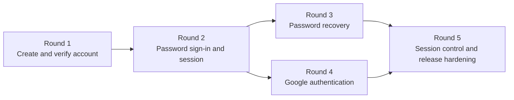
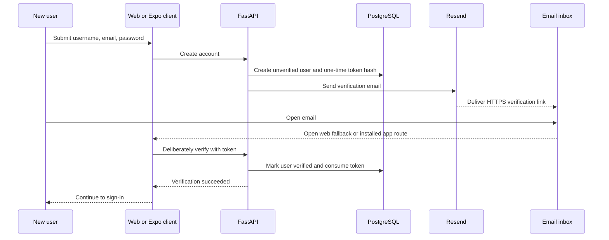
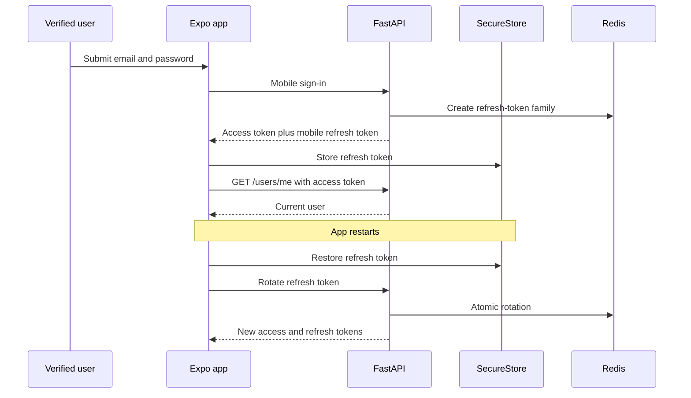
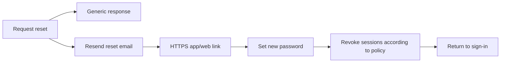
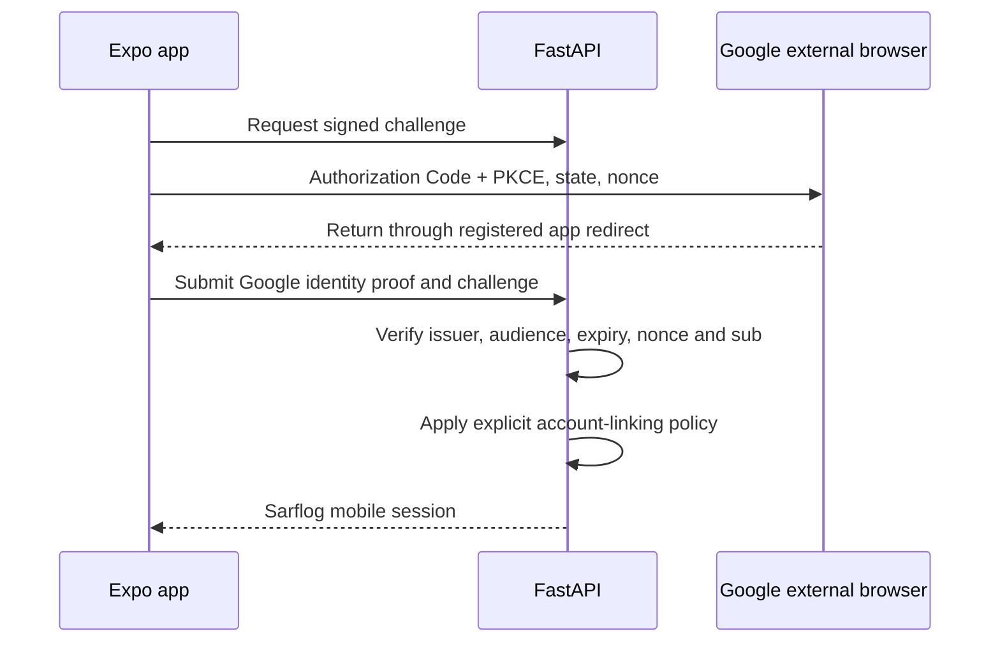
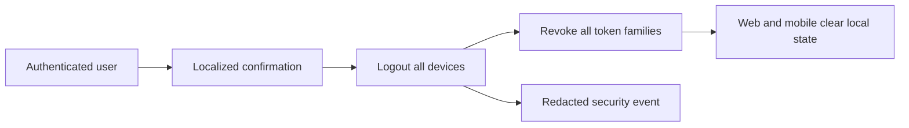

# Sarflog Authentication Rounds

**Status:** Planned  
**Created:** 2026-07-19  
**Scope:** Shared FastAPI authentication, React web compatibility, and Expo mobile authentication  
**Detailed risk register:** [AUTH-ISSUES-AND-EDGE-CASES.md](./AUTH-ISSUES-AND-EDGE-CASES.md)

## Why the Work Is Divided Into Rounds

Authentication is not one feature. It is a chain of user journeys that share security-sensitive backend machinery. Building every backend route first and connecting clients later would postpone the most valuable feedback: whether a real user can complete the journey safely on a real client.

Sarflog will therefore use vertical rounds:

```text
Choose one user journey
        ↓
Change only the backend contracts required by that journey
        ↓
Connect the affected web and/or mobile screens immediately
        ↓
Test the complete journey and its highest-risk failure
        ↓
Stop, review, and learn before beginning the next round
```

Each round must be demonstrable on its own. Later rounds may reuse earlier infrastructure, but they must not silently expand an earlier round's mission.

## Round Overview

| Round | Mission | Primary surfaces | Entry condition | Exit condition |
|---|---|---|---|---|
| 1 | A new user can create and verify a local account | Resend, FastAPI, web, Expo, App/Universal Links | Existing signup and verification code is available but browser-shaped and under-tested | A verification email sent by Resend can complete account verification safely on web or mobile |
| 2 | A verified local user can sign in and maintain a secure mobile session | FastAPI, Redis, web regression, Expo SecureStore | A verified local account exists | Sign-in, restoration, refresh, `/users/me`, and logout work without weakening web-cookie auth |
| 3 | A local user can recover a forgotten password and invalidate compromised sessions | Resend, FastAPI, web, Expo links/screens | Round 2 session semantics are stable | Forgot/reset works on web and mobile with a documented access-token invalidation guarantee |
| 4 | A user can authenticate with Google without unsafe account linking | Google, FastAPI, web regression, Expo AuthSession | Round 2 can issue native Sarflog sessions | Native Google sign-in uses external-browser PKCE and shared, hardened identity linking |
| 5 | A user can understand and control every active session before release | FastAPI, Redis, web/mobile settings, security events, E2E | Password and Google sessions are stable | Logout-all, device-loss recovery, audit signals, and release-critical auth journeys are verified |

## Dependency Map



Rounds 3 and 4 are technically independent after Round 2. They remain sequential for learning and delivery focus.

---

# Round 1: Account Creation and Email Verification

## Mission

A brand-new user can create a Sarflog account, receive a verification email delivered by the shared FastAPI backend through Resend, deliberately verify the account on web or mobile, and arrive at the sign-in screen.

## Purpose

Round 1 proves the first trust boundary: Sarflog does not treat a typed email address as owned until the user demonstrates control of its inbox. It also replaces the confusing Resend-plus-SMTP/Mailtrap development setup with one explicit provider path.

## User Journey



## Included

- Resend HTTP API as the only active runtime email transport in development, staging, and production.
- Separate restricted Resend credentials per environment; secrets remain backend-only.
- Removal of active Mailtrap configuration and generic SMTP fallback/configuration.
- Existing local signup behavior, with a recoverable verification-delivery outcome.
- Enumeration-resistant resend-verification behavior and rate limiting.
- Canonical state-changing verification through POST rather than GET.
- One-time, hashed, expiring verification tokens.
- Canonical HTTPS verification links with desktop web fallback.
- Android App Link and iOS Universal Link configuration for the Expo verification route.
- Web signup/check-email/resend/verification compatibility.
- Mobile signup, check-email, resend, verification, and success-to-sign-in screens.
- Uzbek, Russian, and English copy together.
- Backend, web, mobile, link, and controlled manual Resend verification.

## Excluded

- Password sign-in tokens and mobile SecureStore sessions.
- Forgot/reset-password behavior beyond preserving existing email-template compatibility.
- Google authentication.
- Sign out of all devices.
- Asynchronous email queues, broad notification infrastructure, or marketing email.
- Final auth visual polish beyond accessible, usable Round 1 screens.

## Risks Addressed

- [AUTH-004](./AUTH-ISSUES-AND-EDGE-CASES.md#auth-004-email-verification-mutates-account-state-through-get)
- [AUTH-005](./AUTH-ISSUES-AND-EDGE-CASES.md#auth-005-verification-and-reset-links-target-only-the-web-frontend)
- Verification/resend portion of [AUTH-009](./AUTH-ISSUES-AND-EDGE-CASES.md#auth-009-recovery-and-verification-routes-lack-focused-backend-tests)

## Completion Proof

Round 1 is complete when one controlled development account can be created on web and mobile, receives the Resend email, verifies through the correct client, cannot reuse the token, and is rejected by password sign-in before verification but allowed to proceed to sign-in after verification.

---

# Round 2: Password Sign-In and Session Lifecycle

## Mission

A verified local user can sign in on mobile, enter the authenticated app, restore the session after restart, survive normal access-token expiry, and sign out safely while the existing web cookie flow remains secure and compatible.

## Purpose

Round 2 introduces native session credentials only after the refresh-token engine can enforce replay and concurrency guarantees.

## Session Flow



## Included

- Refresh-family replay revocation.
- Atomic Redis refresh rotation.
- Shared session service beneath web and mobile adapters.
- Explicit mobile sign-in, refresh, and logout contracts.
- Access token in memory; refresh token only in Expo SecureStore.
- Single-flight client refresh and authenticated API retry.
- `restoring`, `authenticated`, and `unauthenticated` state machine.
- `/users/me`, startup restoration, logout, and web-cookie regression tests.

## Excluded

- Signup and verification changes already completed in Round 1.
- Password recovery.
- Google.
- Logout-all.

## Risks Addressed

- AUTH-001, AUTH-002, AUTH-003, and AUTH-010.

---

# Round 3: Password Recovery and Security-Event Invalidation

## Mission

A local user who forgets a password can request a recovery email without disclosing whether an account exists, set a new password on web or mobile, and receive the exact documented session invalidation protection.

## Purpose

Recovery is an account-control flow, not merely another form. Round 3 establishes what happens to every active session after a password security event.

## Recovery Flow



## Included

- Forgot/reset backend coverage.
- Enumeration resistance and rate limiting.
- One-time, hashed, expiring reset tokens.
- Web fallback and mobile reset links/screens.
- Explicit decision and tests for access JWTs after password reset.
- Refresh-family revocation and local client cleanup.
- Three-language recovery copy.

## Risks Addressed

- AUTH-006 and the recovery portion of AUTH-009.

---

# Round 4: Google Authentication and Account Linking

## Mission

A user can sign in or create an account with Google through a standards-aligned native flow, and Sarflog cannot silently attach the wrong Google identity to an existing financial account.

## Purpose

Round 4 adapts Google authentication to a native public client while making identity linking authoritative and shared between web and mobile.

## Native Google Flow



## Included

- External-browser Expo AuthSession flow with PKCE.
- Platform/environment client IDs and redirect registration.
- No Google client secret in the app.
- Server-side Google token validation.
- Provider `sub` as the durable identity key.
- Explicit Gmail, Workspace, third-party-domain, and ambiguous-match policy.
- Shared identity-linking service for web and mobile.
- Cancellation, duplicate return, provider error, and offline recovery.

## Risks Addressed

- AUTH-007 and AUTH-008.

---

# Round 5: Session Control and Auth Release Hardening

## Mission

A user can recover from a lost or shared device, understand session-ending actions, and trust that Sarflog's release-critical authentication journeys behave consistently across clients.

## Purpose

Round 5 closes control, observability, and release-readiness gaps after all primary identity methods work.

## Control Flow



## Included

- Authenticated sign out of all devices.
- Recent-authentication decision for destructive session actions.
- Redacted security/audit events.
- Web and mobile cache/secret cleanup.
- Cross-device session tests.
- Android and iOS development-build verification.
- Release-critical Maestro journeys.
- Final accessibility, localization parity, rate-limit, and secret-leak audit.

## Risks Addressed

- AUTH-011 and residual risks from earlier rounds.

---

# Definition of Done for Every Round

- [ ] The round's user journey is demonstrable from its actual client.
- [ ] Backend trust rules are not delegated to the client.
- [ ] Happy path and highest-risk failure path have automated coverage.
- [ ] Existing web behavior is preserved or intentionally migrated in the same round.
- [ ] Uzbek, Russian, and English user-visible copy ships together.
- [ ] No password, secret, access token, refresh token, provider token, or one-time raw token is logged.
- [ ] Rate limits and enumeration behavior remain explicit.
- [ ] Android/iOS differences are verified or recorded as a release blocker.
- [ ] Documentation and the auth issue tracker are updated with actual verification results.
- [ ] The next round does not start until the current round is reviewed.

## Change Rule

If implementation uncovers a new auth requirement, record it in the auth issue tracker first. Add it to the current round only when it is required to make that round's stated journey safe and complete; otherwise assign it to a later round.

